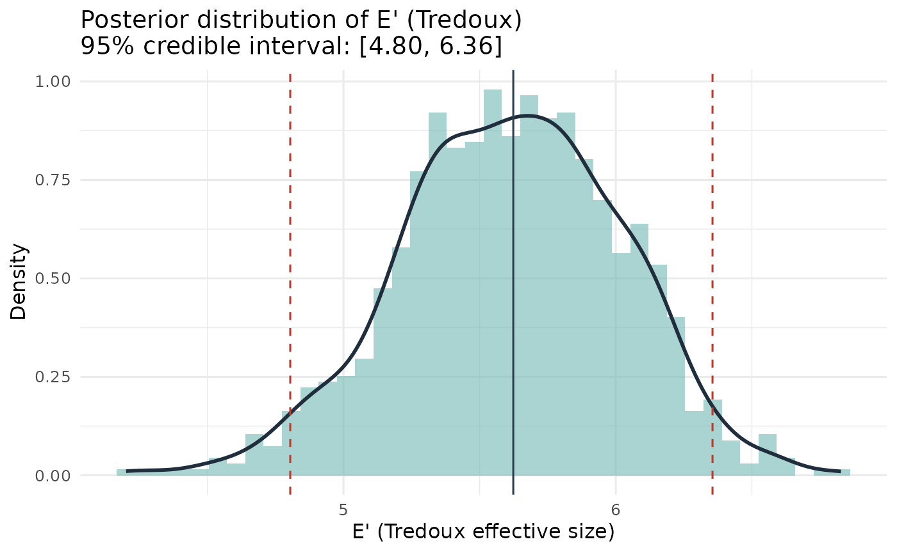
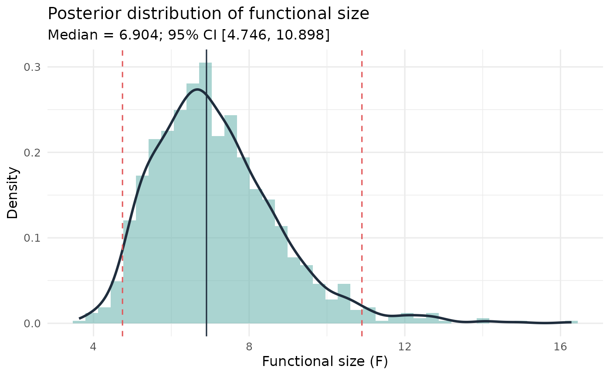
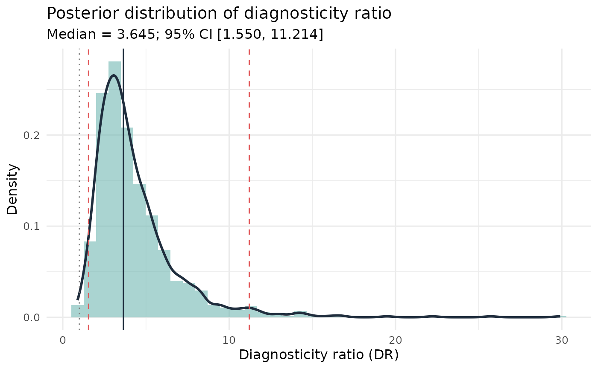
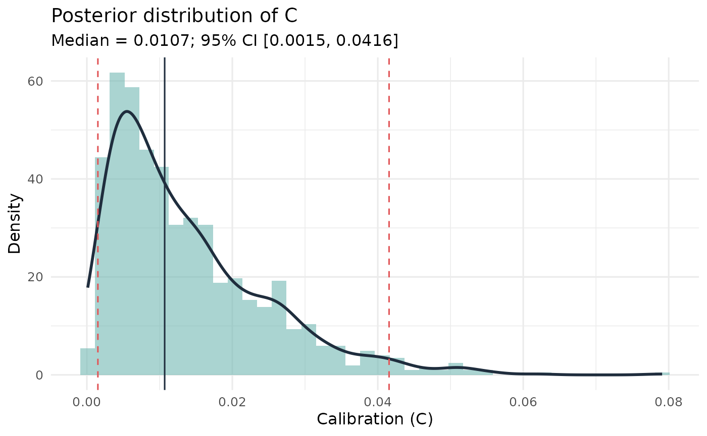
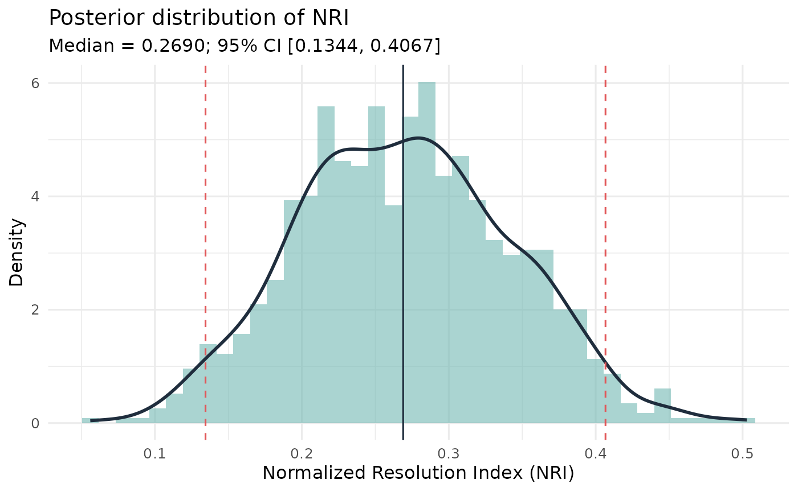
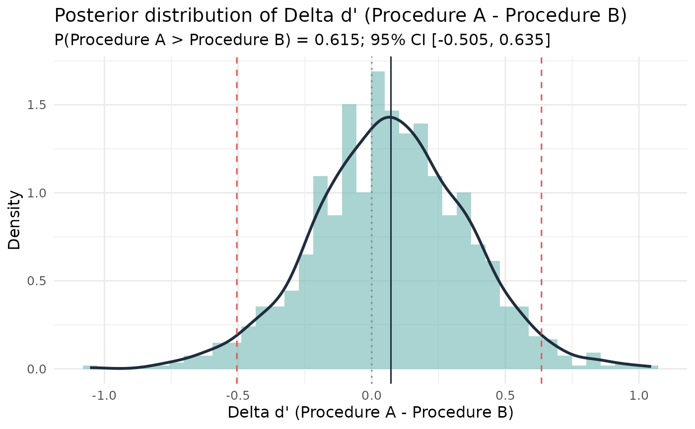

# Bayesian Inference for Lineup Measures

## Purpose

This vignette shows the Bayesian posterior summaries in **r4lineups**
for lineup fairness and confidence-based eyewitness measures.

Use these functions when you want credible intervals or direct
probability statements such as $`P(E' < 6 \mid data)`$,
$`P(F < 6 \mid data)`$, or $`P(DR > 1 \mid data)`$. The examples use
small posterior samples so that the vignette runs quickly during package
checks; increase `S` for final analyses.

``` r

library(r4lineups)
```

## Data Shapes

The Bayesian fairness functions use mock-witness lineup choices:

- a **lineup vector**, where each value is the chosen lineup position;
  or
- a **lineup table**, where each cell is the count for one lineup
  position.

The Bayesian calibration function uses the standard confidence-based
data frame with `target_present`, `identification`, and `confidence`.
The SDT comparison uses summary counts: hits, misses, false alarms, and
correct rejections for two conditions.

## Tredoux Effective Size

[`esize_T_bayes()`](https://cgtza2.github.io/r4lineups/reference/esize_T_bayes.md)
fits a Dirichlet-multinomial model to the lineup choice counts and
transforms each posterior draw of the choice-probability vector to
Tredoux’s effective size $`E'`$.

``` r

data(nortje2012)

lineup_vec <- nortje2012$lineup_1
k <- max(lineup_vec, na.rm = TRUE)
lineup_table <- table(factor(lineup_vec, levels = seq_len(k)))

set.seed(1)
esize_post <- esize_T_bayes(
  lineup_table,
  alpha = 0.5,
  S = 1000,
  threshold = k
)

esize_post
#> Bayesian Posterior: Tredoux Effective Size (E')
#> ------------------------------------------------
#>   k (positions): 8    N (choices): 133    S (draws): 1000
#>   Prior: Dirichlet(alpha = 0.50)
#>   Posterior mean:   5.614
#>   Posterior median: 5.624
#>   95% credible interval: [4.804, 6.355]
#>   P(E' < 8.00 | data): 1.000
#>   P(E' > 8.00 | data): 0.000
```

``` r

plot(esize_post)
```



The threshold argument makes the posterior useful for fairness
benchmarks. For example, with a six-person lineup one might inspect
$`P(E' < 6 \mid data)`$ as a posterior probability that the effective
size falls below nominal size.

## Functional Size

[`func_size_bayes()`](https://cgtza2.github.io/r4lineups/reference/func_size_bayes.md)
models the suspect-selection rate with a beta-binomial posterior and
transforms posterior draws to functional size.

``` r

set.seed(2)
func_post <- func_size_bayes(
  lineup_vec,
  target_pos = 3,
  alpha = 0.5,
  S = 1000,
  threshold = k
)

func_post
#> Bayesian Functional Size - Beta-Binomial model
#>   Prior: Jeffreys-type Beta(0.50, 0.50)
#>   n = 133, suspect IDs = 19 (rate = 0.143)
#>   Posterior mean F:   7.144
#>   Posterior median F: 6.904
#>   95% credible interval: [4.746, 10.898]
#>   P(F < 8.000 | data): 0.7480
#>   P(F > 8.000 | data): 0.2520
```

``` r

plot(func_post)
```



## Diagnosticity Ratio

[`diag_ratio_T_bayes()`](https://cgtza2.github.io/r4lineups/reference/diag_ratio_T_bayes.md)
models target-present and target-absent suspect-selection rates with
independent beta-binomial posteriors and returns the posterior of the
diagnosticity ratio.

``` r

tp_vec <- nortje2012$lineup_1
ta_vec <- nortje2012$lineup_2

set.seed(3)
diag_post <- diag_ratio_T_bayes(
  lineup_pres = tp_vec,
  lineup_abs = ta_vec,
  pos_pres = 3,
  pos_abs = 3,
  k1 = max(tp_vec, na.rm = TRUE),
  k2 = max(ta_vec, na.rm = TRUE),
  alpha = 0.5,
  S = 1000,
  threshold = 1
)

diag_post
#> Bayesian Diagnosticity Ratio (Tredoux) - Beta-Binomial model
#>   Prior: Jeffreys-type Beta(0.50, 0.50)
#>   TP lineup: n = 133, suspect IDs = 19
#>   TA lineup: n = 133, suspect IDs = 5
#>   Posterior mean DR:   4.337
#>   Posterior median DR: 3.645
#>   95% credible interval: [1.550, 11.214]
#>   P(DR < 1.000 | data): 0.0010
#>   P(DR > 1.000 | data): 0.9990
```

``` r

plot(diag_post)
```



The threshold `1` is useful because $`DR > 1`$ indicates that suspect
identifications are more common in the target-present lineup than in the
target-absent lineup.

## Calibration

[`calibration_bayes()`](https://cgtza2.github.io/r4lineups/reference/calibration_bayes.md)
places beta posteriors on accuracy within confidence bins and propagates
uncertainty into calibration $`C`$, over/underconfidence $`O/U`$, and
normalized resolution $`NRI`$.

``` r

data(lineup_example)

set.seed(4)
cal_post <- calibration_bayes(
  lineup_example,
  confidence_bins = c(0, 60, 80, 100),
  alpha = 0.5,
  S = 1000
)

cal_post
#> Bayesian Calibration Analysis - Beta-Binomial model
#>   n = 75; 3 confidence bins; prior alpha = 0.50
#>   C (calibration):      mean = 0.0138, median = 0.0107, 95% CI [0.0015, 0.0416]
#>   O/U (over/underconf): mean = 0.0351, median = 0.0348, 95% CI [-0.0384, 0.1094]
#>   NRI (resolution):     mean = 0.2697, median = 0.2690, 95% CI [0.1344, 0.4067]
#>   (Frequentist: C = 0.0081, O/U = 0.0267, NRI = 0.2670)
```

``` r

plot(cal_post, metric = "C")
```



``` r

plot(cal_post, metric = "NRI")
```



## SDT d’ Comparison

[`sdt_compare()`](https://cgtza2.github.io/r4lineups/reference/sdt_compare.md)
compares two conditions using summary SDT counts. It draws from
posterior hit and false-alarm rates, converts each draw to $`d'`$, and
reports the posterior for $`\Delta d' = d'_A - d'_B`$.

``` r

set.seed(5)
sdt_post <- sdt_compare(
  hits_A = 45, misses_A = 55, fas_A = 12, crs_A = 88,
  hits_B = 38, misses_B = 62, fas_B = 10, crs_B = 90,
  label_A = "Procedure A",
  label_B = "Procedure B",
  alpha = 0.5,
  S = 1000
)

sdt_post
#> Bayesian SDT Comparison: Procedure A vs Procedure B
#>   Prior: Jeffreys Beta(0.50, 0.50) on HR and FAR
#>   Posterior mean d': Procedure A = 1.042, Procedure B = 0.971
#>   Delta d' (Procedure A - Procedure B):
#>     Posterior mean:   0.072
#>     Posterior median: 0.072
#>     95% CI: [-0.505, 0.635]
#>   P(d'_Procedure A > d'_Procedure B | data): 0.6150
#>   P(d'_Procedure B > d'_Procedure A | data): 0.3850
#>   (Frequentist z-test: z = 0.254, p = 0.7994)
```

``` r

plot(sdt_post)
```



## Workflow Position

These Bayesian functions complement, rather than replace, the
frequentist and bootstrap functions elsewhere in the package:

- use normal-theory functions for quick classical intervals where
  assumptions are acceptable;
- use bootstrap functions when you want sampling-distribution
  uncertainty with minimal distributional assumptions;
- use Bayesian functions when credible intervals and direct posterior
  probabilities are the clearest way to express uncertainty.

For substantive reports, run enough posterior draws for stable summaries
and check sensitivity to the prior concentration, for example
`alpha = 0.1`, `0.5`, and `1`.
