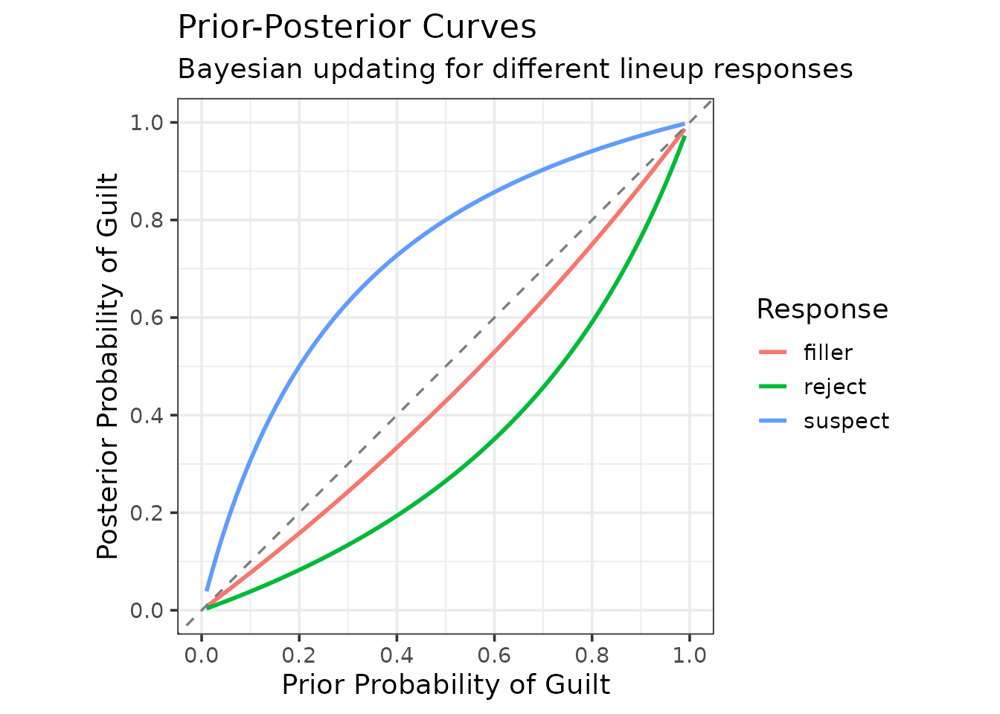
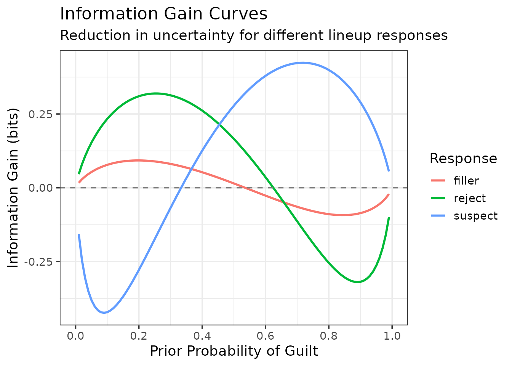
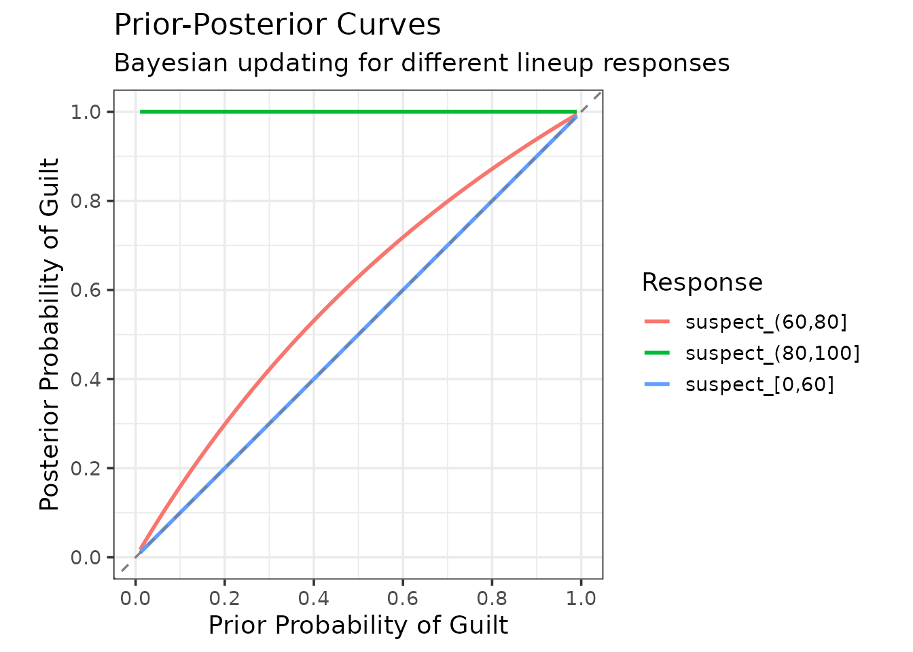
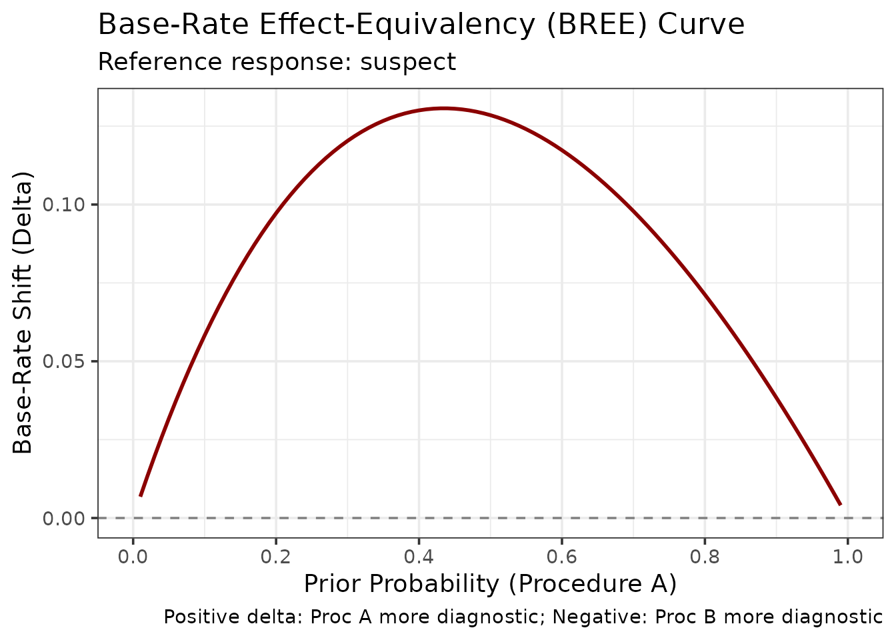
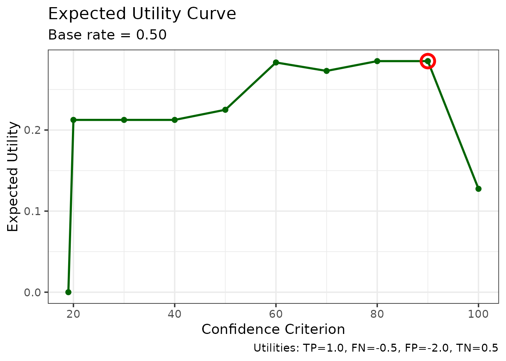
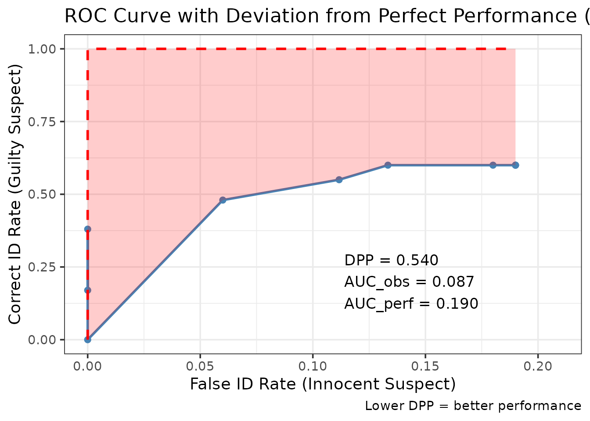
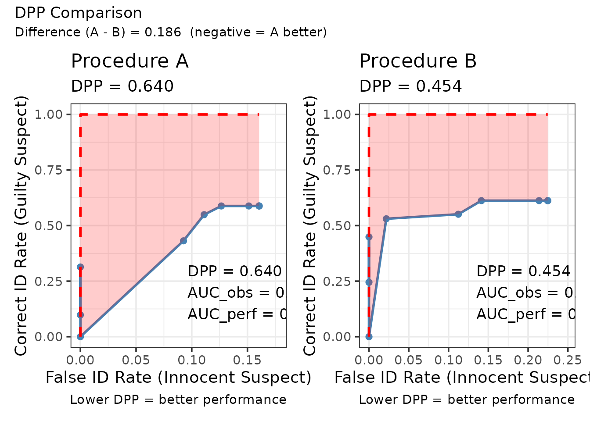
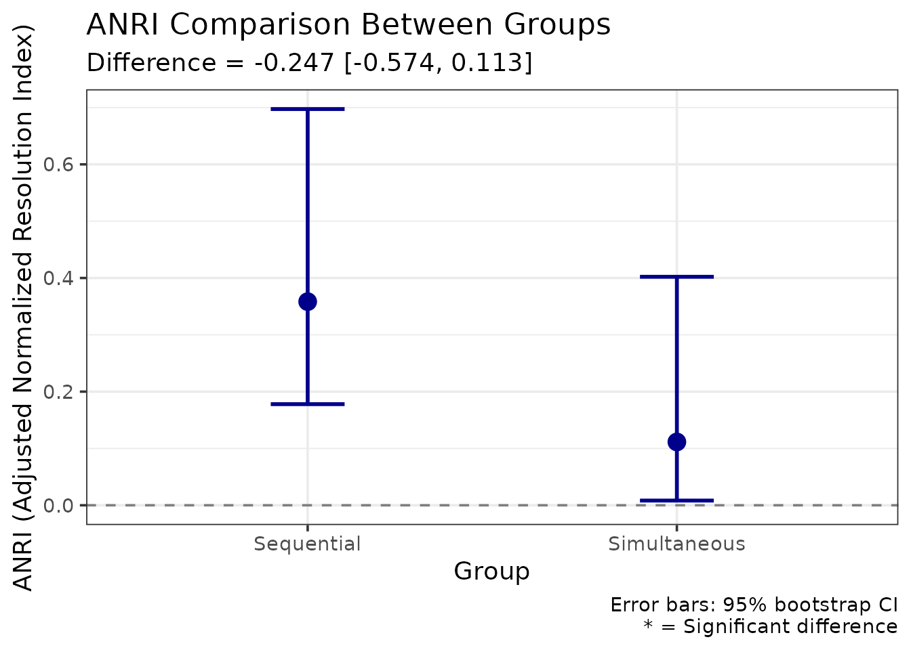
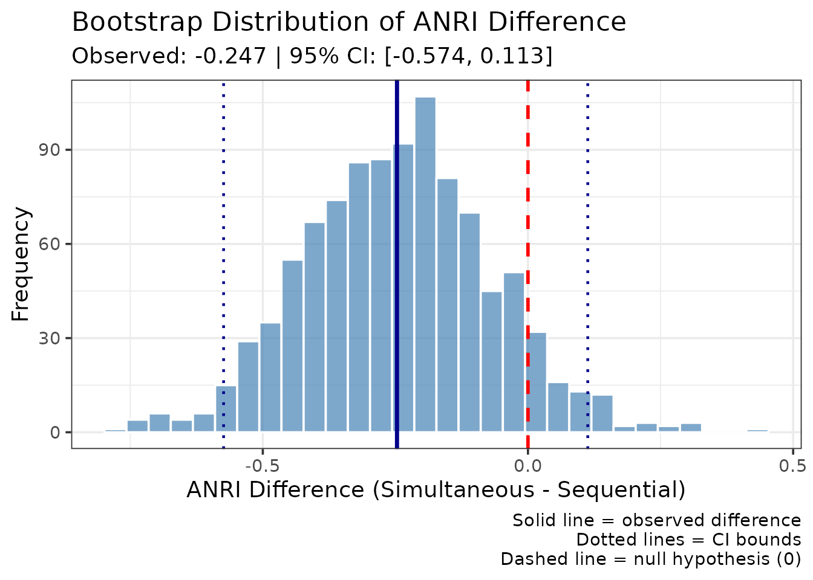

# Calibration and Decision Analysis

## Introduction

This vignette demonstrates five advanced statistical methods for
analyzing eyewitness identification data in **r4lineups**:

1.  **Calibration Analysis** - Assessing confidence-accuracy
    correspondence
2.  **Bayesian Information-Gain Curves** - Evaluating diagnostic value
    of evidence
3.  **Expected Utility Analysis** - Decision-theoretic evaluation with
    cost/benefit tradeoffs
4.  **Deviation from Perfect Performance (DPP)** - ROC-based
    truncation-robust metric
5.  **ANRI** - Bias-corrected resolution index with bootstrap inference

These methods complement the traditional lineup fairness measures by
providing sophisticated analyses of identification accuracy, confidence
calibration, and decision-making utility.

## Data Format

All methods in this vignette require a dataframe with the following
columns:

- `target_present`: Logical. TRUE if the guilty suspect is in the lineup
- `identification`: Character. “suspect”, “filler”, or “reject”
- `confidence`: Numeric. Confidence rating (any scale)

We’ll use the built-in `lineup_example` dataset throughout.

``` r
library(r4lineups)
data(lineup_example)

# Examine the data structure
head(lineup_example)
  target_present identification confidence
1           TRUE        suspect         90
2           TRUE         reject         50
3           TRUE        suspect         90
4           TRUE         filler         50
5           TRUE         filler         50
6           TRUE        suspect         90
str(lineup_example)
'data.frame':   200 obs. of  3 variables:
 $ target_present: logi  TRUE TRUE TRUE TRUE TRUE TRUE ...
 $ identification: chr  "suspect" "reject" "suspect" "filler" ...
 $ confidence    : num  90 50 90 50 50 90 70 40 90 60 ...
```

## 1. Calibration Analysis

Calibration measures how well confidence judgments correspond to
accuracy. Perfect calibration means that when witnesses express X%
confidence, they are correct X% of the time.

### Basic Calibration

``` r
# Compute calibration with binned confidence
cal_result <- make_calibration(
  lineup_example,
  confidence_bins = c(0, 60, 80, 100),
  choosers_only = TRUE  # Analyze only suspect identifications
)

print(cal_result)

=== Lineup Calibration Analysis ===

Analysis type: Choosers only (suspect IDs)
Total N: 75 

Calibration Statistics:
  C (Calibration):         0.0081 
  O/U (Over/Under):        +0.0267 
  NRI (Resolution):        0.2670 

Overall Performance:
  Mean Accuracy:      0.800 
  Mean Confidence:    0.827 

Calibration Data by Bin:

[38;5;246m# A tibble: 3 × 7
[39m
  bin          n mean_confidence accuracy n_correct n_incorrect
  
[3m
[38;5;246m<chr>
[39m
[23m    
[3m
[38;5;246m<int>
[39m
[23m           
[3m
[38;5;246m<dbl>
[39m
[23m    
[3m
[38;5;246m<dbl>
[39m
[23m     
[3m
[38;5;246m<dbl>
[39m
[23m       
[3m
[38;5;246m<dbl>
[39m
[23m

[38;5;250m1
[39m [0,60]      10            56      0.5           5           5

[38;5;250m2
[39m (60,80]     27            75.9    0.630        17          10

[38;5;250m3
[39m (80,100]    38            94.5    1            38           0

[38;5;246m# ℹ 1 more variable: mean_confidence_prop <dbl>
[39m

Plot available in $plot
```

The output provides three key statistics:

- **C statistic**: Overall calibration quality (0 = perfect, higher =
  worse)
- **O/U (Over/Under confidence)**: Positive = overconfident, Negative =
  underconfident
- **NRI (Normalized Resolution Index)**: Ability to discriminate
  accuracy levels with confidence (higher = better)

### Interpreting the Calibration Plot

The calibration plot shows:

- **Diagonal line**: Perfect calibration
- **Points above diagonal**: Underconfident (accuracy exceeds
  confidence)
- **Points below diagonal**: Overconfident (confidence exceeds accuracy)
- **Point size**: Sample size in each bin

``` r

# The plot is automatically displayed, but you can save it:
ggsave("calibration_plot.png", cal_result$plot, width = 8, height = 6)
```

### Calibration by Condition

Compare calibration across experimental conditions:

``` r
# Add a grouping variable (for demonstration)
lineup_example$procedure <- sample(
  c("Simultaneous", "Sequential"),
  nrow(lineup_example),
  replace = TRUE
)

# Compute calibration by condition
cal_by_cond <- make_calibration_by_condition(
  lineup_example,
  condition_var = "procedure",
  confidence_bins = c(0, 60, 80, 100)
)

print(cal_by_cond)
$by_condition
$by_condition$Simultaneous
$by_condition$Simultaneous$calibration_data

[38;5;246m# A tibble: 3 × 7
[39m
  bin          n mean_confidence accuracy n_correct n_incorrect
  
[3m
[38;5;246m<chr>
[39m
[23m    
[3m
[38;5;246m<int>
[39m
[23m           
[3m
[38;5;246m<dbl>
[39m
[23m    
[3m
[38;5;246m<dbl>
[39m
[23m     
[3m
[38;5;246m<dbl>
[39m
[23m       
[3m
[38;5;246m<dbl>
[39m
[23m

[38;5;250m1
[39m [0,60]       3            56.7    0.667         2           1

[38;5;250m2
[39m (60,80]     17            76.5    0.706        12           5

[38;5;250m3
[39m (80,100]    16            93.1    1            16           0

[38;5;246m# ℹ 1 more variable: mean_confidence_prop <dbl>
[39m

$by_condition$Simultaneous$C
[1] 0.004568015

$by_condition$Simultaneous$OU
[1] -0.01111111

$by_condition$Simultaneous$NRI
[1] 0.1607843

$by_condition$Simultaneous$overall_accuracy
[1] 0.8333333

$by_condition$Simultaneous$overall_confidence
[1] 0.8222222

$by_condition$Simultaneous$n_total
[1] 36

$by_condition$Simultaneous$choosers_only
[1] TRUE

$by_condition$Simultaneous$confidence_scale
[1] 100


$by_condition$Sequential
$by_condition$Sequential$calibration_data

[38;5;246m# A tibble: 3 × 7
[39m
  bin          n mean_confidence accuracy n_correct n_incorrect
  
[3m
[38;5;246m<chr>
[39m
[23m    
[3m
[38;5;246m<int>
[39m
[23m           
[3m
[38;5;246m<dbl>
[39m
[23m    
[3m
[38;5;246m<dbl>
[39m
[23m     
[3m
[38;5;246m<dbl>
[39m
[23m       
[3m
[38;5;246m<dbl>
[39m
[23m

[38;5;250m1
[39m [0,60]       7            55.7    0.429         3           4

[38;5;250m2
[39m (60,80]     10            75      0.5           5           5

[38;5;250m3
[39m (80,100]    22            95.5    1            22           0

[38;5;246m# ℹ 1 more variable: mean_confidence_prop <dbl>
[39m

$by_condition$Sequential$C
[1] 0.02015818

$by_condition$Sequential$OU
[1] 0.06153846

$by_condition$Sequential$NRI
[1] 0.3912698

$by_condition$Sequential$overall_accuracy
[1] 0.7692308

$by_condition$Sequential$overall_confidence
[1] 0.8307692

$by_condition$Sequential$n_total
[1] 39

$by_condition$Sequential$choosers_only
[1] TRUE

$by_condition$Sequential$confidence_scale
[1] 100


$condition_summary

[38;5;246m# A tibble: 2 × 7
[39m
  condition        n       C      OU   NRI overall_accuracy overall_confidence

[38;5;250m*
[39m 
[3m
[38;5;246m<chr>
[39m
[23m        
[3m
[38;5;246m<int>
[39m
[23m   
[3m
[38;5;246m<dbl>
[39m
[23m   
[3m
[38;5;246m<dbl>
[39m
[23m 
[3m
[38;5;246m<dbl>
[39m
[23m            
[3m
[38;5;246m<dbl>
[39m
[23m              
[3m
[38;5;246m<dbl>
[39m
[23m

[38;5;250m1
[39m Simultaneous    36 0.004
[4m5
[24m
[4m7
[24m -
[31m0
[39m
[31m.
[39m
[31m0
[39m
[31m11
[4m1
[24m
[39m 0.161            0.833              0.822

[38;5;250m2
[39m Sequential      39 0.020
[4m2
[24m   0.061
[4m5
[24m 0.391            0.769              0.831

$condition_vars
[1] "procedure"

# Plot comparison
cal_by_cond$plot
NULL
```

## 2. Bayesian Information-Gain Analysis

Bayesian analysis evaluates how much an identification response changes
our belief about guilt, quantified as information gain (reduction in
uncertainty).

### Prior-Posterior Curves

``` r
# Compute Bayesian curves for simple responses
bayes_result <- make_bayes_curves(
  lineup_example,
  response_categories = "simple",  # "suspect", "filler", "reject"
  prior_grid = seq(0.01, 0.99, 0.01)
)

print(bayes_result)
$curves

[38;5;246m# A tibble: 297 × 4
[39m
   response prior posterior information_gain
   
[3m
[38;5;246m<chr>
[39m
[23m    
[3m
[38;5;246m<dbl>
[39m
[23m     
[3m
[38;5;246m<dbl>
[39m
[23m            
[3m
[38;5;246m<dbl>
[39m
[23m

[38;5;250m 1
[39m suspect   0.01    0.038
[4m8
[24m           -
[31m0
[39m
[31m.
[39m
[31m156
[39m

[38;5;250m 2
[39m suspect   0.02    0.075
[4m5
[24m           -
[31m0
[39m
[31m.
[39m
[31m245
[39m

[38;5;250m 3
[39m suspect   0.03    0.110            -
[31m0
[39m
[31m.
[39m
[31m306
[39m

[38;5;250m 4
[39m suspect   0.04    0.143            -
[31m0
[39m
[31m.
[39m
[31m349
[39m

[38;5;250m 5
[39m suspect   0.05    0.174            -
[31m0
[39m
[31m.
[39m
[31m380
[39m

[38;5;250m 6
[39m suspect   0.06    0.203            -
[31m0
[39m
[31m.
[39m
[31m401
[39m

[38;5;250m 7
[39m suspect   0.07    0.231            -
[31m0
[39m
[31m.
[39m
[31m415
[39m

[38;5;250m 8
[39m suspect   0.08    0.258            -
[31m0
[39m
[31m.
[39m
[31m422
[39m

[38;5;250m 9
[39m suspect   0.09    0.283            -
[31m0
[39m
[31m.
[39m
[31m424
[39m

[38;5;250m10
[39m suspect   0.1     0.308            -
[31m0
[39m
[31m.
[39m
[31m421
[39m

[38;5;246m# ℹ 287 more rows
[39m

$likelihoods

[38;5;246m# A tibble: 3 × 5
[39m
  response p_x_given_guilty p_x_given_innocent n_guilty n_innocent
  
[3m
[38;5;246m<chr>
[39m
[23m               
[3m
[38;5;246m<dbl>
[39m
[23m              
[3m
[38;5;246m<dbl>
[39m
[23m    
[3m
[38;5;246m<int>
[39m
[23m      
[3m
[38;5;246m<int>
[39m
[23m

[38;5;250m1
[39m suspect              0.6                0.15       60         15

[38;5;250m2
[39m reject               0.22               0.61       22         61

[38;5;250m3
[39m filler               0.18               0.24       18         24

$response_counts

[38;5;246m# A tibble: 6 × 3
[39m
  response target_present     n
  
[3m
[38;5;246m<chr>
[39m
[23m    
[3m
[38;5;246m<lgl>
[39m
[23m          
[3m
[38;5;246m<int>
[39m
[23m

[38;5;250m1
[39m filler   FALSE             24

[38;5;250m2
[39m filler   TRUE              18

[38;5;250m3
[39m reject   FALSE             61

[38;5;250m4
[39m reject   TRUE              22

[38;5;250m5
[39m suspect  FALSE             15

[38;5;250m6
[39m suspect  TRUE              60

$n_guilty
[1] 100

$n_innocent
[1] 100

$response_categories
[1] "simple"

# Plot prior-posterior relationships
plot_bayes_prior_posterior(bayes_result)
```



The plot shows how each response type updates prior belief:

- **Lines above diagonal**: Evidence increases guilt belief (diagnostic
  of guilt)
- **Lines below diagonal**: Evidence decreases guilt belief (diagnostic
  of innocence)
- **Steeper slopes**: More diagnostic evidence

### Information Gain

Information gain quantifies uncertainty reduction:

``` r

# Plot information gain
plot_bayes_information_gain(bayes_result)
```



Interpretation:

- **Positive values**: Response reduces uncertainty (diagnostic)
- **Negative values**: Response increases uncertainty (misleading)
- **Higher magnitude**: Stronger diagnostic value

### Confidence-Based Bayesian Analysis

Analyze by confidence level:

``` r

bayes_conf <- make_bayes_curves(
  lineup_example,
  response_categories = "confidence",
  confidence_bins = c(0, 60, 80, 100)
)

# Get suspect responses only
suspect_responses <- grep("^suspect_", unique(bayes_conf$curves$response), value = TRUE)
plot_bayes_prior_posterior(bayes_conf, selected_responses = suspect_responses)
```



### Base-Rate Equivalency of Evidence (BREE)

BREE curves compare the diagnostic value of two procedures:

``` r

# Create two procedure datasets (for demonstration)
data_proc_a <- lineup_example[lineup_example$procedure == "Simultaneous", ]
data_proc_b <- lineup_example[lineup_example$procedure == "Sequential", ]

# Compute BREE curve for suspect identifications
bree_result <- make_bree_curve(
  data_proc_a,
  data_proc_b,
  reference_response = "suspect"
)

plot_bree(bree_result)
```



The BREE curve shows equivalent base rates for equal posterior
probabilities. Points above the diagonal indicate Procedure A requires
higher base rates to achieve the same posterior as Procedure B.

## 3. Expected Utility Analysis

Expected utility analysis evaluates identification procedures
considering costs and benefits of different outcomes.

### Define Utility Matrix

``` r

# Define costs/benefits (on same scale)
utility_matrix <- c(
  tp = 1.0,    # True positive (correct suspect ID): Benefit
  fn = -0.5,   # False negative (reject/filler ID when guilty): Cost
  fp = -2.0,   # False positive (suspect ID when innocent): Major cost
  tn = 0.5     # True negative (reject/filler ID when innocent): Benefit
)
```

### Compute Utility Curves

``` r
# Compute expected utility across confidence criteria
util_result <- make_utility_curves(
  lineup_example,
  base_rate = 0.5,  # Assume 50% guilty suspects
  utility_matrix = utility_matrix,
  lineup_size = 6
)

print(util_result)
$utility_data

[38;5;246m# A tibble: 10 × 6
[39m
   criterion hit_rate false_alarm_rate expected_utility n_ids_tp n_ids_ta
       
[3m
[38;5;246m<dbl>
[39m
[23m    
[3m
[38;5;246m<dbl>
[39m
[23m            
[3m
[38;5;246m<dbl>
[39m
[23m            
[3m
[38;5;246m<dbl>
[39m
[23m    
[3m
[38;5;246m<dbl>
[39m
[23m    
[3m
[38;5;246m<dbl>
[39m
[23m

[38;5;250m 1
[39m       100     0.17            0                0.128       17      0  

[38;5;250m 2
[39m        90     0.38            0                0.285       38      0  

[38;5;250m 3
[39m        80     0.48            0.06             0.285       48      6  

[38;5;250m 4
[39m        70     0.55            0.112            0.273       55     11.2

[38;5;250m 5
[39m        60     0.6             0.133            0.283       60     13.3

[38;5;250m 6
[39m        50     0.6             0.18             0.225       60     18  

[38;5;250m 7
[39m        40     0.6             0.19             0.212       60     19  

[38;5;250m 8
[39m        30     0.6             0.19             0.212       60     19  

[38;5;250m 9
[39m        20     0.6             0.19             0.212       60     19  

[38;5;250m10
[39m        19     0               0                0            0      0  

$max_utility
$max_utility$expected_utility
   tp 
0.285 

$max_utility$criterion
[1] 90

$max_utility$hit_rate
[1] 0.38

$max_utility$false_alarm_rate
[1] 0


$avg_utility
[1] 0.2351389

$utility_all_ids
    tp 
0.1275 

$base_rate
[1] 0.5

$utility_matrix
  tp   fn   fp   tn 
 1.0 -0.5 -2.0  0.5 

$n_target_present
[1] 100

$n_target_absent
[1] 100

# Plot utility curves
plot_utility_curves(util_result)
```



The plot shows:

- **Expected utility** at each confidence threshold
- **Optimal threshold**: Maximum utility point
- **Comparison with “all identifications”** strategy

### Compare Procedures

``` r

# Compare two procedures (requires datasets from BREE section)
# First compute utility for each procedure separately
util_proc_a <- make_utility_curves(data_proc_a, base_rate = 0.5,
                                   utility_matrix = utility_matrix)
util_proc_b <- make_utility_curves(data_proc_b, base_rate = 0.5,
                                   utility_matrix = utility_matrix)

cat("Procedure A max utility:", round(util_proc_a$max_utility, 3), "\n")
cat("Procedure B max utility:", round(util_proc_b$max_utility, 3), "\n")
```

### Sensitivity to Base Rate

Examine how utility depends on base rate:

``` r

# Test multiple base rates
base_rates <- c(0.2, 0.5, 0.8)

for (br in base_rates) {
  util <- make_utility_curves(lineup_example, base_rate = br,
                              utility_matrix = utility_matrix)
  cat("Base rate:", br, "  Max utility:", round(util$max_utility, 3), "\n")
}
```

## 4. Deviation from Perfect Performance (DPP)

DPP quantifies how far an ROC curve deviates from perfect performance.
It’s robust to ROC truncation (missing low-confidence data).

### Basic DPP

``` r
# Compute DPP
dpp_result <- make_dpp(
  lineup_example,
  lineup_size = 6
)

print(dpp_result)
$dpp
[1] 0.5396491

$auc_observed
[1] 0.08746667

$auc_perfect
[1] 0.19

$auc_gap
[1] 0.1025333

$roc_data

[38;5;246m# A tibble: 10 × 5
[39m
   confidence correct_id_rate false_id_rate n_correct_ids n_false_ids
        
[3m
[38;5;246m<dbl>
[39m
[23m           
[3m
[38;5;246m<dbl>
[39m
[23m         
[3m
[38;5;246m<dbl>
[39m
[23m         
[3m
[38;5;246m<dbl>
[39m
[23m       
[3m
[38;5;246m<dbl>
[39m
[23m

[38;5;250m 1
[39m        100            0.17         0                17         0  

[38;5;250m 2
[39m         90            0.38         0                38         0  

[38;5;250m 3
[39m         19            0            0                 0         0  

[38;5;250m 4
[39m         80            0.48         0.06             48         6  

[38;5;250m 5
[39m         70            0.55         0.112            55        11.2

[38;5;250m 6
[39m         60            0.6          0.133            60        13.3

[38;5;250m 7
[39m         50            0.6          0.18             60        18  

[38;5;250m 8
[39m         40            0.6          0.19             60        19  

[38;5;250m 9
[39m         30            0.6          0.19             60        19  

[38;5;250m10
[39m         20            0.6          0.19             60        19  

$perfect_roc

[38;5;246m# A tibble: 3 × 2
[39m
  false_id_rate correct_id_rate
          
[3m
[38;5;246m<dbl>
[39m
[23m           
[3m
[38;5;246m<dbl>
[39m
[23m

[38;5;250m1
[39m          0                  0

[38;5;250m2
[39m          0                  1

[38;5;250m3
[39m          0.19               1

$max_fa
[1] 0.19

$n_target_present
[1] 100

$n_target_absent
[1] 100

# Plot ROC with perfect performance comparison
plot_dpp(dpp_result)
```



Interpretation:

- **DPP = 0**: Perfect performance
- **DPP = 1**: Chance performance
- **DPP \< 0**: Better than perfect (impossible, indicates error)

The plot shows:

- **Black curve**: Observed ROC
- **Red dashed line**: Perfect ROC given the maximum false alarm rate
- **Shaded area**: Deviation from perfect performance

### Compare DPP Between Groups

``` r
# Compare procedures (using datasets from BREE section)
dpp_comparison <- compare_dpp(
  data_proc_a,
  data_proc_b,
  lineup_size = 6
)

print(dpp_comparison)
$dpp_a
[1] 0.6398944

$dpp_b
[1] 0.4540816

$dpp_difference
[1] 0.1858128

$dpp_obj_a
$dpp_obj_a$dpp
[1] 0.6398944

$dpp_obj_a$auc_observed
[1] 0.05779472

$dpp_obj_a$auc_perfect
[1] 0.1604938

$dpp_obj_a$auc_gap
[1] 0.1026991

$dpp_obj_a$roc_data

[38;5;246m# A tibble: 10 × 5
[39m
   confidence correct_id_rate false_id_rate n_correct_ids n_false_ids
        
[3m
[38;5;246m<dbl>
[39m
[23m           
[3m
[38;5;246m<dbl>
[39m
[23m         
[3m
[38;5;246m<dbl>
[39m
[23m         
[3m
[38;5;246m<dbl>
[39m
[23m       
[3m
[38;5;246m<dbl>
[39m
[23m

[38;5;250m 1
[39m        100          0.098
[4m0
[24m        0                  5        0   

[38;5;250m 2
[39m         90          0.314         0                 16        0   

[38;5;250m 3
[39m         19          0             0                  0        0   

[38;5;250m 4
[39m         80          0.431         0.092
[4m6
[24m            22        5   

[38;5;250m 5
[39m         70          0.549         0.111             28        6   

[38;5;250m 6
[39m         60          0.588         0.127             30        6.83

[38;5;250m 7
[39m         50          0.588         0.151             30        8.17

[38;5;250m 8
[39m         40          0.588         0.160             30        8.67

[38;5;250m 9
[39m         30          0.588         0.160             30        8.67

[38;5;250m10
[39m         20          0.588         0.160             30        8.67

$dpp_obj_a$perfect_roc

[38;5;246m# A tibble: 3 × 2
[39m
  false_id_rate correct_id_rate
          
[3m
[38;5;246m<dbl>
[39m
[23m           
[3m
[38;5;246m<dbl>
[39m
[23m

[38;5;250m1
[39m         0                   0

[38;5;250m2
[39m         0                   1

[38;5;250m3
[39m         0.160               1

$dpp_obj_a$max_fa
[1] 0.1604938

$dpp_obj_a$n_target_present
[1] 51

$dpp_obj_a$n_target_absent
[1] 54


$dpp_obj_b
$dpp_obj_b$dpp
[1] 0.4540816

$dpp_obj_b$auc_observed
[1] 0.1226338

$dpp_obj_b$auc_perfect
[1] 0.2246377

$dpp_obj_b$auc_gap
[1] 0.1020038

$dpp_obj_b$roc_data

[38;5;246m# A tibble: 10 × 5
[39m
   confidence correct_id_rate false_id_rate n_correct_ids n_false_ids
        
[3m
[38;5;246m<dbl>
[39m
[23m           
[3m
[38;5;246m<dbl>
[39m
[23m         
[3m
[38;5;246m<dbl>
[39m
[23m         
[3m
[38;5;246m<dbl>
[39m
[23m       
[3m
[38;5;246m<dbl>
[39m
[23m

[38;5;250m 1
[39m        100           0.245        0                 12        0   

[38;5;250m 2
[39m         90           0.449        0                 22        0   

[38;5;250m 3
[39m         19           0            0                  0        0   

[38;5;250m 4
[39m         80           0.531        0.021
[4m7
[24m            26        1   

[38;5;250m 5
[39m         70           0.551        0.112             27        5.17

[38;5;250m 6
[39m         60           0.612        0.141             30        6.5 

[38;5;250m 7
[39m         50           0.612        0.214             30        9.83

[38;5;250m 8
[39m         40           0.612        0.225             30       10.3 

[38;5;250m 9
[39m         30           0.612        0.225             30       10.3 

[38;5;250m10
[39m         20           0.612        0.225             30       10.3 

$dpp_obj_b$perfect_roc

[38;5;246m# A tibble: 3 × 2
[39m
  false_id_rate correct_id_rate
          
[3m
[38;5;246m<dbl>
[39m
[23m           
[3m
[38;5;246m<dbl>
[39m
[23m

[38;5;250m1
[39m         0                   0

[38;5;250m2
[39m         0                   1

[38;5;250m3
[39m         0.225               1

$dpp_obj_b$max_fa
[1] 0.2246377

$dpp_obj_b$n_target_present
[1] 49

$dpp_obj_b$n_target_absent
[1] 46

# Plot comparison side-by-side
plot_dpp_comparison(dpp_comparison)
```



### When to Use DPP

Use DPP when:

- You have confidence-based ROC data
- ROC curves are truncated (witnesses may not use full scale)
- You want a single performance metric comparable across studies
- You need to compare procedures with different confidence distributions

## 5. ANRI: Adjusted Normalized Resolution Index

ANRI corrects NRI for small-sample bias, making it more appropriate for
hypothesis testing and group comparisons.

### Basic ANRI

``` r
# Compute ANRI
anri_result <- compute_anri(
  lineup_example,
  confidence_bins = c(0, 60, 80, 100)
)

print(anri_result)
$anri
[1] 0.2468924

$nri
[1] 0.2669753

$n_total
[1] 75

$n_bins
[1] 3

$calibration_data

[38;5;246m# A tibble: 3 × 7
[39m
  bin          n mean_confidence accuracy n_correct n_incorrect
  
[3m
[38;5;246m<chr>
[39m
[23m    
[3m
[38;5;246m<int>
[39m
[23m           
[3m
[38;5;246m<dbl>
[39m
[23m    
[3m
[38;5;246m<dbl>
[39m
[23m     
[3m
[38;5;246m<dbl>
[39m
[23m       
[3m
[38;5;246m<dbl>
[39m
[23m

[38;5;250m1
[39m [0,60]      10            56      0.5           5           5

[38;5;250m2
[39m (60,80]     27            75.9    0.630        17          10

[38;5;250m3
[39m (80,100]    38            94.5    1            38           0

[38;5;246m# ℹ 1 more variable: mean_confidence_prop <dbl>
[39m

$overall_accuracy
[1] 0.8

$overall_confidence
[1] 0.8266667

$choosers_only
[1] TRUE
```

ANRI is always ≤ NRI because it removes positive bias. The bias
correction is larger when:

- Sample size N is small
- Number of bins J is large
- The ratio J/N is high

### Bootstrap Confidence Intervals

``` r
# Compute ANRI with bootstrap CIs
anri_boot <- bootstrap_anri(
  lineup_example,
  confidence_bins = c(0, 60, 80, 100),
  n_bootstrap = 2000,  # Use 2000+ for publications
  conf_level = 0.95,
  seed = 123
)

print(anri_boot)
$anri
[1] 0.2468924

$nri
[1] 0.2669753

$ci_lower
[1] 0.1307574

$ci_upper
[1] 0.4510968

$conf_level
[1] 0.95

$n_bootstrap
[1] 2000

$n_total
[1] 75

$n_bins
[1] 3

$bootstrap_distribution
   [1] 0.20194638 0.30343499 0.30720830 0.31798769 0.29250842 0.18848880
   [7] 0.14686859 0.21534529 0.23223364 0.47579087 0.17534764 0.14247449
  [13] 0.24314628 0.28607135 0.24363049 0.35129068 0.26931928 0.19940256
  [19] 0.28259563 0.26674773 0.41679034 0.12235554 0.20613489 0.25845833
  [25] 0.13688676 0.25717863 0.37966795 0.40735004 0.25557213 0.17532175
  [31] 0.22752538 0.21151981 0.36861538 0.12004371 0.25672474 0.16538304
  [37] 0.31845101 0.31665805 0.21535948 0.13360359 0.18502812 0.19904762
  [43] 0.35427733 0.20342962 0.26340800 0.20603942 0.29562184 0.18246303
  [49] 0.29756143 0.23015487 0.29340454 0.25652967 0.14839009 0.25665745
  [55] 0.20775114 0.32080070 0.35850352 0.40718878 0.14494044 0.17329853
  [61] 0.15136933 0.31880098 0.16845747 0.45107913 0.28907816 0.29966262
  [67] 0.25464524 0.20199366 0.13396533 0.24461627 0.35836378 0.25412582
  [73] 0.28165607 0.26269443 0.24343970 0.13369759 0.36827991 0.24605087
  [79] 0.27247200 0.25379378 0.27644191 0.19157724 0.22917508 0.31602331
  [85] 0.29634585 0.26662971 0.25557939 0.24994921 0.23648834 0.34031418
  [91] 0.14498405 0.16808050 0.46792514 0.25726035 0.28106956 0.27406339
  [97] 0.40346593 0.19961646 0.32444520 0.23517835 0.27236393 0.40406173
 [103] 0.34668715 0.35535714 0.31933529 0.22455450 0.21736115 0.38299378
 [109] 0.30906532 0.23376287 0.33249817 0.31367476 0.19790863 0.42715961
 [115] 0.52898416 0.30261544 0.26374795 0.23177498 0.19657981 0.11705051
 [121] 0.34037267 0.30082645 0.49817784 0.18059533 0.30706767 0.20129457
 [127] 0.17353516 0.26418437 0.23601301 0.35523291 0.13158258 0.42137366
 [133] 0.19761188 0.35280240 0.28489860 0.18820066 0.26645408 0.22542499
 [139] 0.09776245 0.28499436 0.18949170 0.32400915 0.51760986 0.05488060
 [145] 0.19029196 0.17302918 0.33354908 0.26936090 0.51042736 0.12724474
 [151] 0.29536747 0.26174368 0.16234601 0.24323693 0.26524467 0.27265535
 [157] 0.30195832 0.17128276 0.22984270 0.30448641 0.19214688 0.34901799
 [163] 0.30641148 0.18897379 0.18203820 0.32583943 0.20263812 0.28343819
 [169] 0.20544218 0.14591705 0.27017789 0.39845101 0.18738863 0.24504561
 [175] 0.22021288 0.29771681 0.11558237 0.22612155 0.43417725 0.25632332
 [181] 0.22932433 0.36933794 0.21173021 0.29567076 0.29011082 0.45454066
 [187] 0.21986770 0.17603889 0.27081334 0.42336950 0.28028275 0.32334584
 [193] 0.17406015 0.13833886 0.42171191 0.41518952 0.44094765 0.15413849
 [199] 0.24375000 0.30462754 0.27253923 0.17415917 0.27332598 0.22210858
 [205] 0.24449100 0.16195447 0.31053987 0.34157969 0.33376623 0.17397738
 [211] 0.28826438 0.22270255 0.43061224 0.25794118 0.28226157 0.24666812
 [217] 0.16977999 0.27767769 0.27020799 0.24305142 0.22038118 0.40837710
 [223] 0.48456943 0.22416744 0.11312217 0.29347202 0.32228170 0.22050840
 [229] 0.26712667 0.22203699 0.40144983 0.37131287 0.31275707 0.18076535
 [235] 0.20774211 0.34480733 0.28226060 0.25074925 0.29665090 0.21710966
 [241] 0.23994253 0.22872769 0.28328125 0.32814667 0.26533670 0.18156511
 [247] 0.25031205 0.27186801 0.15413534 0.21339296 0.31486212 0.41052632
 [253] 0.16414304 0.22828889 0.21699796 0.25611178 0.23649507 0.45814945
 [259] 0.32664843 0.34078706 0.35250645 0.30538561 0.15524768 0.21788047
 [265] 0.21359100 0.42125521 0.37518690 0.22309611 0.20693426 0.23190451
 [271] 0.47305434 0.32170214 0.28792447 0.23258390 0.27189626 0.33309742
 [277] 0.20651919 0.21671405 0.26642830 0.14405897 0.13449132 0.23324361
 [283] 0.19571209 0.25904876 0.23436166 0.29707719 0.30272474 0.26279052
 [289] 0.23106594 0.41186813 0.32179844 0.22526889 0.33278867 0.36447983
 [295] 0.28506305 0.37269841 0.24312759 0.14753844 0.16957732 0.25868104
 [301] 0.16058257 0.22671952 0.32944749 0.37114940 0.25827684 0.22833986
 [307] 0.27345321 0.32329278 0.24035077 0.13545924 0.32215373 0.19330306
 [313] 0.08853392 0.40455511 0.27577650 0.35638608 0.57221126 0.33924079
 [319] 0.31627000 0.24712802 0.47070707 0.40701754 0.28755585 0.28660477
 [325] 0.31496199 0.23080372 0.24567432 0.29254036 0.24666010 0.18416314
 [331] 0.24805947 0.31457031 0.39248146 0.19407746 0.15925214 0.34371921
 [337] 0.23615052 0.24906666 0.33385209 0.24735882 0.31190654 0.22585869
 [343] 0.33974463 0.29705971 0.24009465 0.26442264 0.27695436 0.22029824
 [349] 0.18529881 0.28086124 0.11594898 0.24440483 0.33213979 0.16038873
 [355] 0.32531846 0.40525814 0.39545798 0.16189518 0.30667194 0.20753982
 [361] 0.19536807 0.31581206 0.20905612 0.03693569 0.20641543 0.22655966
 [367] 0.20505847 0.29856546 0.20649419 0.27320950 0.14472050 0.30081301
 [373] 0.25384928 0.32732453 0.18236607 0.22308234 0.33904515 0.22349330
 [379] 0.30935394 0.14998581 0.41133471 0.38746813 0.15056382 0.26657407
 [385] 0.23274818 0.37546785 0.26135428 0.25774503 0.22857924 0.27579880
 [391] 0.46193378 0.11494318 0.24938091 0.24471144 0.25353205 0.34482948
 [397] 0.25964729 0.35753502 0.35701848 0.30243333 0.35547387 0.24416388
 [403] 0.32737909 0.24904301 0.29990010 0.18688024 0.25711463 0.36818568
 [409] 0.19166667 0.27029298 0.21671405 0.28844697 0.36460262 0.22608253
 [415] 0.11860389 0.32928957 0.32922297 0.30403690 0.20120253 0.24458247
 [421] 0.20455882 0.37236070 0.23944565 0.26312754 0.35667083 0.40414576
 [427] 0.33720229 0.25431240 0.27311063 0.23378209 0.31792404 0.21069396
 [433] 0.23487578 0.24724492 0.19131161 0.27695761 0.24823894 0.25382875
 [439] 0.32134839 0.30317810 0.33434411 0.39872287 0.20902423 0.33965589
 [445] 0.23925327 0.33257199 0.20089562 0.26209991 0.23008276 0.26069634
 [451] 0.32619875 0.33676726 0.22975498 0.33422222 0.20177758 0.18270750
 [457] 0.28394646 0.31681698 0.31367540 0.26824627 0.20798385 0.46792044
 [463] 0.31313363 0.17297749 0.13492794 0.30990063 0.43669854 0.25194672
 [469] 0.36496743 0.22395237 0.24862132 0.36298958 0.28307256 0.29352197
 [475] 0.24824825 0.19144202 0.37297308 0.30308880 0.24151339 0.28806151
 [481] 0.23395606 0.29091311 0.32267301 0.21668107 0.25360654 0.22578409
 [487] 0.19706552 0.36757333 0.18720936 0.18343676 0.41925556 0.19001598
 [493] 0.27787789 0.29829621 0.34220390 0.44185088 0.12512057 0.25573654
 [499] 0.34186810 0.25255490 0.20268435 0.23082865 0.24553571 0.36798474
 [505] 0.15895496 0.38693176 0.30530038 0.21046992 0.29437752 0.27056154
 [511] 0.35220406 0.20491868 0.33376262 0.23386251 0.40869482 0.23697305
 [517] 0.13956116 0.22137889 0.17797295 0.35933398 0.23700833 0.26603798
 [523] 0.32871777 0.18546046 0.29268758 0.28875181 0.22589754 0.30913964
 [529] 0.27217385 0.24393681 0.47399219 0.30339689 0.26072412 0.34528871
 [535] 0.26307859 0.17360656 0.25043974 0.20841360 0.21305089 0.24986564
 [541] 0.28774033 0.22129153 0.33619547 0.29146357 0.26920478 0.30087728
 [547] 0.25214358 0.31346253 0.30073831 0.26695329 0.36369268 0.15844156
 [553] 0.37741286 0.19806901 0.13188742 0.36764905 0.28758062 0.26079307
 [559] 0.37194666 0.37982941 0.25298074 0.29012523 0.32161411 0.18987789
 [565] 0.26623986 0.32103642 0.34857700 0.27488021 0.41671389 0.26029951
 [571] 0.10869454 0.52285701 0.25775646 0.31530441 0.25125588 0.47849224
 [577] 0.21250803 0.34966022 0.19323292 0.19743316 0.28817388 0.09336428
 [583] 0.16509429 0.28186732 0.11652637 0.17783883 0.37641403 0.20562127
 [589] 0.41274202 0.34404025 0.28834529 0.17956972 0.22919535 0.21915061
 [595] 0.25650167 0.31427986 0.46419931 0.25370606 0.40140668 0.18713588
 [601] 0.20092477 0.24413821 0.25301700 0.27774374 0.24317247 0.12637219
 [607] 0.20923606 0.22227623 0.27975963 0.20067533 0.09067199 0.21320387
 [613] 0.27275117 0.24849003 0.37660838 0.22945205 0.30162990 0.14396486
 [619] 0.38464398 0.32193097 0.34359336 0.40316514 0.20964210 0.18154820
 [625] 0.25632479 0.29380999 0.15701206 0.29084074 0.24397540 0.30919476
 [631] 0.34882665 0.28144188 0.37327721 0.32433048 0.17460039 0.32422640
 [637] 0.24332816 0.23809524 0.28060571 0.20105165 0.19772565 0.38396509
 [643] 0.31996525 0.32798976 0.29477784 0.32917105 0.40571429 0.23562855
 [649] 0.40141049 0.27972548 0.24808486 0.28413169 0.17174263 0.39328674
 [655] 0.31464674 0.23010638 0.15673745 0.24260355 0.25489525 0.21247187
 [661] 0.23242063 0.22635855 0.32746481 0.35527135 0.31105266 0.20044482
 [667] 0.22835297 0.36027512 0.27146497 0.31759095 0.29640196 0.14502058
 [673] 0.25481962 0.36007530 0.31712446 0.18280722 0.31618704 0.28937352
 [679] 0.20477897 0.32870296 0.18262626 0.19592812 0.27941176 0.30375657
 [685] 0.30795809 0.30475269 0.41226202 0.25433400 0.25226519 0.23201752
 [691] 0.22351546 0.19385369 0.22655367 0.19890110 0.23790584 0.15843886
 [697] 0.15563253 0.25843534 0.39075306 0.19006953 0.27943253 0.50213825
 [703] 0.30686515 0.30489601 0.18189703 0.36397436 0.32938029 0.25339795
 [709] 0.35295562 0.22788524 0.35546139 0.20695441 0.11943394 0.10811547
 [715] 0.39957303 0.29327994 0.21632819 0.31182986 0.30982678 0.19994841
 [721] 0.28495532 0.38182515 0.29650776 0.22828889 0.41597155 0.18381818
 [727] 0.36346789 0.30177697 0.21107720 0.22896306 0.30440550 0.25494026
 [733] 0.37063686 0.29714351 0.30020485 0.21525958 0.29541047 0.31487199
 [739] 0.39087548 0.18946675 0.21817158 0.15588095 0.27126121 0.28891185
 [745] 0.36053096 0.30591088 0.26509333 0.33749219 0.28909370 0.35582723
 [751] 0.18350216 0.41712644 0.27963774 0.38052189 0.24032210 0.46630310
 [757] 0.20774798 0.24510126 0.24083740 0.21560430 0.24507306 0.23445950
 [763] 0.16026786 0.27910040 0.16205454 0.26638339 0.36017536 0.28240242
 [769] 0.38130854 0.31549325 0.40189873 0.28798634 0.38478411 0.16709997
 [775] 0.33883082 0.23315178 0.29371881 0.32412359 0.18809756 0.17652778
 [781] 0.19117309 0.26510569 0.25486783 0.15665701 0.22798230 0.09820488
 [787] 0.20469612 0.22734694 0.28126398 0.42274626 0.40756284 0.30770452
 [793] 0.23920833 0.25682977 0.13466713 0.22989040 0.25951546 0.27979657
 [799] 0.33566492 0.42355137 0.21576455 0.30857143 0.31167549 0.33860184
 [805] 0.30501511 0.31963176 0.10281017 0.20868123 0.34545455 0.41556870
 [811] 0.29034037 0.18751241 0.23603096 0.26691729 0.24828375 0.24638248
 [817] 0.17438413 0.23518814 0.17931411 0.18753241 0.43006409 0.24152207
 [823] 0.22657619 0.30541556 0.29802368 0.30719573 0.37761165 0.41301650
 [829] 0.23335891 0.36425137 0.47124071 0.34997670 0.41035064 0.18332317
 [835] 0.21055569 0.29320313 0.12909432 0.15152811 0.31578947 0.17705247
 [841] 0.28029985 0.42888613 0.15580728 0.18695786 0.29479369 0.26351384
 [847] 0.25198993 0.19311180 0.40353391 0.17508720 0.38311101 0.24955357
 [853] 0.43099265 0.24993432 0.34877589 0.25878060 0.21043378 0.29339813
 [859] 0.37015873 0.28161602 0.20761445 0.19573284 0.53089796 0.16319613
 [865] 0.18919429 0.21714884 0.31301631 0.16093347 0.26471112 0.29987472
 [871] 0.26210363 0.15761560 0.09315939 0.38686456 0.42899569 0.23178043
 [877] 0.23443588 0.13069588 0.42333210 0.16092515 0.26695347 0.35850629
 [883] 0.39601787 0.28388212 0.28713474 0.40543390 0.21230769 0.20934732
 [889] 0.29016553 0.22655367 0.23997779 0.38539683 0.20970127 0.39698183
 [895] 0.25407925 0.26001524 0.37097005 0.26893311 0.30919557 0.28864169
 [901] 0.24479961 0.29338997 0.23541333 0.22884924 0.29567399 0.13032407
 [907] 0.38321910 0.20594718 0.21779638 0.18517857 0.31412765 0.24911690
 [913] 0.18372667 0.24030580 0.12840329 0.17300450 0.17044064 0.40968825
 [919] 0.23616351 0.22397959 0.34754957 0.20122580 0.28738646 0.35096830
 [925] 0.29059233 0.23953957 0.43036799 0.14318836 0.20185440 0.20047462
 [931] 0.25745710 0.19683609 0.22413738 0.23993179 0.26379067 0.31478027
 [937] 0.13257592 0.31537936 0.20798327 0.33523653 0.36143804 0.28218147
 [943] 0.27966030 0.35336035 0.29700936 0.13689473 0.24369748 0.23740192
 [949] 0.25678719 0.21174666 0.16390389 0.18826989 0.38053924 0.17693733
 [955] 0.32240806 0.16364612 0.17728403 0.40679164 0.30580406 0.19845652
 [961] 0.27046858 0.26402442 0.23647837 0.26205594 0.24578805 0.28207506
 [967] 0.51901492 0.34869910 0.31592985 0.21049138 0.22871488 0.17568319
 [973] 0.22272694 0.18363529 0.24978571 0.36993409 0.35115294 0.15691903
 [979] 0.20904159 0.19849790 0.09464555 0.36786938 0.21499209 0.28668848
 [985] 0.17729388 0.30694729 0.28757816 0.33954678 0.22083946 0.18824017
 [991] 0.12024958 0.28750613 0.38265187 0.33484907 0.27531812 0.19861509
 [997] 0.29416667 0.32323039 0.27323665 0.17917338 0.35520653 0.34193144
[1003] 0.28294553 0.21834497 0.17300562 0.34648727 0.30943847 0.15515319
[1009] 0.21433001 0.19411096 0.26019739 0.20841821 0.21756686 0.22268398
[1015] 0.39003831 0.22921829 0.26221945 0.33915709 0.20003810 0.27016802
[1021] 0.19266716 0.38126964 0.21051696 0.34811050 0.25282853 0.29144594
[1027] 0.42214936 0.08860759 0.31241171 0.28664582 0.37273491 0.26097423
[1033] 0.28381595 0.31419722 0.15927407 0.31990584 0.32402524 0.29857270
[1039] 0.22358262 0.25843358 0.37373792 0.34487326 0.19112721 0.24147336
[1045] 0.14477604 0.27593601 0.20164286 0.25099763 0.23562708 0.27335600
[1051] 0.19940399 0.27319004 0.27964456 0.26996168 0.37451737 0.26378696
[1057] 0.28963590 0.33595077 0.24607852 0.34422372 0.19319250 0.23624620
[1063] 0.30816327 0.32387266 0.30247008 0.43111493 0.34151034 0.22741816
[1069] 0.13362947 0.27626050 0.30066313 0.18551453 0.18824106 0.32877487
[1075] 0.29625136 0.22665768 0.23975586 0.43353555 0.48242263 0.15875504
[1081] 0.23607843 0.23290625 0.22346167 0.23158875 0.29104881 0.15904942
[1087] 0.14685593 0.30414517 0.33169397 0.24413643 0.23594848 0.20819921
[1093] 0.16650132 0.12240666 0.35140415 0.35883011 0.14320656 0.29667519
[1099] 0.27529412 0.36692476 0.28112875 0.13225428 0.32245203 0.40285965
[1105] 0.26372824 0.27792736 0.19547579 0.19230297 0.28820488 0.24032210
[1111] 0.13803455 0.37777834 0.18097075 0.19564744 0.20826782 0.34347326
[1117] 0.21690940 0.18893501 0.28534994 0.38410129 0.13327348 0.12740385
[1123] 0.32784244 0.28491556 0.31134031 0.40928976 0.15566528 0.23204072
[1129] 0.35141059 0.21416376 0.37223707 0.26373873 0.16399841 0.33134570
[1135] 0.21059552 0.30554146 0.24642856 0.20130655 0.10792371 0.28904590
[1141] 0.42071941 0.18896942 0.27584392 0.48049375 0.15561048 0.33808630
[1147] 0.44096895 0.24483336 0.27890908 0.44654576 0.23420954 0.42810458
[1153] 0.21250803 0.24818125 0.43995262 0.15140347 0.13172229 0.27847296
[1159] 0.20775463 0.26930749 0.23572312 0.32494094 0.32508827 0.28987924
[1165] 0.22553973 0.18837936 0.21540825 0.29237029 0.33484163 0.33675648
[1171] 0.30023390 0.16190971 0.32264101 0.23918651 0.17259968 0.13201316
[1177] 0.25404045 0.13193093 0.20168421 0.27405084 0.33804291 0.24999144
[1183] 0.26234499 0.23616584 0.36318128 0.27915455 0.27036199 0.20811390
[1189] 0.29239703 0.15130101 0.20681126 0.15991240 0.22002875 0.29771681
[1195] 0.42891906 0.24305142 0.20636401 0.23639578 0.24362880 0.17393275
[1201] 0.28020369 0.26592450 0.27867845 0.25818817 0.14001413 0.25255490
[1207] 0.21211490 0.26677184 0.25291060 0.27164778 0.16877694 0.29175978
[1213] 0.24909219 0.35358961 0.29276550 0.15246684 0.21582589 0.29321614
[1219] 0.20181302 0.36083426 0.20497727 0.18393678 0.25369549 0.32100066
[1225] 0.45397680 0.21113524 0.12931970 0.10599419 0.25969387 0.23179559
[1231] 0.14420496 0.34882864 0.15680940 0.37803637 0.17096702 0.26772901
[1237] 0.32106155 0.27256816 0.13075895 0.21011019 0.42979700 0.18505330
[1243] 0.25844927 0.40443269 0.24614076 0.26483494 0.19114389 0.31339717
[1249] 0.19525197 0.22690219 0.23803123 0.43479843 0.20684528 0.17497154
[1255] 0.28931151 0.38795262 0.44527472 0.21711187 0.16289044 0.22350406
[1261] 0.28337209 0.27101509 0.15867539 0.34991009 0.43398019 0.29392918
[1267] 0.22427486 0.18014665 0.34315616 0.15969244 0.34370934 0.38402485
[1273] 0.31707289 0.21369508 0.26195596 0.27862689 0.19029349 0.31407525
[1279] 0.35204501 0.19244422 0.19617140 0.17931447 0.22423037 0.53725056
[1285] 0.26171032 0.29713279 0.16025321 0.20532760 0.20925700 0.17747489
[1291] 0.35254439 0.28695541 0.29698315 0.34366550 0.42427524 0.37244643
[1297] 0.41967197 0.22393611 0.16110075 0.23973814 0.38476547 0.36710196
[1303] 0.32225119 0.22122367 0.11014911 0.13646847 0.51687128 0.18908049
[1309] 0.31425974 0.26196320 0.24652397 0.52128772 0.58514286 0.25843327
[1315] 0.32873107 0.41557831 0.31136708 0.18670577 0.25939768 0.48368425
[1321] 0.30420980 0.23976222 0.36571598 0.32712022 0.27047867 0.28218746
[1327] 0.22787516 0.18044993 0.26267281 0.11799114 0.24483232 0.18986810
[1333] 0.28382670 0.29445427 0.15374538 0.19197147 0.31680379 0.44039505
[1339] 0.28428891 0.30605540 0.33347723 0.28456762 0.26079203 0.20543866
[1345] 0.25313804 0.25082418 0.31315173 0.29541047 0.28846344 0.18589234
[1351] 0.26393206 0.22326166 0.21325420 0.23913306 0.26684773 0.28581361
[1357] 0.20514333 0.37275652 0.21696813 0.22099904 0.14130233 0.28663170
[1363] 0.27342874 0.28152411 0.30857143 0.37911544 0.24426032 0.30605482
[1369] 0.38771274 0.15008862 0.44386824 0.32040816 0.10163165 0.38419779
[1375] 0.18198404 0.30853659 0.33639495 0.37164835 0.35062867 0.17141434
[1381] 0.34918695 0.32575385 0.28743468 0.27547822 0.29964516 0.24634220
[1387] 0.21923521 0.13379592 0.17760135 0.22545854 0.23391983 0.34078431
[1393] 0.22709303 0.27359009 0.48808833 0.17735238 0.29321324 0.08033759
[1399] 0.39888683 0.27567690 0.38301640 0.21842054 0.27248087 0.47168979
[1405] 0.19948682 0.38464886 0.18819261 0.32541000 0.28423915 0.18961039
[1411] 0.29223016 0.19135919 0.30911631 0.23422148 0.37453166 0.18044993
[1417] 0.40204005 0.42096433 0.22624011 0.19965976 0.34070764 0.37326864
[1423] 0.21869609 0.21889968 0.28845688 0.18844584 0.19129392 0.40083365
[1429] 0.35728727 0.20190411 0.20861763 0.35124009 0.07622969 0.21081012
[1435] 0.41310303 0.25552020 0.35061699 0.28902614 0.18636361 0.34086799
[1441] 0.33150039 0.30247909 0.23420954 0.16209001 0.19193317 0.41754035
[1447] 0.24193639 0.23190994 0.17741402 0.28595290 0.26381954 0.15469457
[1453] 0.35281237 0.20944986 0.17772597 0.23092014 0.18262252 0.30957380
[1459] 0.39384300 0.24185517 0.19675400 0.18841853 0.29528165 0.47512409
[1465] 0.22564810 0.26229028 0.22761685 0.34491339 0.45195122 0.36130008
[1471] 0.13579545 0.19157895 0.18647570 0.16414304 0.36493301 0.19060743
[1477] 0.27141973 0.17809783 0.29976852 0.28110454 0.22968224 0.40401107
[1483] 0.17014307 0.24865214 0.37993923 0.31845266 0.36842080 0.19024807
[1489] 0.41021734 0.30561375 0.32675160 0.23958151 0.17698937 0.18246134
[1495] 0.27643225 0.21817126 0.21188571 0.25423522 0.28858393 0.34638150
[1501] 0.18558661 0.33821664 0.28125840 0.20663321 0.33655317 0.19534478
[1507] 0.12971774 0.39122307 0.38552402 0.34690580 0.44691594 0.21517028
[1513] 0.26743859 0.25858631 0.32279568 0.30096076 0.28820051 0.56221217
[1519] 0.24963215 0.30194435 0.26702927 0.38663053 0.16105927 0.45279613
[1525] 0.45010055 0.28227277 0.24961818 0.08052246 0.30711283 0.26588261
[1531] 0.18147213 0.37563803 0.39632707 0.25333856 0.27258246 0.23403672
[1537] 0.32447087 0.33569347 0.38664167 0.28001255 0.23477161 0.18322936
[1543] 0.32025694 0.35937706 0.27234045 0.36451991 0.40626558 0.26885901
[1549] 0.21342933 0.29716859 0.50128557 0.26336534 0.53153865 0.25107324
[1555] 0.22728622 0.44459953 0.30721967 0.34377984 0.26448751 0.27059346
[1561] 0.31174146 0.27443328 0.38679879 0.26303644 0.16618252 0.30028422
[1567] 0.18185493 0.22931366 0.17591155 0.37321937 0.36396907 0.19131060
[1573] 0.40007845 0.34690332 0.27908040 0.20518534 0.22689263 0.34165737
[1579] 0.39390574 0.27681071 0.38037241 0.36719327 0.25937346 0.35145189
[1585] 0.22621573 0.34572524 0.18714349 0.07852281 0.27365491 0.27475876
[1591] 0.25695742 0.23924088 0.29166625 0.23202656 0.25118546 0.27999863
[1597] 0.29096369 0.44747318 0.20046827 0.20396334 0.27058951 0.33098444
[1603] 0.35107285 0.15673107 0.31118306 0.22594241 0.25629294 0.20079871
[1609] 0.38955527 0.33686155 0.32894974 0.33901456 0.26943943 0.28717612
[1615] 0.27749651 0.15429630 0.29808386 0.36630588 0.24829216 0.30178075
[1621] 0.34880754 0.27010630 0.13303358 0.18847802 0.25781384 0.34982790
[1627] 0.22312387 0.23963916 0.16299270 0.16469428 0.31738764 0.25652289
[1633] 0.24998212 0.32640776 0.28887662 0.28652968 0.21996907 0.39284633
[1639] 0.36756833 0.24442958 0.31017249 0.24356097 0.23440860 0.32209469
[1645] 0.15976753 0.34106923 0.26743025 0.19409023 0.34612632 0.28533488
[1651] 0.32387208 0.27430981 0.21584135 0.24910282 0.40954987 0.25811732
[1657] 0.12940069 0.40668298 0.26063255 0.28496552 0.38411458 0.24825886
[1663] 0.16520007 0.45085950 0.22555464 0.17985123 0.41824792 0.20114188
[1669] 0.26320072 0.35813807 0.19263879 0.23593155 0.24353697 0.32303620
[1675] 0.28487344 0.16488150 0.28667129 0.28925662 0.25598839 0.30669078
[1681] 0.27303644 0.18810513 0.30154250 0.33033926 0.28238182 0.18783921
[1687] 0.15577657 0.13737173 0.17881677 0.28474748 0.21540412 0.20666746
[1693] 0.19651500 0.34156929 0.20132358 0.25460167 0.36004444 0.24351384
[1699] 0.19446492 0.22344962 0.19840866 0.25897712 0.15130564 0.13862464
[1705] 0.39873129 0.26388755 0.32676564 0.27778122 0.34634536 0.45178479
[1711] 0.23343079 0.48484164 0.23954670 0.37576132 0.32018797 0.33946233
[1717] 0.30956938 0.24320164 0.35760234 0.44704095 0.19483322 0.19523376
[1723] 0.34007267 0.06679179 0.41697307 0.28207506 0.29205106 0.22195860
[1729] 0.25835090 0.19564833 0.28479601 0.24682661 0.18455505 0.21501882
[1735] 0.24917972 0.26454516 0.26295211 0.21246914 0.16723479 0.26181755
[1741] 0.25847146 0.26062584 0.32977704 0.27513291 0.40455257 0.23936577
[1747] 0.24501425 0.39430749 0.20497583 0.42412883 0.38975992 0.25231138
[1753] 0.25427817 0.31152671 0.37965261 0.33378899 0.25811949 0.32857278
[1759] 0.22638146 0.46169654 0.21497913 0.27460539 0.18249272 0.35617166
[1765] 0.20021309 0.30759685 0.28231340 0.29469960 0.27967567 0.50060023
[1771] 0.24086157 0.34412452 0.35167725 0.27639098 0.29682200 0.43289100
[1777] 0.37654979 0.30968550 0.18319981 0.19444814 0.19057412 0.26506156
[1783] 0.21816098 0.32456710 0.20702209 0.17579204 0.35657342 0.22778842
[1789] 0.16875691 0.39157045 0.53935424 0.22480326 0.35323040 0.31984802
[1795] 0.25836714 0.24808593 0.35729677 0.20064314 0.25910993 0.20388200
[1801] 0.23789813 0.19064318 0.42917966 0.14292054 0.16996201 0.17036464
[1807] 0.08961751 0.34083896 0.26974699 0.24824960 0.24693362 0.29116260
[1813] 0.27116323 0.25497802 0.21492034 0.23393128 0.19922570 0.34023648
[1819] 0.36590335 0.54827251 0.40285329 0.23061416 0.25877193 0.22602651
[1825] 0.17382302 0.36852703 0.20461908 0.31602514 0.34824290 0.56571429
[1831] 0.16915921 0.25164648 0.23456511 0.36223546 0.34780952 0.30143282
[1837] 0.19369736 0.27367503 0.26621425 0.19855922 0.39138579 0.14352817
[1843] 0.30919477 0.25407600 0.20022114 0.37106679 0.28512644 0.20440812
[1849] 0.35679439 0.26316763 0.19462503 0.20653061 0.20800000 0.24129380
[1855] 0.27802461 0.40018180 0.28662003 0.32046215 0.41409817 0.21308296
[1861] 0.28743468 0.28525619 0.14749354 0.34747475 0.17417798 0.24247841
[1867] 0.32208342 0.22741128 0.17520508 0.26781129 0.25547775 0.25464524
[1873] 0.28877636 0.25902366 0.20138059 0.21454545 0.12832068 0.12485979
[1879] 0.26684435 0.30619405 0.35979546 0.32672673 0.46795756 0.26432442
[1885] 0.29135853 0.25713266 0.30706767 0.26803728 0.27413273 0.20550393
[1891] 0.40861538 0.28985609 0.46411077 0.32194478 0.29814706 0.16208283
[1897] 0.35043326 0.37847255 0.17041629 0.29602331 0.27060980 0.34096668
[1903] 0.14396564 0.28842105 0.14659155 0.31745014 0.36127434 0.26530612
[1909] 0.21945946 0.31363113 0.15328776 0.27296590 0.40072962 0.32405015
[1915] 0.26919979 0.25133690 0.35645477 0.44957979 0.31827238 0.34156004
[1921] 0.24016310 0.25970749 0.31270154 0.17184441 0.29718600 0.21890274
[1927] 0.09980303 0.28948961 0.27738911 0.44904871 0.36565195 0.43282524
[1933] 0.23116878 0.22990844 0.32496708 0.22028490 0.52621961 0.25040023
[1939] 0.21960748 0.26799320 0.16287179 0.36258402 0.26114508 0.30473393
[1945] 0.25403506 0.43731006 0.27561328 0.27980463 0.21326455 0.29870875
[1951] 0.25878060 0.18462086 0.24096903 0.13901491 0.37623945 0.46267059
[1957] 0.21247187 0.28048187 0.32524658 0.39745331 0.21617904 0.30855161
[1963] 0.28634572 0.21440713 0.28715488 0.39406719 0.13315789 0.28114925
[1969] 0.43058008 0.24600096 0.15808858 0.36395355 0.31972789 0.34554394
[1975] 0.24297356 0.16512614 0.31150111 0.19605869 0.21683892 0.40690873
[1981] 0.34586911 0.17265244 0.17970230 0.34457170 0.30308880 0.33372191
[1987] 0.28261034 0.31105501 0.20399717 0.19012321 0.30496237 0.30359835
[1993] 0.24391116 0.27236737 0.39157761 0.39547186 0.27896109 0.24252552
[1999] 0.18443978 0.37491107

cat("\nANRI:", round(anri_boot$anri, 3), "\n")

ANRI: 0.247 
cat("95% CI: [", round(anri_boot$ci_lower, 3), ",",
    round(anri_boot$ci_upper, 3), "]\n")
95% CI: [ 0.131 , 0.451 ]
```

### Compare Groups

``` r
# Compare ANRI between procedures
anri_comparison <- compare_anri(
  lineup_example,
  group_var = "procedure",
  confidence_bins = c(0, 60, 80, 100),
  n_bootstrap = 1000,
  seed = 456
)

print(anri_comparison)
$anri_group1
[1] 0.1114187

$anri_group2
[1] 0.3583655

$nri_group1
[1] 0.1607843

$nri_group2
[1] 0.3912698

$difference
[1] -0.2469468

$ci_lower
[1] -0.5739238

$ci_upper
[1] 0.1127707

$conf_level
[1] 0.95

$significant
 2.5% 
FALSE 

$group_names
[1] "Simultaneous" "Sequential"  

$n_bootstrap
[1] 999

$bootstrap_results_group1
$bootstrap_results_group1$anri
[1] 0.1114187

$bootstrap_results_group1$nri
[1] 0.1607843

$bootstrap_results_group1$ci_lower
[1] 0.008264463

$bootstrap_results_group1$ci_upper
[1] 0.4021355

$bootstrap_results_group1$conf_level
[1] 0.95

$bootstrap_results_group1$n_bootstrap
[1] 999

$bootstrap_results_group1$n_total
[1] 36

$bootstrap_results_group1$n_bins
[1] 3

$bootstrap_results_group1$bootstrap_distribution
  [1]  4.648649e-02  1.611520e-01  9.866221e-02  1.529310e-01  1.533704e-01
  [6]  4.868608e-01  2.370798e-01  2.162189e-01  3.586985e-02  3.507692e-02
 [11] -1.442646e-02  7.637363e-02  3.581267e-02  8.910035e-02  3.857302e-02
 [16]  1.379592e-01  2.701521e-02  4.172267e-01  1.846595e-01  1.052288e-01
 [21]  2.317971e-01  7.970443e-02  1.946804e-01  1.191120e-01  1.039668e-01
 [26]  2.466548e-01  3.539643e-01  1.666497e-01  1.385023e-01  1.181061e-01
 [31]  1.559029e-01  1.940962e-01  1.020299e-01  3.653931e-01  6.721504e-02
 [36]  1.955972e-01  7.966387e-02  1.903114e-02  2.095508e-01  1.576694e-01
 [41]  2.496439e-01  7.501194e-02  2.857143e-02  1.145833e-01  1.915825e-01
 [46]  2.212963e-01  8.696845e-02  1.751161e-01  2.184447e-01  1.586538e-01
 [51]  1.402571e-01  3.435897e-01  5.924479e-02  1.323284e-01  1.300565e-01
 [56]  1.536364e-01  1.394323e-01  3.488394e-01  7.980478e-02  2.346939e-01
 [61]  1.034638e-02  1.374359e-01  3.242461e-01  1.957259e-01  1.410526e-01
 [66]  3.905091e-02  8.103341e-02  9.097550e-02  1.025641e-01  1.938821e-01
 [71]  6.774194e-02  1.156901e-01  4.335301e-01  1.464646e-01  1.428571e-01
 [76]  5.317540e-02 -3.472222e-03  1.814552e-01  9.866667e-02  1.883117e-01
 [81]  3.421053e-01  2.164516e-01  1.225694e-01  3.732639e-01  1.446725e-01
 [86]  3.642473e-01  1.250000e-01  1.048806e-01  1.062950e-01  2.476780e-01
 [91]  1.806112e-01  2.073762e-01  2.903600e-02  1.172123e-01  1.172414e-01
 [96]  8.831169e-02  3.836836e-01  3.555317e-01  3.046349e-01  1.900577e-01
[101]  7.274944e-02  2.256814e-01  1.347529e-01  3.743316e-02  1.419922e-01
[106]  1.505792e-01  6.862745e-02  1.044041e-01  7.839912e-02  1.585690e-01
[111]  1.110390e-01  2.908425e-01  1.348584e-01  1.742857e-01  1.975362e-01
[116]  1.505279e-01  1.456389e-01  9.330684e-02  1.815476e-01  1.233352e-01
[121]  1.244159e-01  9.243547e-02  1.618946e-01  1.392557e-02  9.147870e-02
[126]  3.767790e-02  3.356725e-01  2.312600e-02  2.135511e-01  2.054707e-01
[131]  3.840683e-02  1.070141e-01  7.844388e-02  3.350042e-01  6.503133e-02
[136]  2.354497e-01  3.133371e-01  1.199551e-01  9.880231e-02  5.293367e-02
[141]  2.268226e-01  1.710007e-01  2.393791e-01  1.152074e-03  8.840729e-02
[146]  7.304602e-05  8.764220e-02  2.255865e-01  1.443452e-01  1.618231e-01
[151]  1.643519e-01  2.063418e-01  2.153991e-01  1.237323e-01  7.523148e-03
[156]  2.086766e-01  2.636015e-01  1.259755e-01  8.571429e-02  1.907389e-01
[161]  1.119545e-01  2.861305e-01  1.796792e-01  1.076632e-01  2.316017e-01
[166]  3.828571e-01  1.546490e-01  3.019943e-01  1.122025e-01  3.204238e-01
[171]  2.169710e-01  9.402221e-02  1.284585e-01  2.163014e-02  1.307937e-01
[176]  1.374568e-01  3.216912e-02  4.254940e-01  3.232657e-01  3.673656e-01
[181]  1.796792e-01  1.560440e-01  1.010156e-01  2.242424e-01  2.045455e-01
[186]  2.303114e-01  1.777800e-01  3.571429e-01  1.547049e-01  1.493886e-01
[191]  3.896571e-01  1.446725e-01  3.968799e-02  8.696845e-02  1.858553e-01
[196]  1.898148e-01  1.292517e-01  2.524704e-01  1.364969e-01  7.196970e-02
[201]  9.970238e-02  1.789988e-01  1.314388e-01  3.303571e-01  8.058189e-02
[206]  5.721747e-02  1.219618e-01  3.356298e-01  9.611443e-02  3.598342e-01
[211]  3.408876e-02  2.696058e-01  1.635945e-01  1.586645e-01  6.082290e-02
[216]  2.088147e-01  3.620415e-01  1.826840e-01  5.784205e-02  7.097157e-02
[221]  1.437816e-01  6.555556e-02 -1.254789e-02  4.018952e-01  3.608309e-01
[226]  1.307937e-01  1.373749e-01  1.680672e-03  2.530545e-01  1.828989e-04
[231]  4.209500e-01  2.555908e-02  1.177908e-01  2.213442e-01  2.181643e-01
[236]  9.207522e-02  9.340659e-02  2.522269e-01  3.475936e-02  2.342657e-02
[241]  2.288050e-02  3.657505e-01  1.003352e-01  2.373611e-01  2.146739e-01
[246]  5.673868e-01  2.058824e-01  2.647059e-01  2.175926e-01  2.608352e-01
[251]  6.611111e-02  1.025866e-01  1.773583e-01  7.933502e-02  2.881481e-01
[256]  3.252841e-02  1.205399e-01  8.586025e-02  6.942993e-02  1.750110e-01
[261]  3.096820e-01  9.437689e-02  2.440559e-01  2.031177e-01  2.522723e-01
[266]  2.881773e-01  3.336085e-01  1.569132e-01  1.398762e-01  2.631579e-01
[271]  1.384615e-01  2.127272e-01  3.370064e-01  2.178041e-01  2.956522e-01
[276]  1.043771e-01  1.005181e-01  3.863740e-02  1.945725e-01  3.330177e-02
[281]  1.327392e-01  9.592785e-02  1.288889e-01  1.765481e-01  6.647839e-02
[286]  8.163113e-02  1.967546e-01  3.344538e-01  1.264706e-01  1.906856e-01
[291]  3.483719e-01  1.213375e-01  3.158371e-01  3.034696e-01  5.340333e-02
[296]  1.219634e-01  1.649916e-01  9.031839e-02  1.549708e-01  1.789988e-01
[301]  1.533528e-01  1.326165e-01  1.352889e-01  2.300000e-01  2.132184e-01
[306]  1.900826e-01  2.621554e-01  1.182609e-01  1.396738e-01  2.743764e-01
[311]  1.911172e-01  1.525785e-01  3.879617e-01  3.160774e-01  2.097959e-01
[316]  2.982487e-01  5.385433e-02  2.598550e-01  4.425154e-01  1.689375e-01
[321]  2.796266e-01  6.259565e-02  1.445015e-01  1.734779e-01  7.802041e-02
[326]  1.177838e-01  3.097479e-01  1.264706e-01  1.778378e-01  8.585018e-02
[331]  1.866358e-01  3.183940e-01  1.768707e-01  9.457672e-02  2.690058e-01
[336]  1.993332e-01  1.651786e-01  2.529711e-01  3.871462e-01  2.708557e-01
[341]  1.551731e-01  2.106290e-01  3.773850e-02  1.393732e-01  9.460654e-02
[346]  9.715077e-02  2.270167e-01  7.966387e-02  3.454545e-01  1.136222e-01
[351]  1.374904e-01  3.850333e-01  1.615293e-01  6.076067e-02  9.538462e-02
[356]  1.146630e-01  1.573296e-01  1.020299e-01  1.788604e-01  3.657258e-01
[361]  8.424908e-02  6.586389e-02  4.159544e-02  9.482759e-02  1.280220e-01
[366]  1.374638e-01  2.330532e-01  1.198642e-01  3.852419e-01  9.931245e-03
[371]  8.972390e-02  1.119545e-01  9.869378e-02  2.615785e-01  1.296053e-01
[376]  1.940183e-01  2.092792e-01  4.340062e-02  1.778378e-01  9.195789e-02
[381]  2.987568e-01  1.288604e-01  8.031513e-02  1.311612e-01  3.273428e-01
[386]  7.636517e-02  1.835631e-01  3.107692e-01  9.578825e-02  2.971131e-01
[391]  1.437478e-01  1.031079e-01  8.783588e-02  2.409777e-01  7.172668e-01
[396] -1.964312e-02  1.222571e-01 -8.996540e-03  6.076067e-02  1.558091e-01
[401]  4.311111e-01  1.076253e-01  1.437037e-01  2.540614e-01  2.110016e-01
[406]  7.053028e-02  9.320350e-02  1.100529e-01  1.591416e-01  3.436214e-02
[411]  5.263158e-02  6.235294e-01  3.435407e-01  1.642857e-01  5.961844e-02
[416]  1.816993e-01  2.115575e-01  2.800000e-02  2.392720e-01  1.837495e-01
[421]  1.157999e-01  9.243697e-02  1.670588e-01  2.451916e-01  1.442928e-01
[426]  1.953370e-01  1.709184e-01  8.438940e-02  1.274505e-01  1.695402e-01
[431]  1.407756e-01  9.572525e-02  2.113304e-01  9.267119e-02  1.969305e-01
[436]  3.559677e-01  2.018100e-01  1.107110e-01  1.463151e-01  1.576163e-01
[441]  3.452381e-01  3.242019e-01  1.133621e-01  3.301309e-01  3.647059e-01
[446]  1.868280e-01  1.759804e-01  1.033233e-01  3.427992e-01  1.689838e-01
[451]  1.247049e-01  6.495405e-02  1.398810e-01  1.902929e-01  5.746922e-02
[456]  4.290541e-01  1.303241e-01  1.241651e-01  7.096774e-02  1.177945e-01
[461]  3.340136e-01  4.942028e-02  2.850566e-01  1.445015e-01  8.072697e-02
[466]  3.240220e-01  9.981061e-02  2.897924e-01  3.974479e-01  1.926268e-01
[471]  6.061752e-01  1.262868e-01  1.977208e-01  1.813538e-02 -2.545344e-02
[476]  2.861305e-01  2.071087e-01  1.248187e-01  2.389169e-01  1.627662e-01
[481]  3.855032e-01  3.284339e-01  1.382576e-01  3.957143e-01  6.223132e-02
[486]  2.001509e-01  9.961728e-02  1.116796e-01  1.441821e-01  1.890683e-01
[491]  2.354497e-01  1.629464e-01  1.355827e-01  1.630093e-01  2.429493e-01
[496]  1.649413e-01  2.669683e-01  9.052632e-02  9.403618e-02  9.551657e-02
[501]  5.695806e-02  2.115245e-01 -5.952381e-03  9.523810e-02  1.999739e-01
[506]  8.235294e-02  5.804890e-02  2.777918e-01  3.200000e-01  8.313797e-02
[511]  1.851190e-01  7.196970e-02  4.081081e-02  1.290409e-01  1.465721e-01
[516]  1.910774e-01  2.666427e-01  3.571906e-01  6.816239e-02  1.514771e-01
[521]  7.280220e-02  2.074275e-01  2.427357e-01  7.017375e-02  1.219702e-01
[526]  8.429648e-02  1.088327e-01  2.811966e-01  2.018044e-01  3.230220e-01
[531]  3.753642e-01  1.225694e-01  7.456227e-02  3.650027e-01  1.510965e-01
[536]  4.649770e-02 -1.830484e-02  1.435884e-01  1.876653e-01  8.984287e-02
[541]  5.881226e-02  2.293233e-01  2.072398e-01  1.803226e-01  7.196970e-02
[546]  2.453416e-01  1.359781e-01  8.478627e-02  1.221474e-01  1.654797e-01
[551]  2.129727e-01  1.902834e-01  5.361681e-02  7.863777e-02 -3.219984e-02
[556]  2.202729e-01  1.443750e-01  1.789032e-01  1.791209e-01  3.036924e-01
[561]  9.102466e-02  1.115226e-01  6.432749e-02  1.517091e-01  1.915709e-02
[566]  2.840207e-01  3.025117e-01  3.111954e-01  8.194852e-02  1.063667e-01
[571]  3.216912e-02  1.173913e-01  1.080888e-01  1.095123e-01  2.151410e-01
[576]  8.961728e-02  4.662698e-02  3.627321e-01  2.734778e-01  8.072648e-02
[581]  7.593583e-02  2.094557e-01  2.516835e-01  2.686483e-01  1.806556e-01
[586]  1.196970e-01  1.036310e-01  1.682028e-01  1.303241e-01  2.050439e-01
[591]  7.274944e-02  1.272727e-01  1.865185e-01  1.865234e-01  2.081899e-01
[596]  3.250000e-01  3.948836e-01  8.294433e-02  1.330341e-01  3.369660e-01
[601]  4.812821e-01  2.189286e-01  9.661654e-02  2.988487e-01  1.392789e-01
[606]  1.928961e-01  9.460654e-02  1.181934e-01  8.327619e-02  1.412593e-01
[611]  2.518060e-01  3.199265e-01  8.838384e-02  4.497354e-02  1.320460e-01
[616]  2.221701e-01  1.588326e-01  6.600808e-02  1.117249e-01  1.529412e-01
[621]  5.873880e-02  1.110390e-01 -4.417577e-03  1.488964e-01  2.033217e-01
[626]  1.204036e-01  1.102632e-01  1.004748e-01  7.897924e-02  4.398504e-01
[631]  2.314200e-01  5.497147e-02  2.320000e-01  2.719603e-02  7.863777e-02
[636]  3.410345e-01  9.476342e-02  2.503042e-01  1.503095e-01  6.864342e-02
[641]  1.970011e-02  5.462185e-02  2.631117e-01  1.750842e-01  4.851546e-01
[646]  1.443750e-01  2.104709e-01  4.340107e-01  1.873016e-01  1.715517e-01
[651]  2.070655e-01  6.812570e-02  5.177489e-02  3.076923e-02  2.712671e-01
[656]  1.373955e-01  5.913978e-02  1.878719e-01  8.082609e-02  2.898504e-01
[661]  1.207430e-01  1.633202e-01  1.233005e-01  4.067019e-01  1.958632e-01
[666]  8.117689e-02  1.151961e-01  1.739124e-01  1.459135e-01  1.589606e-01
[671]  1.356438e-01  9.874918e-02  7.280220e-02  1.172123e-01  8.592911e-05
[676]  1.606481e-01  1.944146e-01  1.726496e-01  3.903124e-02  1.823560e-01
[681]  2.031621e-01 -5.972906e-03  1.822222e-01  1.708013e-01  6.701730e-02
[686]  2.069593e-01  1.776224e-01  2.569659e-01  1.301754e-01  1.547287e-01
[691]  1.603499e-02  3.567362e-02  1.811765e-01  1.618367e-01  2.294767e-01
[696]  3.839572e-01  8.243728e-02  4.842342e-02  1.520019e-01  2.419786e-01
[701]  1.888752e-01  1.341640e-01  6.834536e-02  8.207418e-02  1.991927e-01
[706]  1.040583e-03  1.385023e-01  3.047091e-02  1.505279e-01  2.929293e-01
[711]  9.539474e-02  1.076253e-01  1.080247e-01  2.841657e-01  2.280983e-01
[716]  7.010908e-02  3.612040e-03  6.214475e-02  1.613759e-01  2.566477e-01
[721]  1.715517e-01  1.428571e-01  1.192810e-01  8.438940e-02  2.657117e-01
[726]  1.269735e-01  5.252511e-02  1.283696e-01  2.721331e-01  2.399969e-01
[731]  4.952725e-01  3.572294e-01  9.104938e-02  4.712078e-01  1.849254e-01
[736]  2.426561e-01  2.685475e-01  1.583152e-01  1.949091e-01  5.931122e-02
[741]  4.875747e-02  2.043592e-01  3.461047e-01  1.183503e-01  1.100529e-01
[746]  2.756463e-01  1.123768e-01  1.419157e-01  4.459834e-01  1.045903e-01
[751]  1.116796e-01  3.654494e-01 -7.432734e-04  2.177778e-01  2.201172e-01
[756]  2.193548e-01  2.657937e-01  6.333296e-02  3.480952e-01  3.678946e-02
[761]  1.340000e-01  5.629630e-02  9.448395e-02  2.437500e-01  1.723104e-01
[766]  2.133227e-01  6.774194e-02  5.649832e-01  2.121849e-01  2.987168e-02
[771]  1.814297e-01  2.851059e-02  4.319527e-02  1.806556e-01  1.113143e-01
[776]  1.477273e-02  1.378589e-01  1.265597e-01  2.561632e-01  2.223437e-01
[781]  8.616922e-02  1.693777e-01  3.755553e-02  2.344550e-01  1.373749e-01
[786]  5.500000e-02  1.691410e-01  2.496221e-01  2.545923e-01  9.325881e-02
[791]  1.023485e-01  2.303114e-01  8.592911e-05  7.178030e-02  8.264463e-03
[796]  2.073570e-01  9.784698e-02  1.900000e-01  1.121238e-01  1.285831e-01
[801]  4.992051e-01  8.031886e-02  1.972222e-01  1.600000e-01  1.005387e-01
[806]  1.477273e-01  5.913978e-02  1.525974e-01  3.436214e-02  1.626126e-01
[811]  2.413506e-01  1.311612e-01  3.820421e-01  1.000000e-01  1.025641e-01
[816]  2.837302e-01  1.744104e-01  1.237323e-01  2.085451e-02  1.423611e-01
[821]  1.473772e-01  1.111075e-01  1.330080e-01  1.325566e-01  3.086420e-01
[826]  1.693827e-01  4.698182e-01  1.563845e-01  5.320197e-02  1.441821e-01
[831]  2.180359e-01  1.180478e-01  3.828291e-01  6.333296e-02  2.812777e-01
[836]  1.057754e-01  1.914382e-01  1.060811e-01  9.683207e-02  1.385082e-01
[841]  1.563585e-01  8.264463e-03  1.744066e-01  1.146869e-01  3.227365e-01
[846]  1.004494e-01  3.122552e-01  3.196055e-01  1.183673e-01  5.904378e-02
[851]  2.992110e-01  7.995392e-02  1.143941e-01  7.408398e-02  5.462185e-02
[856]  5.230769e-02  1.265528e-01  3.399542e-01  7.492183e-02  9.243697e-02
[861]  3.062887e-02  1.715452e-01  3.276362e-01  3.314815e-01  2.013180e-01
[866]  1.308824e-01  1.150124e-01  2.743676e-01  3.068356e-01  2.048059e-01
[871]  1.802657e-01  2.584500e-01  1.086420e-01  6.631234e-02  1.586538e-01
[876]  9.161373e-02  2.410277e-01  2.433696e-02  6.787279e-02  2.330532e-01
[881]  8.189237e-02  1.098242e-01  1.341640e-01  2.392720e-01  3.678125e-01
[886]  2.073529e-01  1.863228e-01  8.974806e-02  2.927637e-01  2.384721e-02
[891]  2.040286e-01  2.322458e-01  2.416667e-01  2.516447e-01  1.181934e-01
[896]  3.813480e-01  3.365052e-01  1.532258e-01  1.088327e-01  7.274944e-02
[901]  2.123149e-01  2.095508e-01  3.236607e-02  1.237839e-01  1.710476e-01
[906]  7.804709e-02  2.169884e-01  1.229343e-01  4.666667e-01  5.893223e-02
[911]  1.683735e-01  1.754386e-02  1.166418e-01  3.708797e-02  1.892223e-01
[916] -1.135802e-02  7.196970e-02  6.201599e-02  3.012744e-01  7.950192e-02
[921]  1.320460e-01  1.529412e-01  1.486656e-01  1.757785e-01  1.588326e-01
[926]  9.360835e-02  2.380383e-01  1.121385e-01  1.076253e-01  1.635101e-01
[931]  1.709041e-01  1.382576e-01  1.163636e-01  2.788462e-01  7.197682e-02
[936]  3.633351e-01  1.537064e-01  1.563585e-01  2.193548e-01  1.898148e-01
[941]  1.773637e-01  2.512994e-01  3.695887e-02  1.794992e-01  8.382632e-02
[946]  1.663462e-01  6.082290e-02  3.881119e-01  9.813665e-02  5.214932e-02
[951]  5.313571e-01  1.244159e-01  1.366966e-01  4.910607e-02  5.389732e-02
[956]  1.556923e-01  2.027682e-01  7.980478e-02  1.055901e-01  3.429646e-01
[961]  2.086988e-01 -1.572202e-02  1.335852e-01  2.525952e-01  2.419786e-01
[966]  1.352621e-01  1.852617e-01  6.425154e-02  1.529412e-01  1.123768e-01
[971]  8.382632e-02  1.354668e-01  1.041981e-01  8.749035e-02  1.397740e-01
[976]  1.533203e-01  3.341014e-01  1.626014e-01  5.989583e-02  1.466388e-01
[981]  5.620915e-02  1.838673e-01  1.080688e-01  3.168526e-01  7.818163e-02
[986]  8.317460e-02  9.803057e-02  2.346846e-01  1.697774e-01  1.957071e-01
[991]  3.863740e-02  6.164080e-02  7.280220e-02 -4.607967e-03  1.435884e-01
[996]  3.845972e-02  2.277526e-01  3.191586e-01  1.615293e-01


$bootstrap_results_group2
$bootstrap_results_group2$anri
[1] 0.3583655

$bootstrap_results_group2$nri
[1] 0.3912698

$bootstrap_results_group2$ci_lower
[1] 0.1779503

$bootstrap_results_group2$ci_upper
[1] 0.6973379

$bootstrap_results_group2$conf_level
[1] 0.95

$bootstrap_results_group2$n_bootstrap
[1] 1000

$bootstrap_results_group2$n_total
[1] 39

$bootstrap_results_group2$n_bins
[1] 3

$bootstrap_results_group2$bootstrap_distribution
   [1] 0.26083537 0.33449780 0.55166361 0.41296875 0.69022017 0.23426071
   [7] 0.58518519 0.29221769 0.34484707 0.48614865 0.31084354 0.39616102
  [13] 0.20258078 0.60931481 0.27339782 0.20275862 0.33142857 0.45791246
  [19] 0.26713187 0.34363636 0.34819444 0.52149292 0.31690396 0.57084639
  [25] 0.35839880 0.45844902 0.46803714 0.34560884 0.51470097 0.31189891
  [31] 0.33035714 0.31060606 0.60710458 0.40923997 0.40538974 0.21521552
  [37] 0.30394737 0.30745554 0.56869773 0.34470168 0.35516693 0.14479039
  [43] 0.34231471 0.39162458 0.47111783 0.46938131 0.50660677 0.35707341
  [49] 0.32970256 0.27398942 0.42174432 0.39195537 0.39332780 0.39983371
  [55] 0.68388239 0.46117200 0.37604938 0.44591672 0.31194500 0.20510929
  [61] 0.75916667 0.27134986 0.21422697 0.17046296 0.26709080 0.43927073
  [67] 0.31507353 0.29297913 0.36086538 0.59734321 0.55604166 0.48430418
  [73] 0.41002252 0.25846115 0.53672059 0.47618412 0.39145829 0.37618869
  [79] 0.38560000 0.17952600 0.20367647 0.24949041 0.21407529 0.33325513
  [85] 0.35108025 0.55314586 0.43303058 0.41121199 0.40123521 0.45389267
  [91] 0.22794118 0.35142128 0.33961625 0.51961740 0.44343343 0.39791667
  [97] 0.26687721 0.45702633 0.41543485 0.41442568 0.33545986 0.27040441
 [103] 0.33601518 0.45958448 0.26238172 0.48340261 0.48812500 0.58014695
 [109] 0.38779240 0.31004485 0.32455364 0.53642328 0.39599080 0.22985843
 [115] 0.78287433 0.44915800 0.50022624 0.36598346 0.53271182 0.58151028
 [121] 0.76320214 0.16179337 0.35266302 0.59218147 0.35856281 0.30511251
 [127] 0.58317146 0.22049480 0.12233415 0.41631944 0.33968254 0.22664141
 [133] 0.35485512 0.43575758 0.54902494 0.39123377 0.44639834 0.55212085
 [139] 0.38385390 0.46594050 0.11602880 0.57023810 0.64941077 0.38840230
 [145] 0.45142171 0.36630499 0.35729702 0.31975102 0.25067349 0.30068966
 [151] 0.56016016 0.71047501 0.30158730 0.39889301 0.28406888 0.40155742
 [157] 0.37656810 0.41494505 0.39332780 0.42515834 0.74443797 0.25038156
 [163] 0.32939535 0.36742334 0.24187063 0.30250000 0.29368877 0.45175439
 [169] 0.27734562 0.27896075 0.40592221 0.61462230 0.38330634 0.22460106
 [175] 0.33345910 0.15100582 0.44137469 0.41464120 0.36907537 0.54270042
 [181] 0.33181818 0.42195637 0.47599058 0.46815539 0.60037348 0.24203125
 [187] 0.26609848 0.59643992 0.52909699 0.25652842 0.47058824 0.33310892
 [193] 0.46014137 0.34279919 0.60847574 0.54660360 0.31880211 0.46550819
 [199] 0.43783069 0.25273818 0.40365079 0.63549461 0.24897047 0.31352094
 [205] 0.34331938 0.35611264 0.09045139 0.19214388 0.39854025 0.41175875
 [211] 0.23568580 0.33832409 0.51236503 0.55782086 0.41672618 0.38193182
 [217] 0.47673319 0.19612551 0.54285159 0.32371917 0.50946970 0.33489736
 [223] 0.34795709 0.36733926 0.23829094 0.39569609 0.52797203 0.34156250
 [229] 0.26797386 0.32422523 0.43124975 0.23245122 0.66362126 0.14930556
 [235] 0.48752772 0.24981685 0.35990403 0.44092262 0.32341270 0.22979472
 [241] 0.45020020 0.50187970 0.62748299 0.36414956 0.39015152 0.34172222
 [247] 0.18454608 0.34149708 0.46338384 0.29434156 0.43146148 0.58646687
 [253] 0.38519924 0.47069597 0.32739985 0.72189153 0.55203620 0.40891608
 [259] 0.29507246 0.46792929 0.31581439 0.69201038 0.36470588 0.43314559
 [265] 0.39791667 0.25853372 0.62818915 0.33923828 0.52580402 0.35491071
 [271] 0.26563959 0.65406201 0.24431818 0.25015501 0.60490620 0.61552627
 [277] 0.31054392 0.42915323 0.74895507 0.37790638 0.31955069 0.83589744
 [283] 0.69920652 0.41090038 0.44263926 0.55317885 0.87927690 0.37097646
 [289] 0.28822754 0.19400922 0.48815629 0.42654834 0.34358974 0.37808012
 [295] 0.34363636 0.31093052 0.41732709 0.59758125 0.30545800 0.34813993
 [301] 0.51000000 0.50518018 0.37179487 0.29096521 0.39756592 0.34809524
 [307] 0.38168609 0.24265375 0.56302536 0.25642687 0.28541667 0.22892985
 [313] 0.33288745 0.26083537 0.21357521 0.35022742 0.44730640 0.41645387
 [319] 0.48128205 0.48589065 0.35490523 0.56352639 0.39502794 0.44649860
 [325] 0.37807309 0.31486486 0.57524985 0.37297901 0.40673217 0.35173962
 [331] 0.37305755 0.55304054 0.58750549 0.44624869 0.50214744 0.38840230
 [337] 0.60727273 0.54565626 0.32951567 0.44162587 0.37967172 0.47305764
 [343] 0.49284802 0.28038278 0.40944581 0.64717550 0.25403912 0.50302322
 [349] 0.05769231 0.45395894 0.53860007 0.49470520 0.55075723 0.34096110
 [355] 0.44788175 0.47779025 0.26747489 0.38166803 0.51252006 0.24935065
 [361] 0.31938406 0.20869048 0.47850156 0.36495510 0.28239203 0.39486057
 [367] 0.35643743 0.60071301 0.25233512 0.38304426 0.45754854 0.47319728
 [373] 0.35406699 0.41818182 0.49600000 0.24578230 0.31200550 0.43579486
 [379] 0.48575499 0.30525883 0.32694833 0.67238095 0.44217172 0.31593690
 [385] 0.50819355 0.44838989 0.31544118 0.50189078 0.32118165 0.52592593
 [391] 0.47916667 0.41586538 0.46518607 0.46003086 0.28452194 0.72016194
 [397] 0.58821166 0.38315446 0.34809524 0.31820988 0.30362654 0.58949939
 [403] 0.61443149 0.34279919 0.51609390 0.35131948 0.52979021 0.31802217
 [409] 0.47815126 0.49167947 0.51760894 0.37581058 0.38921819 0.47487997
 [415] 0.40340909 0.42139982 0.41123394 0.47556568 0.46851669 0.31550260
 [421] 0.40621622 0.09464286 0.61313008 0.43782433 0.62106129 0.39495798
 [427] 0.56994048 0.52225000 0.32950192 0.35853809 0.63000000 0.42174432
 [433] 0.45198220 0.55744028 0.52315586 0.27678571 0.65021008 0.31200550
 [439] 0.67115822 0.67586981 0.29292929 0.40347339 0.34924631 0.65316487
 [445] 0.51370192 0.18553897 0.53947368 0.51927164 0.52001748 0.41494505
 [451] 0.18046259 0.33712121 0.30479735 0.58707039 0.30991999 0.28817129
 [457] 0.18114973 0.54066968 0.47221350 0.21833333 0.27525253 0.33116711
 [463] 0.43431804 0.27239819 0.59490330 0.58967355 0.56601307 0.31885892
 [469] 0.24579125 0.41919391 0.37517856 0.49127907 0.34370236 0.44882698
 [475] 0.50316550 0.34974747 0.42568277 0.23197492 0.26403823 0.34147135
 [481] 0.51984127 0.36953812 0.30962644 0.32499001 0.38710508 0.35471324
 [487] 0.34382336 0.37295791 0.29006047 0.27941176 0.32441122 0.33101852
 [493] 0.38101387 0.31583710 0.44251543 0.39328723 0.78593844 0.24007881
 [499] 0.43936877 0.60888889 0.51238095 0.59883838 0.30686090 0.30842912
 [505] 0.40630077 0.24495485 0.42822790 0.29734219 0.54636243 0.51343915
 [511] 0.48614865 0.40950950 0.15890084 0.38315446 0.40012421 0.45488722
 [517] 0.43295540 0.65538847 0.56352639 0.45229525 0.72145062 0.47308885
 [523] 0.49637659 0.28727273 0.29824561 0.44450962 0.25496599 0.28646934
 [529] 0.32209877 0.22589286 0.35346154 0.15991254 0.51710758 0.25242165
 [535] 0.38452381 0.67704068 0.41063644 0.38186710 0.58948864 0.40503521
 [541] 0.40178571 0.74689641 0.76146263 0.19289931 0.52431179 0.45787546
 [547] 0.61764706 0.52544753 0.32123569 0.26767925 0.29376984 0.24721660
 [553] 0.52340013 0.46380471 0.44770115 0.15407596 0.33105764 0.46370193
 [559] 0.34760369 0.31208028 0.57897373 0.26487395 0.76733950 0.33013205
 [565] 0.34141238 0.45653652 0.41644521 0.18493432 0.33645408 0.30143084
 [571] 0.35671208 0.39220779 0.54436826 0.32692003 0.58942308 0.57568482
 [577] 0.48822917 0.26788541 0.40141006 0.29106364 0.40306122 0.25207632
 [583] 0.37057829 0.58242999 0.34812686 0.45233266 0.36832449 0.45519068
 [589] 0.52575806 0.61743286 0.37317938 0.42470399 0.21872910 0.35823660
 [595] 0.23288114 0.33703586 0.35386535 0.36325758 0.33423637 0.42761649
 [601] 0.48825969 0.51851852 0.36953481 0.66369992 0.76363095 0.42119609
 [607] 0.33882955 0.25297076 0.50162894 0.25918367 0.45446499 0.47472973
 [613] 0.25051786 0.20941176 0.21647686 0.35548586 0.49281046 0.34199134
 [619] 0.42118750 0.47280564 0.31959296 0.36125714 0.59878930 0.54037267
 [625] 0.55677656 0.20331352 0.43257841 0.58942537 0.58875000 0.58767944
 [631] 0.40631058 0.31566820 0.18209311 0.42698413 0.30686090 0.48308271
 [637] 0.55322129 0.33696600 0.19716162 0.39759133 0.54636243 0.47637150
 [643] 0.43599056 0.46881834 0.48186271 0.24942202 0.51707225 0.21465201
 [649] 0.29204013 0.17756203 0.38833953 0.51143695 0.33148148 0.33266058
 [655] 0.49984911 0.49592512 0.17587209 0.27863636 0.38527907 0.19088803
 [661] 0.54100583 0.38095238 0.40607294 0.23833020 0.68093487 0.69729002
 [667] 0.23635548 0.38562092 0.45389267 0.47738357 0.44868976 0.48557175
 [673] 0.45664944 0.40063857 0.40683310 0.60373458 0.41451613 0.51709751
 [679] 0.50109329 0.33145558 0.29758915 0.30000000 0.31829574 0.37913832
 [685] 0.62262327 0.39849624 0.20202975 0.19260169 0.35162742 0.46768191
 [691] 0.40135328 0.37174987 0.55280592 0.55324133 0.22863248 0.24359070
 [697] 0.65628507 0.62406015 0.56640728 0.38863751 0.29619218 0.34912162
 [703] 0.45452462 0.46423548 0.45770308 0.47290750 0.56538632 0.49536259
 [709] 0.19327731 0.32988971 0.36139942 0.34343188 0.62502968 0.26375661
 [715] 0.36400140 0.50201720 0.44220888 0.30603687 0.53842408 0.28641975
 [721] 0.34006734 0.38775510 0.31084354 0.26703549 0.23873874 0.64906205
 [727] 0.45955335 0.37968797 0.40279263 0.58843537 0.31946625 0.84508874
 [733] 0.30778328 0.32008325 0.55593093 0.41998106 0.31814957 0.25910013
 [739] 0.41384480 0.60048901 0.32444169 0.41054779 0.37834892 0.38209790
 [745] 0.16908746 0.31763889 0.52302632 0.32017514 0.15261538 0.29561717
 [751] 0.34670913 0.54276230 0.54062500 0.31663223 0.66199095 0.38099114
 [757] 0.48772727 0.31486486 0.32828283 0.23485243 0.47874248 0.31059028
 [763] 0.63407258 0.27359184 0.68253968 0.63749464 0.24503015 0.63105590
 [769] 0.26807177 0.57084027 0.54556268 0.52630553 0.33294622 0.52793103
 [775] 0.54599307 0.51073260 0.52311607 0.30299539 0.51944412 0.27878788
 [781] 0.29503367 0.42601945 0.28128342 0.27449965 0.42224073 0.26482874
 [787] 0.37151323 0.36938407 0.44945534 0.68857494 0.27100000 0.54066968
 [793] 0.25688586 0.32517007 0.56449756 0.58461538 0.48894978 0.48958333
 [799] 0.26735867 0.32080808 0.46726062 0.31332139 0.29953023 0.50674095
 [805] 0.54495614 0.34300766 0.75145151 0.34475073 0.32910714 0.28223938
 [811] 0.81671809 0.58834770 0.43785136 0.66590909 0.34543080 0.40388007
 [817] 0.65750775 0.59438739 0.67232300 0.57647059 0.28926750 0.41846154
 [823] 0.45791246 0.30533404 0.62621734 0.57767061 0.47487179 0.46784276
 [829] 0.10658602 0.33893557 0.36794718 0.27235456 0.32642962 0.84120370
 [835] 0.24850480 0.24368221 0.38872522 0.34958560 0.29918552 0.46921850
 [841] 0.49874687 0.35961881 0.50084034 0.38116827 0.21562261 0.39588542
 [847] 0.35337838 0.47130328 0.30080645 0.31678919 0.39083889 0.21398429
 [853] 0.32086296 0.75165533 0.43009038 0.33712121 0.45280331 0.42920213
 [859] 0.27650972 0.44639834 0.27792475 0.51000000 0.57167832 0.46797304
 [865] 0.29997407 0.46485201 0.42817543 0.36360779 0.34016354 0.36742334
 [871] 0.36389228 0.25302579 0.32371569 0.35491071 0.38740859 0.49470418
 [877] 0.42585859 0.48778912 0.24996717 0.65399160 0.51152402 0.32153616
 [883] 0.34341972 0.38080495 0.39570659 0.25441977 0.46518519 0.36871018
 [889] 0.41293999 0.38588682 0.55782313 0.29143198 0.66839043 0.39575163
 [895] 0.31439519 0.37195946 0.30000000 0.54276094 0.46853741 0.44169884
 [901] 0.25057296 0.44137469 0.36111350 0.57142857 0.44636015 0.48774588
 [907] 0.50696296 0.36588297 0.31696703 0.51054894 0.38212323 0.14090909
 [913] 0.27334152 0.58655638 0.13350556 0.53347351 0.77421875 0.44087542
 [919] 0.48287947 0.47235703 0.48488426 0.40468943 0.44730640 0.52750000
 [925] 0.40500756 0.31190476 0.59788196 0.16536476 0.66076686 0.20825387
 [931] 0.14445547 0.39107481 0.43905266 0.57236842 0.15883257 0.21686766
 [937] 0.42917548 0.56666866 0.36821327 0.50285146 0.25642687 0.23528637
 [943] 0.51404151 0.53466287 0.48139256 0.63884632 0.81492192 0.50937466
 [949] 0.43936877 0.42016807 0.20454545 0.36145125 0.38827220 0.47499724
 [955] 0.35189986 0.55116539 0.35456813 0.59262153 0.44747167 0.79854111
 [961] 0.22720448 0.53032289 0.10519873 0.45389267 0.51377507 0.57111966
 [967] 0.41482042 0.12068218 0.56176848 0.22720448 0.47487179 0.34576701
 [973] 0.41520468 0.52575806 0.42226500 0.29919485 0.40750805 0.32077120
 [979] 0.54382202 0.67908832 0.42043142 0.49708455 0.46612847 0.48373958
 [985] 0.23666716 0.54118030 0.35910364 0.36079545 0.31544118 0.32168052
 [991] 0.39318182 0.42684558 0.17796023 0.45754854 0.34517430 0.39627385
 [997] 0.22424242 0.37979497 0.67275317 0.23991597


$difference_distribution
  [1] -0.2143488821 -0.1733458373 -0.4530014068 -0.2600377155 -0.5368497350
  [6]  0.2526000849 -0.3481053533 -0.0759988270 -0.3089772256 -0.4510717256
 [11] -0.3252699977 -0.3197873900 -0.1667681101 -0.5202144688 -0.2348247963
 [16] -0.0647994370 -0.3044133569 -0.0406857554 -0.0824723680 -0.2384076055
 [21] -0.1163973064 -0.4417884942 -0.1222235628 -0.4517344259 -0.2544319893
 [26] -0.2117942088 -0.1140728006 -0.1789591813 -0.3761986631 -0.1937928066
 [31] -0.1744542222 -0.1165098147 -0.5050746679 -0.0438469081 -0.3381747010
 [36] -0.0196183512 -0.2242835029 -0.2884243985 -0.3591469121 -0.1870323175
 [41] -0.1055230570 -0.0697784502 -0.3137432783 -0.2770412458 -0.2795353383
 [46] -0.2480850168 -0.4196383210 -0.1819573088 -0.1112578443 -0.1153355718
 [51] -0.2814872110 -0.0483656250 -0.3340830108 -0.2675052989 -0.5538258428
 [56] -0.3075356351 -0.2366170438 -0.0970773229 -0.2321402243  0.0295845836
 [61] -0.7488202879 -0.1339139648  0.1100191386  0.0252629109 -0.1260381724
 [66] -0.4002198148 -0.2340401160 -0.2020036308 -0.2583012821 -0.4034610643
 [71] -0.4882997240 -0.3686140758  0.0235075277 -0.1119965020 -0.3938634465
 [76] -0.4230087136 -0.3949305114 -0.1947334979 -0.2869333333  0.0087856844
 [81]  0.1384287926 -0.0330387691 -0.0915058420  0.0400087569 -0.2064077151
 [86] -0.1888985486 -0.3080305837 -0.3063313800 -0.2949401823 -0.2062146496
 [91] -0.0473300018 -0.1440450818 -0.3105802470 -0.4024051002 -0.3261920541
 [96] -0.3096049784  0.1168063703 -0.1014946427 -0.1107999290 -0.2243679627
[101] -0.2627104206 -0.0447230208 -0.2012622802 -0.4221513261 -0.1203895378
[106] -0.3328234633 -0.4194975490 -0.4757428644 -0.3093932749 -0.1514758054
[111] -0.2135146835 -0.2455807896 -0.2611324159 -0.0555727156 -0.5853380954
[116] -0.2986300930 -0.3545872991 -0.2726766211 -0.3511642034 -0.4581751263
[121] -0.6387862883 -0.0693579066 -0.1907684295 -0.5782558970 -0.2670841164
[126] -0.2674346029 -0.2474989436 -0.1973688063  0.0912169668 -0.2108487247
[131] -0.3012757118 -0.1196273182 -0.2764112465 -0.1007533986 -0.4839936150
[136] -0.1557840308 -0.1330612309 -0.4321657695 -0.2850515912 -0.4130068313
[141]  0.1107937761 -0.3992373779 -0.4100316894 -0.3872502216 -0.3630144216
[146] -0.3662319393 -0.2696548246 -0.0941645135 -0.1063282507 -0.1388665460
[151] -0.3958083083 -0.5041331961 -0.0861881603 -0.2751607602 -0.2765457294
[156] -0.1928808461 -0.1129665678 -0.2889695811 -0.3076135167 -0.2344194229
[161] -0.6324835065  0.0357489781 -0.1497161603 -0.2597601672 -0.0102688978
[166]  0.0803571429 -0.1390398110 -0.1497600840 -0.1651430814  0.0414630717
[171] -0.1889512140 -0.5206000846 -0.2548478404 -0.2029709285 -0.2026654450
[176] -0.0135490207 -0.4092055760  0.0108527479 -0.0458096496 -0.1753348280
[181] -0.1521389900 -0.2659124127 -0.3749749471 -0.2439129669 -0.3958280282
[186] -0.0117198947 -0.0883185064 -0.2392970666 -0.3743920458 -0.1071397947
[191] -0.0809311658 -0.1884363900 -0.4204533785 -0.2558307387 -0.4226204813
[196] -0.3567887873 -0.1895504052 -0.2130378368 -0.3013337743 -0.1807684837
[201] -0.3039484127 -0.4564958289 -0.1175316822  0.0168362043 -0.2627374895
[206] -0.2988951635  0.0315104167  0.1434858932 -0.3024258164 -0.0519245188
[211] -0.2015970394 -0.0687183136 -0.3487705596 -0.3991563087 -0.3559032864
[216] -0.1731170985 -0.1146917260 -0.0134415292 -0.4850095461 -0.2527475951
[221] -0.3656881313 -0.2693418051 -0.3605049861  0.0345559181  0.1225399818
[226] -0.2649024406 -0.3905971670 -0.3398818277 -0.0149193449 -0.3240423264
[231] -0.0102997361 -0.2068921424 -0.5458304511  0.0720385951 -0.2693634650
[236] -0.1577416335 -0.2664974322 -0.1886957283 -0.2886533401 -0.2063681480
[241] -0.4273196966 -0.1361291707 -0.5271477442 -0.1267884490 -0.1754776021
[246]  0.2256646091  0.0213362684 -0.0767911947 -0.2457912458 -0.0335063703
[251] -0.3653503723 -0.4838803125 -0.2078409643 -0.3913609539 -0.0392517007
[256] -0.6893631253 -0.4314963076 -0.3230558334 -0.2256425323 -0.2929183136
[261] -0.0061324294 -0.5976334931 -0.1206500291 -0.2300278773 -0.1456443413
[266]  0.0296436156 -0.2945806840 -0.1823250401 -0.3859278014 -0.0917528195
[271] -0.1271780507 -0.4413348510  0.0926882461 -0.0323509559 -0.3092540310
[276] -0.5111491665 -0.2100258247 -0.3905158230 -0.5543826153 -0.3446046109
[281] -0.1868114778 -0.7399695821 -0.5703176285 -0.2343522868 -0.3761608639
[286] -0.4715477212 -0.6825223320 -0.0365226792 -0.1617569557 -0.0033236210
[291] -0.1397843963 -0.3052108558 -0.0277526395 -0.0746105288 -0.2902330382
[296] -0.1889670955 -0.2523355395 -0.5072628662 -0.1504872369 -0.1691411487
[301] -0.3566472303 -0.3725636927 -0.2365059829 -0.0609652076 -0.1843475321
[306] -0.1580125935 -0.1195307053 -0.1243928825 -0.4233515947  0.0179495492
[311] -0.0942994505 -0.0763513404  0.0550742241  0.0552420724 -0.0037792895
[316] -0.0519787298 -0.3934520645 -0.1565989078 -0.0387666192 -0.3169531630
[321] -0.0752786065 -0.5009307395 -0.2505264690 -0.2730207083 -0.3000526815
[326] -0.1970810892 -0.2655019539 -0.2465084176 -0.2288943365 -0.2658894400
[331] -0.1864217476 -0.2346465163 -0.4106347414 -0.3516719674 -0.2331415879
[336] -0.1890691208 -0.4420941558 -0.2926851178  0.0576305470 -0.1707701394
[341] -0.2244986093 -0.2624286267 -0.4551095244 -0.1410095557 -0.3148392666
[346] -0.5500247266 -0.0270224048 -0.4233593561  0.2877622378 -0.3403367277
[351] -0.4011096542 -0.1096719397 -0.3892279638 -0.2802004305 -0.3524971325
[356] -0.3631272085 -0.1101452958 -0.2796381146 -0.3336597004  0.1163751571
[361] -0.2351349737 -0.1428265827 -0.4369061138 -0.2701275183 -0.1543700486
[366] -0.2573967705 -0.1233842098 -0.4808488359  0.1329068196 -0.3731130131
[371] -0.3678246405 -0.3612428197 -0.2553732026 -0.1566033583 -0.3663947368
[376] -0.0517639539 -0.1027263323 -0.3923942351 -0.3079171479 -0.2133009458
[381] -0.0281915354 -0.5435205089 -0.3618565842 -0.1847756647 -0.1808507523
[386] -0.3720247226 -0.1318780920 -0.1911215480 -0.2253933956 -0.2288127827
[391] -0.3354188372 -0.3127574748 -0.3773501921 -0.2190531129  0.4327448100
[396] -0.7398050682 -0.4659546088 -0.3921510011 -0.2873345702 -0.1624007937
[401]  0.1274845679 -0.4818741172 -0.4707277832 -0.0887378320 -0.3050922563
[406] -0.2807891941 -0.4365867122 -0.2079692596 -0.3190096209 -0.4573173276
[411] -0.4649773565  0.2477188338 -0.0456775174 -0.3105942583 -0.3437906489
[416] -0.2397004747 -0.1996763983 -0.4475656801 -0.2292446580 -0.1317530988
[421] -0.2904163479 -0.0022058824 -0.4460712563 -0.1926327612 -0.4767684877
[426] -0.1996209926 -0.3990221088 -0.4378605991 -0.2020513663 -0.1889978638
[431] -0.4892244282 -0.3260190783 -0.2406517925 -0.4647690859 -0.3262253360
[436]  0.0791820276 -0.4484001293 -0.2012945040 -0.5248430822 -0.5182535463
[441]  0.0523088023 -0.0792714754 -0.2358842403 -0.3230339315 -0.1489960407
[446]  0.0012889894 -0.3634932921 -0.4159482908 -0.1772182939 -0.2459612329
[451] -0.0557576384 -0.2721671603 -0.1649164008 -0.3967774969 -0.2524507672
[456]  0.1408827659 -0.0508256585 -0.4165045434 -0.4012457588 -0.1005388471
[461]  0.0587610802 -0.2817468298 -0.1492614546 -0.1278967174 -0.5141763392
[466] -0.2656515297 -0.4662024658 -0.0290664954  0.1516566222 -0.2265671285
[471]  0.2309966121 -0.3649923051 -0.1459815667 -0.4306916027 -0.5286189346
[476] -0.0636169386 -0.2185740923 -0.1071561772 -0.0251212845 -0.1787051724
[481] -0.1343380899 -0.0411042114 -0.1713688610  0.0707242711 -0.3248737663
[486] -0.1545623204 -0.2442060794 -0.2612782648 -0.1458783918 -0.0903434417
[491] -0.0889614855 -0.1680720899 -0.2454311876 -0.1528278479 -0.1995661233
[496] -0.2283458934 -0.5189701185 -0.1495524909 -0.3453325858 -0.5133723197
[501] -0.4554228954 -0.3873139083 -0.3128132832 -0.2131910235 -0.2063268932
[506] -0.1626019049 -0.3701790026 -0.0195504093 -0.2263624339 -0.4303011881
[511] -0.3010296010 -0.3375398018 -0.1180900255 -0.2541135995 -0.2535521281
[516] -0.2638097770 -0.1663126841 -0.2981978357 -0.4953639998 -0.3008181882
[521] -0.6486484195 -0.2656613162 -0.2536408478 -0.2170989821 -0.1762753924
[526] -0.3602131402 -0.1461332682 -0.0052727634 -0.1202943970  0.0971291209
[531]  0.0219026807 -0.0373430920 -0.4425453174  0.1125810314 -0.2334273183
[536] -0.6305429812 -0.4289412862 -0.2382787420 -0.4018232924 -0.3151923324
[541] -0.3429734537 -0.5175731053 -0.5542228111 -0.0125767333 -0.4523420967
[546] -0.2125338430 -0.4816689755 -0.4406612564 -0.1990882895 -0.1021995159
[551] -0.0807971522 -0.0569331984 -0.4697833170 -0.3851669429 -0.4799009906
[556]  0.0661969408 -0.1866826383 -0.2847987018 -0.1684828075 -0.0083878845
[561] -0.4879490697 -0.1533513307 -0.7030120103 -0.1784229619 -0.3222552874
[566] -0.1725158455 -0.1139335035  0.1262611274 -0.2545055642 -0.1950641193
[571] -0.3245429663 -0.2748164879 -0.4362794471 -0.2174077385 -0.3742820557
[576] -0.4860675401 -0.4416021825  0.0948466887 -0.1279322473 -0.2103371601
[581] -0.3271253956 -0.0426206510 -0.1188947837 -0.3137816534 -0.1674713111
[586] -0.3326356875 -0.2646935392 -0.2869879183 -0.3954339904 -0.4123890033
[591] -0.3004299394 -0.2974312631 -0.0322105785 -0.1717131599 -0.0246912034
[596] -0.0120358598  0.0410182510 -0.2803132415 -0.2012022746 -0.0906504892
[601] -0.0069776370 -0.2995899471 -0.2729182717 -0.3648512402 -0.6243520150
[606] -0.2282999651 -0.2442230060 -0.1347773266 -0.4183527489 -0.1179243252
[611] -0.2026590026 -0.1548031916 -0.1621340188 -0.1644382197 -0.0844308728
[616] -0.1333157509 -0.3339778922 -0.2759832576 -0.3094626323 -0.3198644662
[621] -0.2608541553 -0.2502181818 -0.6032068773 -0.3914762997 -0.3534548785
[626] -0.0829098752 -0.3223152539 -0.4889505325 -0.5097707612 -0.1478290152
[631] -0.1748905671 -0.2606967319  0.0499068915 -0.3997880972 -0.2282231314
[636] -0.1420482240 -0.4584578648 -0.0866617655 -0.0468521626 -0.3289479093
[641] -0.5266623272 -0.4217496480 -0.1728788082 -0.2937341671  0.0032918673
[646] -0.1050470236 -0.3066013510  0.2193586805 -0.1047385465 -0.0060103099
[651] -0.1812740052 -0.4433112487 -0.2797065897 -0.3018913519 -0.2285819808
[656] -0.3585296577 -0.1167323081 -0.0907645101 -0.3044529858  0.0989623965
[661] -0.4202627968 -0.2176322228 -0.2827724468  0.1683717395 -0.4850716720
[666] -0.6161131374 -0.1211594022 -0.2117084954 -0.3079792066 -0.3184229933
[671] -0.3130459932 -0.3868225754 -0.3838472383 -0.2834262680 -0.4067471734
[676] -0.4430864351 -0.2201015211 -0.3444479330 -0.4620620554 -0.1490996144
[681] -0.0944270988 -0.3059729064 -0.1360735171 -0.2083370039 -0.5556059772
[686] -0.1915369094 -0.0244073767  0.0643642517 -0.2214520235 -0.3129532483
[691] -0.3853182909 -0.3360762427 -0.3716294536 -0.3914045947  0.0008442079
[696]  0.1403665146 -0.5738477970 -0.5756367270 -0.4144054076 -0.1466588967
[701] -0.1073169819 -0.2149576112 -0.3861792514 -0.3821613027 -0.2585103820
[706] -0.4718669174 -0.4268840130 -0.4648916754 -0.0427494075 -0.0369604181
[711] -0.2660046801 -0.2358066036 -0.5170049858  0.0204090850 -0.1359031108
[716] -0.4319081177 -0.4385968434 -0.2438921146 -0.3770481882 -0.0297720258
[721] -0.1685156159 -0.2448979592 -0.1915624917 -0.1826460855  0.0269729305
[726] -0.5220885210 -0.4070282383 -0.2513184011 -0.1306595365 -0.3484384759
[731]  0.1758062770 -0.4878593021 -0.2167339015  0.1511245579 -0.3710054882
[736] -0.1773250019 -0.0496020228 -0.1007849613 -0.2189357063 -0.5411777827
[741] -0.2756842164 -0.2061885876 -0.0322441984 -0.2637475908 -0.0590345490
[746] -0.0419926304 -0.4106494685 -0.1782593967  0.2933679949 -0.1910268256
[751] -0.2350294865 -0.1773129326 -0.5413682734 -0.0988544536 -0.4418737627
[756] -0.1616363042 -0.2219336219 -0.2515319036  0.0198124098 -0.1980629673
[761] -0.3447424770 -0.2542939815 -0.5395886332 -0.0298418367 -0.5102292769
[766] -0.4241719371 -0.1772882186 -0.0660727356 -0.0558868980 -0.5409685924
[771] -0.3641329941 -0.4977949433 -0.2897509511 -0.3472754831 -0.4346787861
[776] -0.4959598735 -0.3852571540 -0.1764356769 -0.2632809598 -0.0564441288
[781] -0.2088644523 -0.2566417829 -0.2437278968 -0.0400446715 -0.2848658721
[786] -0.2098287385 -0.2023722378 -0.1197619969 -0.1948630438 -0.5953161284
[791] -0.1686515152 -0.3103583245 -0.2567999270 -0.2533897650 -0.5562331012
[796] -0.3772583677 -0.3911027940 -0.2995833333 -0.1552348250 -0.1922249522
[801]  0.0319444628 -0.2330025278 -0.1023080065 -0.3467409497 -0.4444174198
[806] -0.1952803901 -0.6923117261 -0.1921533305 -0.2947450029 -0.1196267696
[811] -0.5753674938 -0.4571864624 -0.0558092726 -0.5659090909 -0.2428666941
[816] -0.1201499118 -0.4830973447 -0.4706551336 -0.6514684955 -0.4341094771
[821] -0.1418902817 -0.3073540551 -0.3249044499 -0.1727774184 -0.3175753629
[826] -0.4082878892 -0.0050536131 -0.3114582583 -0.0533840511 -0.1947534974
[831] -0.1499112642 -0.1543067493  0.0563994588 -0.7778707424  0.0327729274
[836] -0.1379068353 -0.1972870313 -0.2435045185 -0.2023534503 -0.3307102976
[841] -0.3423883238 -0.3513543443 -0.3264337314 -0.2664813580  0.1071139013
[846] -0.2954360055 -0.0411231487 -0.1516977623 -0.1824391047 -0.2577454149
[851] -0.0916279274 -0.1340303703 -0.2064688158 -0.6775713518 -0.3754685287
[856] -0.2848135198 -0.3262505138 -0.0892479642 -0.2015878908 -0.3539613623
[861] -0.2472958808 -0.3384547839 -0.2440421398 -0.1364915618 -0.0986560459
[866] -0.3339696555 -0.3131630211 -0.0892401861 -0.0333279027 -0.1626174765
[871] -0.1836266259  0.0054242530 -0.2150737179 -0.2885983774 -0.2287547389
[876] -0.4030904521 -0.1848309135 -0.4634521512 -0.1820943800 -0.4209383754
[881] -0.4296316517 -0.2117119581 -0.2092557120 -0.1415329229 -0.0278940867
[886] -0.0470668326 -0.2788623802 -0.2789621250 -0.1201762557 -0.3620396095
[891] -0.3537945393 -0.0591862122 -0.4267237664 -0.1441068971 -0.1962017593
[896]  0.0093885186  0.0365052286 -0.3895351363 -0.3597046968 -0.3689494005
[901] -0.0382580328 -0.2318238758 -0.3287474245 -0.4476446493 -0.2753125342
[906] -0.4096987917 -0.2899745460 -0.2429486480  0.1496996358 -0.4516167076
[911] -0.2137497001 -0.1233652313 -0.1566997447 -0.5494684163  0.0557167681
[916] -0.5448315318 -0.7022490530 -0.3788594276 -0.1816050808 -0.3928551157
[921] -0.3528382720 -0.2517482517 -0.2986408254 -0.3517214989 -0.2461749933
[926] -0.2182964095 -0.3598436792 -0.0532262715 -0.5531415843 -0.0447437663
[931]  0.0264486184 -0.2528172348 -0.3226890217 -0.2935222672 -0.0868557482
[936]  0.1464674215 -0.2754690725 -0.4103101140 -0.1488584295 -0.3130366441
[941] -0.0790631689  0.0160130251 -0.4770826396 -0.3551636890 -0.3975662371
[946] -0.4725001637 -0.7540990222 -0.1212627725 -0.3412321248 -0.3680187460
[951]  0.3268116883 -0.2370353932 -0.2515756206 -0.4258911698 -0.2980025358
[956] -0.3954730868 -0.1517999657 -0.5128167527 -0.3418816031 -0.4555764977
[961] -0.0185056468 -0.5460449110  0.0283864321 -0.2012975125 -0.2717964558
[966] -0.4358575678 -0.2295587131 -0.0564306416 -0.4088273020 -0.1148276299
[971] -0.3910454750 -0.2103002117 -0.3110066027 -0.4382677170 -0.2824910344
[976] -0.1458745345 -0.0734066690 -0.1581697654 -0.4839261868 -0.5324495173
[981] -0.3642222701 -0.3132172377 -0.3580596831 -0.1668870254 -0.1584855302
[986] -0.4580056995 -0.2610730712 -0.1261108683 -0.1456637520 -0.1259734534
[991] -0.3545444153 -0.3652047814 -0.1051580284 -0.4621565036 -0.2015859419
[996] -0.3578141250  0.0035102153 -0.0606364141 -0.5112239015

# Plot comparison
plot_anri_comparison(anri_comparison)
```



``` r


# Plot bootstrap distribution
plot_anri_difference_distribution(anri_comparison)
```



The comparison provides:

- **Point estimates** for each group
- **Difference with CI**: Tests whether groups differ
- **Significance test**: CI excludes 0 = significant difference
- **Bootstrap distributions**: For diagnostic checks

### When to Use ANRI vs NRI

Use ANRI when:

- Sample size is modest (N \< 200)
- Number of bins is small (J = 3-5)
- Comparing across studies with different bin counts
- Conducting formal statistical tests

Use NRI when:

- Sample size is very large (N \> 500)
- You’re only reporting descriptive statistics
- Comparing to older studies that reported NRI

## Integrating Multiple Methods

For a comprehensive analysis, combine these methods:

``` r

# 1. Calibration: Are witnesses well-calibrated?
cal <- make_calibration(data, confidence_bins = c(0, 60, 80, 100))

# 2. DPP: Overall discriminability
dpp <- make_dpp(data, lineup_size = 6)

# 3. ANRI: Resolution with inference
anri <- bootstrap_anri(data, confidence_bins = c(0, 60, 80, 100),
                       n_bootstrap = 2000)

# 4. Utility: Policy decisions
util <- make_utility_curves(data, base_rate = 0.5,
                            utility_matrix = utility_matrix)

# 5. Bayesian: Information value
bayes <- make_bayes_curves(data, response_categories = "confidence",
                           confidence_bins = c(0, 60, 80, 100))
```

## Reporting Results

### Example Write-Up

“We analyzed identification performance using calibration analysis, DPP,
and ANRI with bootstrap inference. Witnesses showed moderate calibration
(C = 0.12, O/U = -0.05), indicating slight overconfidence. The DPP was
0.34 (95% CI \[0.28, 0.41\]), indicating performance well above chance
but below perfection. Resolution, measured by ANRI, was 0.25 (95% CI
\[0.15, 0.36\]), demonstrating that confidence ratings provided
meaningful discrimination between correct and incorrect identifications.

Expected utility analysis revealed that a confidence threshold of 75%
maximized utility (EU = 0.42) given a base rate of 50% and the specified
cost matrix. Bayesian analysis showed that high-confidence suspect
identifications provided the most information gain (mean IG = 0.48
bits), substantially reducing uncertainty about guilt.”

## References

**Calibration:** - Juslin, P., Olsson, N., & Winman, A. (1996).
Calibration and diagnosticity of confidence in eyewitness
identification. *Journal of Experimental Psychology: Learning, Memory,
and Cognition, 22*(5), 1304-1316.

**Bayesian Analysis:** - Wells, G. L., Yang, Y., & Smalarz, L. (2015).
Eyewitness identification: Bayesian information gain, base-rate
effect-equivalency curves, and reasonable suspicion. *Law and Human
Behavior, 39*(2), 99-122.

**Expected Utility:** - Lampinen, J. M., Smith, A. M., & Wells, G. L.
(2019). Four utilities in eyewitness identification practice. *Journal
of Applied Research in Memory and Cognition, 8*(1), 29-38.

**DPP:** - Mickes, L. (2015). Receiver operating characteristic analysis
and confidence-accuracy characteristic analysis in investigations of
system variables and estimator variables that affect eyewitness memory.
*Journal of Applied Research in Memory and Cognition, 4*(2), 93-102.

**ANRI:** - Yaniv, I., Yates, J. F., & Smith, J. E. K. (1991). Measures
of discrimination skill in probabilistic judgment. *Psychological
Bulletin, 110*(3), 611-617.

## Session Info

``` r
sessionInfo()
R version 4.6.1 (2026-06-24)
Platform: x86_64-pc-linux-gnu
Running under: Ubuntu 24.04.4 LTS

Matrix products: default
BLAS:   /usr/lib/x86_64-linux-gnu/openblas-pthread/libblas.so.3 
LAPACK: /usr/lib/x86_64-linux-gnu/openblas-pthread/libopenblasp-r0.3.26.so;  LAPACK version 3.12.0

locale:
 [1] LC_CTYPE=C.UTF-8       LC_NUMERIC=C           LC_TIME=C.UTF-8       
 [4] LC_COLLATE=C.UTF-8     LC_MONETARY=C.UTF-8    LC_MESSAGES=C.UTF-8   
 [7] LC_PAPER=C.UTF-8       LC_NAME=C              LC_ADDRESS=C          
[10] LC_TELEPHONE=C         LC_MEASUREMENT=C.UTF-8 LC_IDENTIFICATION=C   

time zone: UTC
tzcode source: system (glibc)

attached base packages:
[1] stats     graphics  grDevices utils     datasets  methods   base     

other attached packages:
[1] r4lineups_2.0.0

loaded via a namespace (and not attached):
 [1] Matrix_1.7-5       gtable_0.3.6       jsonlite_2.0.0     dplyr_1.2.1       
 [5] compiler_4.6.1     tidyselect_1.2.1   Rcpp_1.1.1-1.1     gridExtra_2.3.1   
 [9] jquerylib_0.1.4    png_0.1-9          systemfonts_1.3.2  scales_1.4.0      
[13] textshaping_1.0.5  boot_1.3-32        yaml_2.3.12        fastmap_1.2.0     
[17] lattice_0.22-9     reticulate_1.46.0  ggplot2_4.0.3      R6_2.6.1          
[21] patchwork_1.3.2    labeling_0.4.3     generics_0.1.4     knitr_1.51        
[25] htmlwidgets_1.6.4  ggrepel_0.9.8      tibble_3.3.1       desc_1.4.3        
[29] bslib_0.11.0       pillar_1.11.1      RColorBrewer_1.1-3 rlang_1.2.0       
[33] utf8_1.2.6         cachem_1.1.0       xfun_0.59          fs_2.1.0          
[37] sass_0.4.10        S7_0.2.2           otel_0.2.0         cli_3.6.6         
[41] withr_3.0.3        pkgdown_2.2.0      magrittr_2.0.5     digest_0.6.39     
[45] grid_4.6.1         lifecycle_1.0.5    vctrs_0.7.3        evaluate_1.0.5    
[49] glue_1.8.1         farver_2.1.2       ragg_1.5.2         purrr_1.2.2       
[53] rmarkdown_2.31     tools_4.6.1        pkgconfig_2.0.3    htmltools_0.5.9   
```
