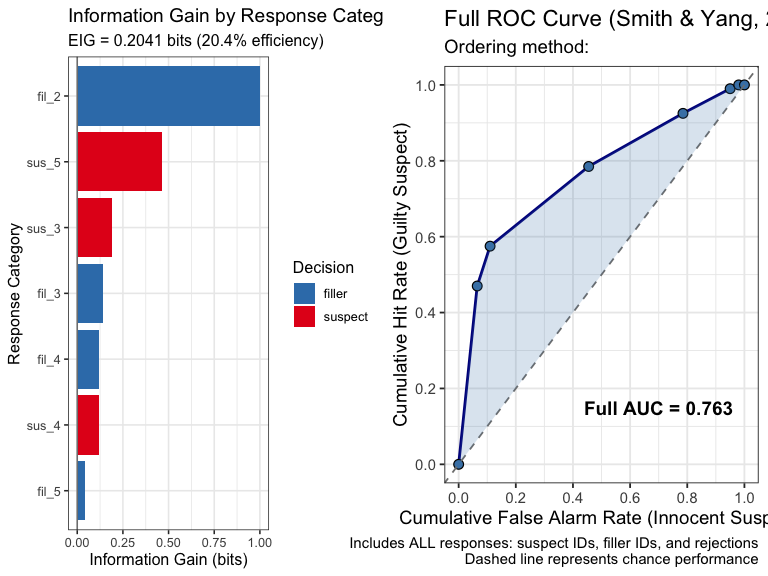

# Comparing Models for Eyewitness Identification Data

## Introduction

Eyewitness identification data can be analyzed using multiple
theoretical frameworks, each providing unique insights. This vignette
demonstrates how to use r4lineups’ model comparison framework to fit and
compare:

1.  **2-HT Model** (Winter et al., 2022): Multinomial Processing Tree
    model
2.  **EIG** (Starns et al., 2023): Expected Information Gain
3.  **Full ROC** (Smith & Yang, 2020): Receiver Operating Characteristic

The
[`compare_models()`](https://cgtza2.github.io/r4lineups/reference/compare_models.md)
function provides a unified interface for fitting all models and
generating comparison tables and visualizations.

## The Three Models

### 2-HT Model: Latent Cognitive Processes

The Two-High Threshold (2-HT) model is a multinomial processing tree
(MPT) that separates identification decisions into distinct latent
processes:

**Parameters:** - **dP**: Detection of culprit presence (0-1) - **dA**:
Detection of culprit absence (0-1) - **b**: Biased suspect selection
(0-1) - **g**: Guessing-based selection (0-1)

**Model equations** (target-present): - P(suspect ID) = dP + (1-dP) ×
\[b + (1-b) × g × (1/L)\] - P(filler ID) = (1-dP) × (1-b) × g ×
((L-1)/L) - P(reject) = (1-dP) × (1-b) × (1-g)

**Use when:** - You want to understand underlying cognitive mechanisms -
Testing theories about detection vs. guessing - Comparing conditions
with different bias levels

### EIG: Information-Theoretic Measure

Expected Information Gain quantifies how much information witness
responses provide about guilt vs. innocence using Shannon entropy:

**Formula:** EIG = Σ p(x) × \[H(prior) - H(p(guilty\|x))\]

where x = response category (e.g., “suspect_high_confidence”)

**Interpretation:** - EIG = 0: No information (responses don’t
distinguish guilty/innocent) - EIG = 1: Perfect information (complete
resolution of uncertainty) - Higher EIG = more diagnostic procedure

**Use when:** - Evaluating overall diagnosticity of procedures -
Comparing different identification methods - Assessing policy-relevant
cutoffs

### Full ROC: Investigator Discriminability

Full ROC uses ALL witness responses (suspect IDs, filler IDs,
rejections) to compute a threshold-free measure of discriminability:

**Measure:** - AUC (Area Under the Curve) - Range: 0.5 (chance) to 1.0
(perfect)

**Use when:** - Measuring investigator discriminability - Comparing
system variables (lineup procedures) - Need threshold-free performance
measure

## Basic Model Comparison

### Loading Data

``` r

library(r4lineups)

# Simulate example dataset with proper structure
set.seed(2024)
lineup_data <- simulate_lineup_data(
  n_tp = 200,
  n_ta = 200,
  d_prime = 1.5,
  lineup_size = 6,
  conf_levels = 5
)

# View structure
head(lineup_data)
#> 
#> === Simulated Lineup Data ===
#> 
#> Simulation Parameters:
#>   Target-present lineups: 200 
#>   Target-absent lineups: 200 
#>   d': 1.5 
#>   Criteria: 0, 0.5, 1, 1.5, 2 
#>   Lineup size: 6 
#>   Decision rule: max 
#>   Confidence levels: 5 
#> 
#> Data Summary:
#>   Total trials: 6 
#>   Target-present:
#>     Suspect IDs: 1 
#>     Filler IDs: 0 
#>     Rejections: 0 
#>   Target-absent:
#>     Suspect IDs: 0 
#>     Filler IDs: 5 
#>     Rejections: 0 
#> 
#>   Suspect ID Accuracy: 0.545 
#> 
#> First 10 rows:
#>   participant_id target_present identification confidence
#> 1            212          FALSE         filler          2
#> 2            173           TRUE        suspect          4
#> 3            388          FALSE         filler          2
#> 4            280          FALSE         filler          3
#> 5            277          FALSE         filler          2
#> 6            350          FALSE         filler          3
str(lineup_data)
#> Classes 'simulated_lineup_data' and 'data.frame':    400 obs. of  4 variables:
#>  $ participant_id: int  212 173 388 280 277 350 60 12 81 331 ...
#>  $ target_present: logi  FALSE TRUE FALSE FALSE FALSE FALSE ...
#>  $ identification: chr  "filler" "suspect" "filler" "filler" ...
#>  $ confidence    : int  2 4 2 3 2 3 3 3 4 3 ...
#>  - attr(*, "simulation_params")=List of 9
#>   ..$ n_tp         : int 200
#>   ..$ n_ta         : int 200
#>   ..$ d_prime      : num 1.5
#>   ..$ c_criterion  : num 0
#>   ..$ criteria     : num [1:5] 0 0.5 1 1.5 2
#>   ..$ lineup_size  : int 6
#>   ..$ conf_levels  : int 5
#>   ..$ decision_rule: chr "max"
#>   ..$ seed         : NULL
```

### Comparing All Models

``` r

# Fit all three models
comparison <- compare_models(
  lineup_data,
  models = c("2ht", "eig", "fullroc"),
  lineup_size = 6,
  prior_guilt = 0.5
)

# View comparison table
print(comparison)
#> 
#> === Lineup Model Comparison ===
#> 
#> Models fit: eig, fullroc 
#> Sample size: 400 
#> Lineup size: 6 
#> 
#> Comparison Table:
#>                          Model                   Measure   Value
#>      EIG (Starns et al., 2023) Expected Information Gain  0.2116
#>      EIG (Starns et al., 2023)    Information Efficiency 21.2000
#>      EIG (Starns et al., 2023)             Prior Entropy  1.0000
#>  Full ROC (Smith & Yang, 2020)                  Full AUC  0.7706
#>  Full ROC (Smith & Yang, 2020)          Operating Points 11.0000
#>  Full ROC (Smith & Yang, 2020)              Max Hit Rate  1.0000
#>               Interpretation
#>      Higher is better (bits)
#>          Percentage (0-100%)
#>          Maximum possible IG
#>       Higher is better (0-1)
#>  Number of decision criteria
#>             Cumulative (0-1)
#> 
#> Metrics describe different estimands and are not a single model-selection scale.
#> 
#> Access fitted models via: $fitted_models$<model_name>
#> Available models: eig, fullroc
```

### Detailed Summary

``` r

# More detailed output
summary(comparison)
#> 
#> === Model Comparison Summary ===
#> 
#> Dataset:
#>   Total observations: 400 
#>   Target-present: 200 
#>   Target-absent: 200 
#>   Lineup size: 6 
#> 
#> Models fitted: 2 
#>    eig, fullroc 
#> 
#> --- EIG Summary ---
#>   EIG: 0.2116 bits
#>   Information efficiency: 21.2 %
#>   Number of response categories: 11 
#> 
#> --- Full ROC Summary ---
#>   Full AUC: 0.7706 
#>   Operating points: 11 
#>   Ordering method: diagnosticity 
#> 
#> ---
#> Interpretation Guidance:
#>   - 2-HT: AIC/BIC are comparable only to other likelihood models fit to the same outcomes
#>   - EIG: Higher values = more informative procedure
#>   - Full ROC: Higher AUC = better investigator discriminability
#> 
#> Each model provides different insights -- consider using multiple models.
```

### Visualizing Model Comparisons

``` r

# Side-by-side plots
plot(comparison, ncol = 2)
```



## Individual Model Access

### 2-HT Model Results

``` r

# Access 2-HT model
model_2ht <- comparison$fitted_models$`2ht`

if (!is.null(model_2ht) && !is.null(model_2ht$parameters)) {
  # View parameters
  cat("2-HT Parameters:\n")
  print(round(model_2ht$parameters, 3))

  # Standard errors
  cat("\nStandard Errors:\n")
  print(round(model_2ht$se, 3))

  # Model fit
  cat("\nModel Fit:\n")
  cat("  AIC:", round(model_2ht$aic, 2), "\n")
  cat("  BIC:", round(model_2ht$bic, 2), "\n")
  cat("  Log-likelihood:", round(model_2ht$loglik, 2), "\n")
} else {
  cat("2-HT model fitting did not converge with this dataset.\n")
}
#> 2-HT model fitting did not converge with this dataset.
```

**Interpreting 2-HT parameters (when available):**

- **dP**: Probability of detecting guilty suspect
- **dA**: Probability of detecting innocent suspect
- **b**: Bias toward suspect
- **g**: Tendency to guess vs. reject

### EIG Results

``` r

# Access EIG model
model_eig <- comparison$fitted_models$eig

# View EIG value
cat("Expected Information Gain:", round(model_eig$eig, 4), "bits\n")
#> Expected Information Gain: 0.2116 bits
cat("Information Efficiency:",
    round(model_eig$eig / model_eig$prior_entropy * 100, 1), "%\n")
#> Information Efficiency: 21.2 %

# Most informative responses
cat("\nTop 5 most informative response categories:\n")
#> 
#> Top 5 most informative response categories:
print(head(model_eig$response_data[, c("response", "information_gain",
                                        "posterior_guilty")], 5))
#> # A tibble: 5 × 3
#>   response  information_gain posterior_guilty
#>   <chr>                <dbl>            <dbl>
#> 1 reject_1             1                0    
#> 2 suspect_1            1                0    
#> 3 suspect_4            0.670            0.939
#> 4 suspect_5            0.441            0.870
#> 5 filler_1             0.350            0.167
```

**Interpreting EIG:**

- Total information provided: 0.212 bits
- Efficiency: 21.2% of maximum possible
- Most informative responses push posterior beliefs strongly toward
  guilt or innocence

### Full ROC Results

``` r

# Access Full ROC model
model_fullroc <- comparison$fitted_models$fullroc

# View AUC
cat("Full ROC AUC:", round(model_fullroc$auc, 4), "\n")
#> Full ROC AUC: 0.7706
cat("Operating Points:", model_fullroc$summary$n_operating_points, "\n")
#> Operating Points: 11

# View diagnosticity table (top 10 points)
cat("\nTop 10 most diagnostic evidence categories:\n")
#> 
#> Top 10 most diagnostic evidence categories:
print(head(model_fullroc$diagnosticity_table[, c("evidence_label",
                                                  "diagnosticity_ratio")], 10))
#>    evidence_label diagnosticity_ratio
#> 10      suspect_4          15.5000000
#> 13      suspect_5           6.6666667
#> 7       suspect_3           2.3750000
#> 4       suspect_2           1.0000000
#> 14       filler_5           0.6363636
#> 11       filler_4           0.5675676
#> 8        filler_3           0.5384615
#> 5        filler_2           0.3673469
#> 2        filler_1           0.2000000
#> 1       suspect_1           0.0000000
```

**Interpreting Full ROC:**

- AUC = 0.771: Investigator’s ability to discriminate
- Values closer to 1.0 indicate better discriminability
- All witness responses contribute to overall discriminability

## Method-Choice Guidance

These methods estimate different quantities; their displayed numbers are
not a common model-selection scale and the wrapper does not declare a
“best model.”

### When to Use Each Model

**Use 2-HT when:** - Testing cognitive theories (detection, guessing,
bias) - Need to separate memory from response bias - Comparing
procedures that might differ in bias - Want to understand latent
psychological processes

**Use EIG when:** - Evaluating overall diagnosticity - Comparing
identification procedures - Need a single summary measure - Want
information-theoretic interpretation

**Use Full ROC when:** - Need threshold-free discriminability measure -
Comparing system variables - Want to use all available information -
Policy/practical decision-making focus

### Comparing Model Fits

The 2-HT fit reports AIC/BIC, but these values are comparative rather
than absolute. They can only be compared with alternative likelihood
models fitted to the same observations and outcome representation; they
cannot be compared with EIG or AUC. A single-condition 2-HT fit is
saturated.

``` r

if ("2ht" %in% comparison$models_fit) {
  cat("2-HT Model Fit:\n")
  cat("  AIC:", round(comparison$fitted_models$`2ht`$aic, 2), "\n")
  cat("  BIC:", round(comparison$fitted_models$`2ht`$bic, 2), "\n")
  cat("\nUse only for comparisons with compatible likelihood models\n")
}
```

## Advanced Usage

### Fitting Specific Models Only

``` r

# Fit only 2-HT and EIG (skip Full ROC)
comparison_subset <- compare_models(
  lineup_data,
  models = c("2ht", "eig"),
  lineup_size = 6,
  prior_guilt = 0.5
)

print(comparison_subset)
#> 
#> === Lineup Model Comparison ===
#> 
#> Models fit: eig 
#> Sample size: 400 
#> Lineup size: 6 
#> 
#> Comparison Table:
#>                      Model                   Measure   Value
#>  EIG (Starns et al., 2023) Expected Information Gain  0.2116
#>  EIG (Starns et al., 2023)    Information Efficiency 21.2000
#>  EIG (Starns et al., 2023)             Prior Entropy  1.0000
#>           Interpretation
#>  Higher is better (bits)
#>      Percentage (0-100%)
#>      Maximum possible IG
#> 
#> Metrics describe different estimands and are not a single model-selection scale.
#> 
#> Access fitted models via: $fitted_models$<model_name>
#> Available models: eig
```

### Using Confidence Bins

``` r

# Bin confidence for EIG and Full ROC
comparison_binned <- compare_models(
  lineup_data,
  models = c("eig", "fullroc"),
  lineup_size = 6,
  confidence_bins = c(0, 40, 70, 100)  # Low, medium, high
)

cat("Binned confidence results:\n")
#> Binned confidence results:
print(comparison_binned)
#> 
#> === Lineup Model Comparison ===
#> 
#> Models fit: eig, fullroc 
#> Sample size: 400 
#> Lineup size: 6 
#> 
#> Comparison Table:
#>                          Model                   Measure   Value
#>      EIG (Starns et al., 2023) Expected Information Gain  0.1659
#>      EIG (Starns et al., 2023)    Information Efficiency 16.6000
#>      EIG (Starns et al., 2023)             Prior Entropy  1.0000
#>  Full ROC (Smith & Yang, 2020)                  Full AUC  0.7246
#>  Full ROC (Smith & Yang, 2020)          Operating Points  3.0000
#>  Full ROC (Smith & Yang, 2020)              Max Hit Rate  1.0000
#>               Interpretation
#>      Higher is better (bits)
#>          Percentage (0-100%)
#>          Maximum possible IG
#>       Higher is better (0-1)
#>  Number of decision criteria
#>             Cumulative (0-1)
#> 
#> Metrics describe different estimands and are not a single model-selection scale.
#> 
#> Access fitted models via: $fitted_models$<model_name>
#> Available models: eig, fullroc
```

### Custom Prior for EIG

``` r

# Use different prior probability for EIG
comparison_prior <- compare_models(
  lineup_data,
  models = "eig",
  prior_guilt = 0.3  # Assume 30% base rate
)

cat("EIG with prior = 0.3:\n")
#> EIG with prior = 0.3:
print(comparison_prior$fitted_models$eig$eig)
#> [1] 0.1904357
```

## Simulated Data Example

### Comparing Models with Known Parameters

``` r

# Simulate data with known d' = 1.5
set.seed(2026)
sim_data <- simulate_lineup_data(
  n_tp = 200,
  n_ta = 200,
  d_prime = 1.5,
  lineup_size = 6,
  conf_levels = 5
)

# Fit all models
sim_comparison <- compare_models(
  sim_data,
  models = c("2ht", "eig", "fullroc"),
  lineup_size = 6
)

print(sim_comparison)
#> 
#> === Lineup Model Comparison ===
#> 
#> Models fit: eig, fullroc 
#> Sample size: 400 
#> Lineup size: 6 
#> 
#> Comparison Table:
#>                          Model                   Measure   Value
#>      EIG (Starns et al., 2023) Expected Information Gain  0.2393
#>      EIG (Starns et al., 2023)    Information Efficiency 23.9000
#>      EIG (Starns et al., 2023)             Prior Entropy  1.0000
#>  Full ROC (Smith & Yang, 2020)                  Full AUC  0.8038
#>  Full ROC (Smith & Yang, 2020)          Operating Points 11.0000
#>  Full ROC (Smith & Yang, 2020)              Max Hit Rate  1.0000
#>               Interpretation
#>      Higher is better (bits)
#>          Percentage (0-100%)
#>          Maximum possible IG
#>       Higher is better (0-1)
#>  Number of decision criteria
#>             Cumulative (0-1)
#> 
#> Metrics describe different estimands and are not a single model-selection scale.
#> 
#> Access fitted models via: $fitted_models$<model_name>
#> Available models: eig, fullroc
```

### Parameter Recovery Check

``` r

# Check if 2-HT model recovers reasonable parameters
if ("2ht" %in% sim_comparison$models_fit) {
  cat("Known d' = 1.5 (moderate discriminability)\n")
  cat("Recovered dP =", round(sim_comparison$fitted_models$`2ht`$parameters["dP"], 3), "\n")
  cat("Expected: Moderate dP for moderate d'\n")
}
```

## Practical Examples

### Example 1: Evaluating a Lineup Procedure

Research question: How well does this lineup procedure discriminate
between guilty and innocent suspects?

``` r

# Fit all models to assess procedure
procedure_eval <- compare_models(
  lineup_data,
  models = c("2ht", "eig", "fullroc")
)

# Interpretation
cat("Procedure Evaluation:\n\n")
#> Procedure Evaluation:

if ("2ht" %in% procedure_eval$models_fit) {
  cat("2-HT: dP =", round(procedure_eval$fitted_models$`2ht`$parameters["dP"], 2),
      "\n  → Detection ability is",
      ifelse(procedure_eval$fitted_models$`2ht`$parameters["dP"] > 0.5, "good", "moderate"), "\n\n")
}

if ("eig" %in% procedure_eval$models_fit) {
  cat("EIG =", round(procedure_eval$fitted_models$eig$eig, 3), "bits\n")
  cat("  → Provides",
      round(procedure_eval$fitted_models$eig$eig /
              procedure_eval$fitted_models$eig$prior_entropy * 100, 0),
      "% of maximum information\n\n")
}
#> EIG = 0.212 bits
#>   → Provides 21 % of maximum information

if ("fullroc" %in% procedure_eval$models_fit) {
  cat("Full ROC AUC =", round(procedure_eval$fitted_models$fullroc$auc, 3), "\n")
  cat("  → Discriminability is",
      ifelse(procedure_eval$fitted_models$fullroc$auc > 0.75, "good", "moderate"), "\n")
}
#> Full ROC AUC = 0.771 
#>   → Discriminability is good
```

### Example 2: Identifying Sources of Bias

Use 2-HT model to check for bias:

``` r

if ("2ht" %in% comparison$models_fit) {
  bias_param <- comparison$fitted_models$`2ht`$parameters["b"]

  cat("Bias Parameter (b) =", round(bias_param, 3), "\n\n")

  if (bias_param < 0.1) {
    cat("Interpretation: Low bias - suspect does not stand out unfairly\n")
  } else if (bias_param > 0.3) {
    cat("Interpretation: High bias - suspect may stand out unfairly\n")
    cat("Consider: Lineup construction, suspect appearance\n")
  } else {
    cat("Interpretation: Moderate bias level\n")
  }
}
```

### Example 3: Comparing Detection vs. Guessing

``` r

if ("2ht" %in% comparison$models_fit) {
  dP <- comparison$fitted_models$`2ht`$parameters["dP"]
  g <- comparison$fitted_models$`2ht`$parameters["g"]

  cat("Detection (dP) =", round(dP, 3), "\n")
  cat("Guessing (g) =", round(g, 3), "\n\n")

  cat("Interpretation:\n")
  if (dP > g) {
    cat("  Memory-based identification dominates\n")
  } else {
    cat("  Guessing plays a significant role\n")
  }
}
```

## Formatted Comparison Tables

### Console Format

``` r

# Console-friendly table
table_console <- format_comparison_table(comparison, format = "console")
print(table_console)
#>                           Model                   Measure   Value
#> 1     EIG (Starns et al., 2023) Expected Information Gain  0.2116
#> 2     EIG (Starns et al., 2023)    Information Efficiency 21.2000
#> 3     EIG (Starns et al., 2023)             Prior Entropy  1.0000
#> 4 Full ROC (Smith & Yang, 2020)                  Full AUC  0.7706
#> 5 Full ROC (Smith & Yang, 2020)          Operating Points 11.0000
#> 6 Full ROC (Smith & Yang, 2020)              Max Hit Rate  1.0000
#>                Interpretation
#> 1     Higher is better (bits)
#> 2         Percentage (0-100%)
#> 3         Maximum possible IG
#> 4      Higher is better (0-1)
#> 5 Number of decision criteria
#> 6            Cumulative (0-1)
```

### Markdown Format

``` r

# Markdown format for reports
if (requireNamespace("knitr", quietly = TRUE)) {
  table_md <- format_comparison_table(comparison, format = "markdown")
  cat(table_md)
}
```

\|Model \|Measure \| Value\|Interpretation \|
\|:—————————–\|:————————-\|——-:\|:—————————\| \|EIG (Starns et al.,
2023) \|Expected Information Gain \| 0.2116\|Higher is better (bits) \|
\|EIG (Starns et al., 2023) \|Information Efficiency \|
21.2000\|Percentage (0-100%) \| \|EIG (Starns et al., 2023) \|Prior
Entropy \| 1.0000\|Maximum possible IG \| \|Full ROC (Smith & Yang,
2020) \|Full AUC \| 0.7706\|Higher is better (0-1) \| \|Full ROC (Smith
& Yang, 2020) \|Operating Points \| 11.0000\|Number of decision criteria
\| \|Full ROC (Smith & Yang, 2020) \|Max Hit Rate \| 1.0000\|Cumulative
(0-1) \|

## Interpretation Guidelines

### 2-HT Parameters

**dP (Detection of Presence)** - 0.0-0.3: Poor detection - 0.3-0.5:
Moderate detection - 0.5-0.7: Good detection - 0.7-1.0: Excellent
detection

**dA (Detection of Absence)** - 0.0-0.2: Poor rejection ability -
0.2-0.4: Moderate rejection ability - 0.4+: Good rejection ability

**b (Bias)** - 0.0-0.1: Low bias (good lineup) - 0.1-0.3: Moderate
bias - 0.3+: High bias (problematic lineup)

**g (Guessing)** - 0.0-0.3: Conservative (prefer rejection) - 0.3-0.7:
Moderate - 0.7-1.0: Liberal (prefer selection)

### EIG Values

- **0.0-0.1 bits**: Very low diagnosticity
- **0.1-0.3 bits**: Low diagnosticity
- **0.3-0.5 bits**: Moderate diagnosticity
- **0.5-0.7 bits**: Good diagnosticity
- **0.7+ bits**: Excellent diagnosticity

### Full ROC AUC

- **0.50**: Chance performance
- **0.50-0.60**: Poor discriminability
- **0.60-0.70**: Fair discriminability
- **0.70-0.80**: Good discriminability
- **0.80-0.90**: Very good discriminability
- **0.90-1.00**: Excellent discriminability

## Common Pitfalls

### 1. Insufficient Sample Size

``` r

# Small sample may lead to unreliable estimates
small_data <- simulate_lineup_data(n_tp = 30, n_ta = 30, d_prime = 1.5, conf_levels = 5)

small_comparison <- compare_models(
  small_data,
  models = c("2ht", "eig"),
  show_warnings = FALSE
)

cat("Warning: Small samples (n=60) may produce unstable parameter estimates\n")
#> Warning: Small samples (n=60) may produce unstable parameter estimates
cat("Recommend: n ≥ 100 per condition for reliable model fitting\n")
#> Recommend: n ≥ 100 per condition for reliable model fitting
```

### 2. Model Convergence Issues

If 2-HT model fails to converge: - Check data quality (sufficient
variability) - Try different starting parameters - Ensure adequate
sample size - Consider data preprocessing

### 3. Comparing Non-Comparable Measures

``` r

cat("Important: Don't directly compare across models!\n\n")
#> Important: Don't directly compare across models!
cat("✗ Wrong: 'dP = 0.6 is better than EIG = 0.4'\n")
#> ✗ Wrong: 'dP = 0.6 is better than EIG = 0.4'
cat("  → These are different scales and constructs\n\n")
#>   → These are different scales and constructs
cat("✓ Right: 'dP = 0.6 indicates good detection AND\n")
#> ✓ Right: 'dP = 0.6 indicates good detection AND
cat("          EIG = 0.4 indicates moderate diagnosticity'\n")
#>           EIG = 0.4 indicates moderate diagnosticity'
cat("  → Each model provides unique insights\n")
#>   → Each model provides unique insights
```

## Best Practices

### 1. Fit Multiple Models

Don’t rely on a single model—each provides unique insights:

``` r

# Always fit at least 2-3 models
comprehensive <- compare_models(
  lineup_data,
  models = c("2ht", "eig", "fullroc")
)

cat("Fitting multiple models provides:\n")
#> Fitting multiple models provides:
cat("  • Process-level understanding (2-HT)\n")
#>   • Process-level understanding (2-HT)
cat("  • Overall diagnosticity (EIG)\n")
#>   • Overall diagnosticity (EIG)
cat("  • Threshold-free performance (Full ROC)\n")
#>   • Threshold-free performance (Full ROC)
```

### 2. Report All Model Results

When publishing, report results from all fitted models:

``` r

cat("In your paper, report:\n")
#> In your paper, report:
cat("  • 2-HT: Parameters with SE, AIC/BIC, convergence\n")
#>   • 2-HT: Parameters with SE, AIC/BIC, convergence
cat("  • EIG: Value in bits, efficiency percentage\n")
#>   • EIG: Value in bits, efficiency percentage
cat("  • Full ROC: AUC, number of operating points\n")
#>   • Full ROC: AUC, number of operating points
cat("  • Interpretation of each model's insights\n")
#>   • Interpretation of each model's insights
```

### 3. Check Model Assumptions

``` r

if ("2ht" %in% comparison$models_fit) {
  # Check goodness of fit
  cat("2-HT Goodness of Fit:\n")
  summary(comparison$fitted_models$`2ht`)

  cat("\nIf χ² p-value < 0.05: Model may not fit well\n")
  cat("Consider: Data quality, model assumptions\n")
}
```

## Summary

**Key Functions:** -
[`compare_models()`](https://cgtza2.github.io/r4lineups/reference/compare_models.md):
Fit multiple models -
[`print.model_comparison()`](https://cgtza2.github.io/r4lineups/reference/print.model_comparison.md):
View comparison table -
[`summary.model_comparison()`](https://cgtza2.github.io/r4lineups/reference/summary.model_comparison.md):
Detailed results -
[`plot.model_comparison()`](https://cgtza2.github.io/r4lineups/reference/plot.model_comparison.md):
Visualizations -
[`format_comparison_table()`](https://cgtza2.github.io/r4lineups/reference/format_comparison_table.md):
Publication tables

**When to Use Each Model:** - **2-HT**: Understanding cognitive
processes - **EIG**: Overall diagnosticity assessment - **Full ROC**:
Threshold-free discriminability

**Best Practices:** - Fit multiple models for comprehensive analysis -
Report all model results - Check model fit and convergence - Use
adequate sample sizes (n ≥ 100 per condition) - Interpret each model’s
unique insights

## References

Winter, K., Menne, N. M., Bell, R., & Buchner, A. (2022). Experimental
validation of a multinomial processing tree model for analyzing
eyewitness identification decisions. *Scientific Reports, 12*, 15571.

Starns, J. J., Cohen, A. L., & Rotello, C. M. (2023). A complete method
for assessing the effectiveness of eyewitness identification procedures:
Expected information gain. *Psychological Review, 130*(3), 677–719.
<https://doi.org/10.1037/rev0000332>

Smith, A. M., Yang, Y., & Wells, G. L. (2020). Distinguishing between
investigator discriminability and eyewitness discriminability: A method
for creating full receiver operating characteristic curves of lineup
identification performance. *Perspectives on Psychological Science,
15*(3), 589-607.

## Further Reading

- See
  [`?compare_models`](https://cgtza2.github.io/r4lineups/reference/compare_models.md)
  for complete parameter documentation
- See vignette(“simulation_power_analysis”) for data simulation
- See vignette(“pauc_comparison”) for statistical comparison of
  conditions
