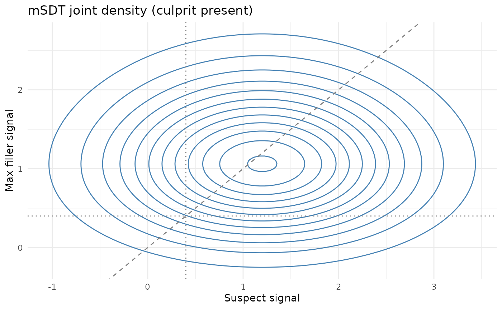
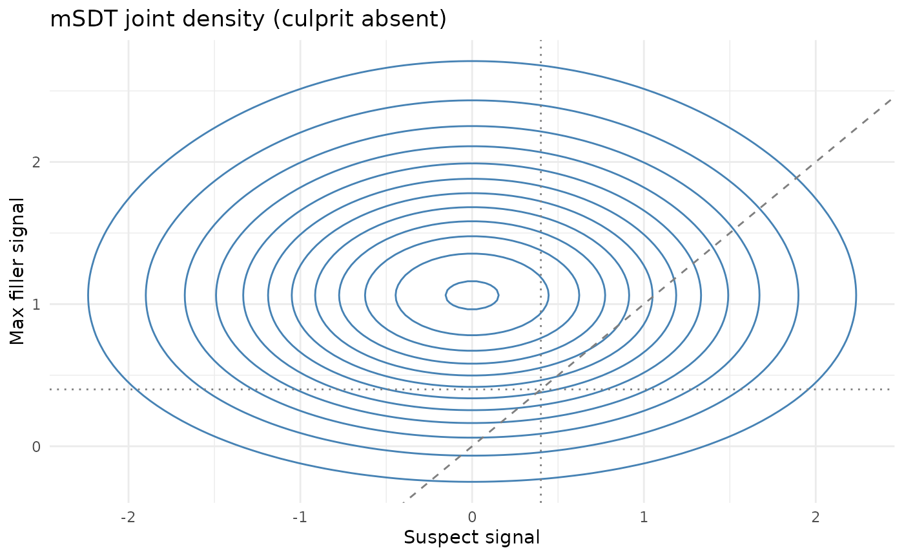

# mSDT: Multi-Item Signal Detection Theory

## Overview

This vignette introduces core utilities for the **multi-item SDT
(mSDT)** model (Yang, Burke, & Healy, 2025), focusing on components that
are mathematically well-defined under the equal-variance, independent
filler assumptions.

Key features:

- The **max filler distribution** for (m - 1) independent standard
  normal fillers
- **Parameter estimation** from rejection rates in culprit-absent and
  culprit-present lineups
- **Joint distribution visualization** (suspect vs. max filler)

## Max filler distribution

``` r

library(r4lineups)

dmax_filler(0, lineup_size = 6)
#> [1] 0.1246695
pmax_filler(0, lineup_size = 6)
#> [1] 0.03125
qmax_filler(0.5, lineup_size = 6)
#> [1] 1.128998
```

Moments are computed numerically:

``` r

max_filler_moments(6)
#> $mean
#> [1] 1.162964
#> 
#> $var
#> [1] 0.4475341
#> 
#> $skewness
#> [1] 0.3025709
```

## Estimating mSDT parameters from rejection rates

Let

- $`Pr(REJ\mid I)`$ = rejection rate in culprit-absent lineups
- $`Pr(REJ\mid G)`$ = rejection rate in culprit-present lineups

Then (Yang et al., 2025):

- $`Pr(REJ\mid I) = \Phi(\gamma)^m`$
- $`Pr(REJ\mid G) = \Phi(\gamma - d')\,\Phi(\gamma)^{m-1}`$

Use the helper:

``` r

estimate_msdt_params(pr_rej_I = 0.25, pr_rej_G = 0.15, lineup_size = 6)
#> $gamma
#> [1] 0.8193286
#> 
#> $dprime
#> [1] 0.8789708
```

**Scope of this estimator.**
[`estimate_msdt_params()`](https://cgtza2.github.io/r4lineups/reference/estimate_msdt_params.md)
is a method-of-moments estimator that is exactly identified from the two
rejection rates: the culprit-absent rejection rate fixes $`\gamma`$, and
the culprit-absent vs culprit-present rejection gap fixes $`d'`$. It is
information-lossy — it ignores the composition of choices (suspect-ID vs
filler-ID) and the spread of filler choices, which are the most
diagnostic outcomes. If you have the full response breakdown
(suspect/filler/reject counts for both lineup types), prefer the
likelihood-based fitter
[`fit_max_sdt()`](https://cgtza2.github.io/r4lineups/reference/fit_max_sdt.md),
which uses all outcome counts, or the 2-HT model
([`fit_winter_2ht()`](https://cgtza2.github.io/r4lineups/reference/fit_winter_2ht.md)).

## Joint distribution plots

``` r

plot_msdt_joint(dprime = 1.2, gamma = 0.4, lineup_size = 6,
                lineup_type = "culprit_present")
```



``` r

plot_msdt_joint(dprime = 1.2, gamma = 0.4, lineup_size = 6,
                lineup_type = "culprit_absent")
```



## Notes

These functions implement the **core** mSDT assumptions (equal variance,
independent filler signals). Correlated signals, unequal variances, and
other extensions discussed in the paper are not yet implemented and
should be treated as experimental extensions.
