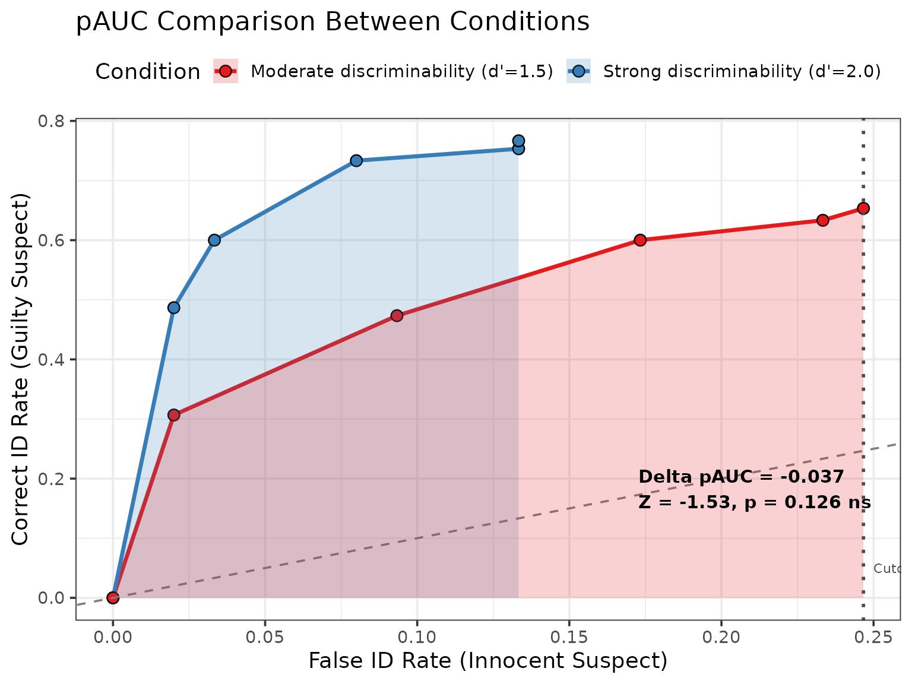
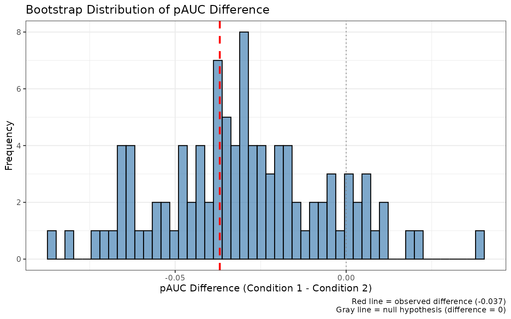

# Statistical Comparison of ROC Curves (pAUC Analysis)

## Introduction

When evaluating eyewitness identification procedures, we often need to
statistically compare ROC curves between conditions. For example:

- Do simultaneous lineups provide better discriminability than
  sequential lineups?
- Does increasing lineup size improve or impair performance?
- Do different retention intervals affect discriminability?

This vignette demonstrates how to use r4lineups’
[`compare_pauc()`](https://cgtza2.github.io/r4lineups/reference/compare_pauc.md)
function to rigorously test for differences in partial Area Under the
Curve (pAUC) between conditions using bootstrap-based standard errors
and z-tests.

## Statistical Framework

### The Z-Test for pAUC Differences

The comparison uses the following statistical framework:

**Test statistic:**
``` math
Z = \frac{pAUC_1 - pAUC_2}{SE(pAUC_1 - pAUC_2)}
```

**Standard errors:** - Computed via bootstrap resampling
(non-parametric) - Typically 1000-2000 bootstrap samples

**P-value:** - Two-tailed test from standard normal distribution - Null
hypothesis: pAUC₁ = pAUC₂

**Confidence interval:**
``` math
CI = (pAUC_1 - pAUC_2) \pm Z_{α/2} \times SE(difference)
```

### Why pAUC?

Partial AUC (pAUC) is preferred over full AUC for several reasons:

1.  **Policy relevance**: Focus on acceptable false ID rates (e.g.,
    ≤20%)
2.  **Practical constraints**: Avoid unrealistic operating points
3.  **Precision**: More stable estimates in the relevant region
4.  **Comparison**: Ensures fair comparison at same false ID rates

## Basic pAUC Comparison

### Loading Data

``` r

library(r4lineups)

# We'll use simulated data for demonstration
set.seed(2026)

# Condition 1: Strong discriminability
condition1 <- simulate_lineup_data(
  n_tp = 150,
  n_ta = 150,
  d_prime = 2.0,
  lineup_size = 6,
  conf_levels = 5
)

# Condition 2: Moderate discriminability
condition2 <- simulate_lineup_data(
  n_tp = 150,
  n_ta = 150,
  d_prime = 1.5,
  lineup_size = 6,
  conf_levels = 5
)
```

### Comparing pAUC

``` r

# Compare the two conditions
comparison <- compare_pauc(
  condition1,
  condition2,
  lineup_size = 6,
  label1 = "Strong discriminability (d'=2.0)",
  label2 = "Moderate discriminability (d'=1.5)",
  n_bootstrap = 100,  # Use 2000+ for publications
  seed = 123
)

# View results
print(comparison)
#> 
#> === pAUC Comparison Analysis ===
#> 
#> Conditions:
#>   Strong discriminability (d'=2.0): pAUC = 0.0832 (SE = 0.0202)
#>   Moderate discriminability (d'=1.5): pAUC = 0.1202 (SE = 0.0123)
#> 
#> Difference: -0.037
#>   95% CI: [-0.0843, 0.0104]
#> 
#> Statistical Test:
#>   Z = -1.531
#>   p-value = 0.1258
#> 
#> Interpretation: Moderate discriminability (d'=1.5) has higher discriminability than Strong discriminability (d'=2.0) (ns)
#> 
#> Max false ID rate cutoff: 0.2467
#> Bootstrap samples: 100
#> 
#> Note: *** p<0.001, ** p<0.01, * p<0.05, ns = not significant
```

### Interpreting Results

``` r

cat("Statistical Test Results:\n\n")
#> Statistical Test Results:
cat("pAUC Difference:", round(comparison$pauc_diff, 4), "\n")
#> pAUC Difference: -0.037
cat("Z-score:", round(comparison$z_score, 3), "\n")
#> Z-score: -1.531
cat("P-value:", format.pval(comparison$p_value, digits = 4), "\n")
#> P-value: 0.1258
cat("95% CI: [", round(comparison$ci_diff["lower"], 4), ", ",
    round(comparison$ci_diff["upper"], 4), "]\n\n", sep = "")
#> 95% CI: [-0.0843, 0.0104]

if (comparison$p_value < 0.05) {
  cat("Conclusion: Significant difference between conditions (p < 0.05)\n")
} else {
  cat("Conclusion: No significant difference between conditions (p ≥ 0.05)\n")
}
#> Conclusion: No significant difference between conditions (p ≥ 0.05)
```

### Detailed Summary

``` r

# More detailed output including effect sizes
summary(comparison)
#> 
#> === pAUC Comparison Summary ===
#> 
#> Condition 1: Strong discriminability (d'=2.0) 
#>   Sample size: 300 
#>   Target-present: 150 
#>   Target-absent: 150 
#>   pAUC: 0.0832 
#>   SE(pAUC): 0.0202 
#>   95% CI: [0.0436, 0.1229]
#> 
#> Condition 2: Moderate discriminability (d'=1.5) 
#>   Sample size: 300 
#>   Target-present: 150 
#>   Target-absent: 150 
#>   pAUC: 0.1202 
#>   SE(pAUC): 0.0123 
#>   95% CI: [0.0961, 0.1443]
#> 
#> Difference (Strong discriminability (d'=2.0) - Moderate discriminability (d'=1.5)):
#>   Estimate: -0.037 
#>   SE(diff): 0.0241 
#>   95% CI: [-0.0843, 0.0104]
#>   Z-score: -1.531 
#>   p-value: 0.1258 
#> 
#> Effect size (d): -2.208 
#> 
#> Analysis Details:
#>   Max false ID rate cutoff: 0.2467 
#>   Bootstrap samples: 100 
#>   Confidence level:95%
```

### Visualization

``` r

# Side-by-side ROC curves with shaded pAUC regions
plot(comparison, show_cutoff = TRUE, show_test_results = TRUE)
```



## Customizing the Comparison

### Specifying False ID Rate Cutoff

You can specify a policy-relevant false ID rate cutoff:

``` r

# Compare up to 20% false ID rate (common policy threshold)
comparison_20 <- compare_pauc(
  condition1,
  condition2,
  max_false_id_rate = 0.20,  # 20% cutoff
  label1 = "Strong",
  label2 = "Moderate",
  n_bootstrap = 100,
  seed = 456
)

cat("pAUC up to 20% false ID rate:\n")
#> pAUC up to 20% false ID rate:
print(comparison_20)
#> 
#> === pAUC Comparison Analysis ===
#> 
#> Conditions:
#>   Strong: pAUC = 0.0832 (SE = 0.0169)
#>   Moderate: pAUC = 0.0908 (SE = 0.0091)
#> 
#> Difference: -0.0076
#>   95% CI: [-0.0483, 0.0332]
#> 
#> Statistical Test:
#>   Z = -0.364
#>   p-value = 0.7156
#> 
#> Interpretation: Moderate has higher discriminability than Strong (ns)
#> 
#> Max false ID rate cutoff: 0.2
#> Bootstrap samples: 100
#> 
#> Note: *** p<0.001, ** p<0.01, * p<0.05, ns = not significant
```

Common policy-relevant cutoffs: - **5% (0.05)**: Very conservative -
**10% (0.10)**: Conservative - **20% (0.20)**: Moderate - **33%
(0.33)**: Liberal

### Adjusting Bootstrap Samples

``` r

# Quick exploratory analysis (fewer samples)
quick_comparison <- compare_pauc(
  condition1,
  condition2,
  n_bootstrap = 100,  # Fast vignette setting
  seed = 789
)

cat("Quick comparison (100 bootstrap samples):\n")
#> Quick comparison (100 bootstrap samples):
cat("  p-value:", format.pval(quick_comparison$p_value), "\n")
#>   p-value: 0.13338

# Vs. publication-quality (more samples)
# publication_comparison <- compare_pauc(
#   condition1,
#   condition2,
#   n_bootstrap = 2000,  # More stable
#   seed = 789
# )
```

Recommendations: - **Exploratory**: 500-1000 samples - **Planning**:
1000-1500 samples - **Publication**: 2000+ samples

## Real-World Examples

### Example 1: Simultaneous vs. Sequential Lineups

``` r

# Simulate simultaneous lineup (potentially better)
simultaneous <- simulate_lineup_data(
  n_tp = 200, n_ta = 200,
  d_prime = 1.8,
  lineup_size = 6,
  conf_levels = 5
)

# Simulate sequential lineup (potentially worse)
sequential <- simulate_lineup_data(
  n_tp = 200, n_ta = 200,
  d_prime = 1.5,
  lineup_size = 6,
  conf_levels = 5
)

# Compare
lineup_comparison <- compare_pauc(
  simultaneous,
  sequential,
  label1 = "Simultaneous",
  label2 = "Sequential",
  n_bootstrap = 1000,
  seed = 111
)

print(lineup_comparison)
plot(lineup_comparison)
```

### Example 2: Lineup Size Comparison

``` r

# 6-person lineup
lineup_6 <- simulate_lineup_data(
  n_tp = 150, n_ta = 150,
  d_prime = 1.6,
  lineup_size = 6,
  conf_levels = 5
)

# 8-person lineup (harder task)
lineup_8 <- simulate_lineup_data(
  n_tp = 150, n_ta = 150,
  d_prime = 1.6,
  lineup_size = 8,
  conf_levels = 5
)

# Compare at same false ID rate
size_comparison <- compare_pauc(
  lineup_6,
  lineup_8,
  max_false_id_rate = 0.15,
  label1 = "6-person lineup",
  label2 = "8-person lineup",
  n_bootstrap = 1000,
  seed = 222
)

summary(size_comparison)
```

### Example 3: Retention Interval

``` r

# Immediate test (better memory)
immediate <- simulate_lineup_data(
  n_tp = 180, n_ta = 180,
  d_prime = 2.0,
  lineup_size = 6,
  conf_levels = 5
)

# Delayed test (worse memory)
delayed <- simulate_lineup_data(
  n_tp = 180, n_ta = 180,
  d_prime = 1.3,
  lineup_size = 6,
  conf_levels = 5
)

# Compare
retention_comparison <- compare_pauc(
  immediate,
  delayed,
  label1 = "Immediate test",
  label2 = "1-week delay",
  n_bootstrap = 1000,
  seed = 333
)

print(retention_comparison)
```

## Multiple Comparisons

### Pairwise Comparisons with Adjustment

When comparing multiple conditions, adjust for multiple testing:

``` r

# Three conditions
high_d <- simulate_lineup_data(n_tp = 120, n_ta = 120, d_prime = 2.0, lineup_size = 6, conf_levels = 5)
med_d <- simulate_lineup_data(n_tp = 120, n_ta = 120, d_prime = 1.5, lineup_size = 6, conf_levels = 5)
low_d <- simulate_lineup_data(n_tp = 120, n_ta = 120, d_prime = 1.0, lineup_size = 6, conf_levels = 5)

# All pairwise comparisons
comp_high_med <- compare_pauc(high_d, med_d, label1 = "High", label2 = "Medium",
                               n_bootstrap = 500, seed = 441)
comp_high_low <- compare_pauc(high_d, low_d, label1 = "High", label2 = "Low",
                               n_bootstrap = 500, seed = 442)
comp_med_low <- compare_pauc(med_d, low_d, label1 = "Medium", label2 = "Low",
                              n_bootstrap = 500, seed = 443)

# Create summary table
comparison_table <- data.frame(
  Comparison = c("High vs Medium", "High vs Low", "Medium vs Low"),
  pAUC_diff = c(comp_high_med$pauc_diff, comp_high_low$pauc_diff, comp_med_low$pauc_diff),
  Z = c(comp_high_med$z_score, comp_high_low$z_score, comp_med_low$z_score),
  p_value = c(comp_high_med$p_value, comp_high_low$p_value, comp_med_low$p_value),
  stringsAsFactors = FALSE
)

# Apply Bonferroni correction
comparison_table$p_adjusted <- p.adjust(comparison_table$p_value, method = "bonferroni")

# Display results
cat("Multiple Comparison Results:\n")
print(comparison_table, row.names = FALSE)

cat("\nInterpretation:\n")
cat("  Use p_adjusted for significance testing\n")
cat("  Bonferroni correction: α = 0.05 / 3 comparisons = 0.0167\n")
```

## Advanced Topics

### Accessing Bootstrap Distributions

``` r

# Access bootstrap results
boot_dist <- comparison$bootstrap_results

# Summary statistics
cat("Bootstrap Distribution Summary:\n\n")
#> Bootstrap Distribution Summary:
cat("Condition 1 pAUC:\n")
#> Condition 1 pAUC:
cat("  Mean:", round(mean(boot_dist$pauc1_boot), 4), "\n")
#>   Mean: 0.0808
cat("  SD:", round(sd(boot_dist$pauc1_boot), 4), "\n\n")
#>   SD: 0.0202

cat("Condition 2 pAUC:\n")
#> Condition 2 pAUC:
cat("  Mean:", round(mean(boot_dist$pauc2_boot), 4), "\n")
#>   Mean: 0.1107
cat("  SD:", round(sd(boot_dist$pauc2_boot), 4), "\n\n")
#>   SD: 0.0123

cat("Difference:\n")
#> Difference:
cat("  Mean:", round(mean(boot_dist$diff_boot), 4), "\n")
#>   Mean: -0.0299
cat("  SD:", round(sd(boot_dist$diff_boot), 4), "\n")
#>   SD: 0.0241
```

### Visualizing Bootstrap Distributions

``` r

# Create histogram of bootstrap differences
library(ggplot2)

boot_diff_df <- data.frame(
  diff = comparison$bootstrap_results$diff_boot
)

ggplot(boot_diff_df, aes(x = diff)) +
  geom_histogram(bins = 50, fill = "steelblue", color = "black", alpha = 0.7) +
  geom_vline(xintercept = comparison$pauc_diff,
             color = "red", size = 1, linetype = "dashed") +
  geom_vline(xintercept = 0, color = "gray50", linetype = "dotted") +
  theme_bw() +
  labs(
    title = "Bootstrap Distribution of pAUC Difference",
    x = "pAUC Difference (Condition 1 - Condition 2)",
    y = "Frequency",
    caption = paste0("Red line = observed difference (",
                    round(comparison$pauc_diff, 4), ")\n",
                    "Gray line = null hypothesis (difference = 0)")
  )
```



### Confidence Level Adjustment

``` r

# Use 99% confidence interval instead of 95%
comparison_99 <- compare_pauc(
  condition1,
  condition2,
  conf_level = 0.99,  # 99% CI
  n_bootstrap = 100,
  seed = 555
)

cat("95% CI:", round(comparison$ci_diff["lower"], 4), "to",
    round(comparison$ci_diff["upper"], 4), "\n")
#> 95% CI: -0.0843 to 0.0104
cat("99% CI:", round(comparison_99$ci_diff["lower"], 4), "to",
    round(comparison_99$ci_diff["upper"], 4), "\n")
#> 99% CI: -0.0916 to 0.0177
cat("\nNote: 99% CI is wider (more conservative)\n")
#> 
#> Note: 99% CI is wider (more conservative)
```

## Power Analysis for pAUC Comparisons

Determine required sample size for detecting pAUC differences:

``` r

# Simulate various sample sizes
sample_sizes <- c(50, 100, 150, 200, 300)
power_results <- data.frame(
  n = sample_sizes,
  power = numeric(length(sample_sizes))
)

# For each sample size, run multiple comparisons
for (i in seq_along(sample_sizes)) {
  n <- sample_sizes[i]

  # Run 50 simulations (use 100+ for real studies)
  significant_count <- 0
  for (sim in 1:50) {
    # Simulate data
    data1 <- simulate_lineup_data(n, n, d_prime = 1.8, lineup_size = 6, conf_levels = 5)
    data2 <- simulate_lineup_data(n, n, d_prime = 1.5, lineup_size = 6, conf_levels = 5)

    # Test
    comp <- compare_pauc(data1, data2, n_bootstrap = 200, seed = sim)

    if (comp$p_value < 0.05) {
      significant_count <- significant_count + 1
    }
  }

  power_results$power[i] <- significant_count / 50
}

# Display results
cat("Power Analysis Results:\n")
print(power_results)

cat("\nFor 80% power, recommend n ≥", min(power_results$n[power_results$power >= 0.8]), "\n")
```

## Interpretation Guidelines

### Understanding Z-Scores

- **\|Z\| \< 1.96**: Not significant at α = 0.05 (two-tailed)
- **\|Z\| ≥ 1.96**: Significant at α = 0.05
- **\|Z\| ≥ 2.58**: Significant at α = 0.01
- **\|Z\| ≥ 3.29**: Significant at α = 0.001

### Understanding P-Values

``` r

cat("P-value Interpretation:\n\n")
#> P-value Interpretation:
cat("p < 0.001:  Very strong evidence against null hypothesis (***)\n")
#> p < 0.001:  Very strong evidence against null hypothesis (***)
cat("p < 0.01:   Strong evidence (**)\n")
#> p < 0.01:   Strong evidence (**)
cat("p < 0.05:   Moderate evidence (*)\n")
#> p < 0.05:   Moderate evidence (*)
cat("p ≥ 0.05:   Insufficient evidence (ns)\n\n")
#> p ≥ 0.05:   Insufficient evidence (ns)
cat("Note: Always report exact p-value, not just '< 0.05'\n")
#> Note: Always report exact p-value, not just '< 0.05'
```

### Effect Size Interpretation

The summary() function provides Cohen’s d equivalent:

``` r

# Effect size from summary
# summary(comparison)

cat("Cohen's d Interpretation:\n\n")
#> Cohen's d Interpretation:
cat("d ≈ 0.2:  Small effect\n")
#> d ≈ 0.2:  Small effect
cat("d ≈ 0.5:  Medium effect\n")
#> d ≈ 0.5:  Medium effect
cat("d ≈ 0.8:  Large effect\n")
#> d ≈ 0.8:  Large effect
```

## Best Practices

### 1. Pre-registration

Specify comparison plans before data collection:

``` r

cat("Pre-register:\n")
#> Pre-register:
cat("  • Primary comparison (e.g., simultaneous vs. sequential)\n")
#>   • Primary comparison (e.g., simultaneous vs. sequential)
cat("  • False ID rate cutoff (e.g., 20%)\n")
#>   • False ID rate cutoff (e.g., 20%)
cat("  • Number of bootstrap samples (e.g., 2000)\n")
#>   • Number of bootstrap samples (e.g., 2000)
cat("  • Alpha level (typically 0.05)\n")
#>   • Alpha level (typically 0.05)
cat("  • Sample size (based on power analysis)\n")
#>   • Sample size (based on power analysis)
```

### 2. Report Complete Results

Always report:

``` r

cat("In your paper, report:\n")
#> In your paper, report:
cat("  • pAUC for each condition with SE\n")
#>   • pAUC for each condition with SE
cat("  • pAUC difference with 95% CI\n")
#>   • pAUC difference with 95% CI
cat("  • Z-score and exact p-value\n")
#>   • Z-score and exact p-value
cat("  • Effect size (Cohen's d)\n")
#>   • Effect size (Cohen's d)
cat("  • Number of bootstrap samples\n")
#>   • Number of bootstrap samples
cat("  • False ID rate cutoff used\n")
#>   • False ID rate cutoff used
cat("  • Sample sizes for each condition\n")
#>   • Sample sizes for each condition
```

### 3. Check Assumptions

``` r

cat("Check:\n")
#> Check:
cat("  • Adequate sample sizes (n ≥ 100 per condition)\n")
#>   • Adequate sample sizes (n ≥ 100 per condition)
cat("  • Bootstrap distributions are approximately normal\n")
#>   • Bootstrap distributions are approximately normal
cat("  • No extreme outliers in bootstrap samples\n")
#>   • No extreme outliers in bootstrap samples
cat("  • Sufficient bootstrap samples (≥ 1000)\n")
#>   • Sufficient bootstrap samples (≥ 1000)
```

### 4. Visualize Results

``` r

cat("Always create:\n")
#> Always create:
cat("  • Side-by-side ROC curves\n")
#>   • Side-by-side ROC curves
cat("  • Shaded pAUC regions\n")
#>   • Shaded pAUC regions
cat("  • Cutoff line if applicable\n")
#>   • Cutoff line if applicable
cat("  • Test statistics on plot\n")
#>   • Test statistics on plot
cat("  • Bootstrap distribution (supplementary)\n")
#>   • Bootstrap distribution (supplementary)
```

## Common Pitfalls

### 1. Insufficient Bootstrap Samples

``` r

cat("Too few bootstrap samples lead to unstable SE estimates:\n\n")

# Compare with different bootstrap samples
comp_100 <- compare_pauc(condition1, condition2, n_bootstrap = 100, seed = 666)
comp_1000 <- compare_pauc(condition1, condition2, n_bootstrap = 1000, seed = 666)

cat("100 samples:  SE =", round(comp_100$se_diff, 5), "\n")
cat("1000 samples: SE =", round(comp_1000$se_diff, 5), "\n")
cat("\nUse ≥ 1000 samples for stable estimates\n")
```

### 2. Ignoring Multiple Testing

``` r

cat("When making multiple comparisons, adjust alpha:\n\n")
#> When making multiple comparisons, adjust alpha:
cat("3 comparisons: α = 0.05 / 3 = 0.0167\n")
#> 3 comparisons: α = 0.05 / 3 = 0.0167
cat("5 comparisons: α = 0.05 / 5 = 0.010\n")
#> 5 comparisons: α = 0.05 / 5 = 0.010
cat("10 comparisons: α = 0.05 / 10 = 0.005\n\n")
#> 10 comparisons: α = 0.05 / 10 = 0.005
cat("Or use: p.adjust(p_values, method = 'bonferroni')\n")
#> Or use: p.adjust(p_values, method = 'bonferroni')
```

### 3. Inappropriate Cutoff

``` r

cat("Choosing inappropriate false ID rate cutoffs:\n\n")
#> Choosing inappropriate false ID rate cutoffs:
cat("✗ Too high (e.g., 0.50): Includes impractical operating points\n")
#> ✗ Too high (e.g., 0.50): Includes impractical operating points
cat("✗ Too low (e.g., 0.01): May miss most of the ROC curve\n")
#> ✗ Too low (e.g., 0.01): May miss most of the ROC curve
cat("✓ Policy-relevant (e.g., 0.20): Balances coverage and practicality\n")
#> ✓ Policy-relevant (e.g., 0.20): Balances coverage and practicality
```

### 4. Small Sample Sizes

``` r

cat("Insufficient sample sizes lead to:\n")
#> Insufficient sample sizes lead to:
cat("  • Low power to detect real differences\n")
#>   • Low power to detect real differences
cat("  • Unreliable pAUC estimates\n")
#>   • Unreliable pAUC estimates
cat("  • Unstable bootstrap distributions\n\n")
#>   • Unstable bootstrap distributions
cat("Minimum recommended: n ≥ 100 per condition\n")
#> Minimum recommended: n ≥ 100 per condition
cat("Preferred: n ≥ 150-200 per condition\n")
#> Preferred: n ≥ 150-200 per condition
```

## Summary

**Key Functions:** -
[`compare_pauc()`](https://cgtza2.github.io/r4lineups/reference/compare_pauc.md):
Statistical comparison of ROC curves -
[`print.pauc_comparison()`](https://cgtza2.github.io/r4lineups/reference/print.pauc_comparison.md):
Display results -
[`summary.pauc_comparison()`](https://cgtza2.github.io/r4lineups/reference/summary.pauc_comparison.md):
Detailed output with effect sizes -
[`plot.pauc_comparison()`](https://cgtza2.github.io/r4lineups/reference/plot.pauc_comparison.md):
Visualization

**Statistical Framework:** - Z-test for pAUC differences -
Bootstrap-based standard errors - Confidence intervals - Effect size
(Cohen’s d)

**Best Practices:** - Use ≥ 1000 bootstrap samples (2000+ for
publication) - Specify policy-relevant false ID rate cutoffs - Adjust
for multiple comparisons - Report complete results including effect
sizes - Visualize comparisons

**Common Applications:** - Comparing lineup procedures - Evaluating
system variables - Testing estimator variables - Policy decision-making

## References

Mickes, L., Seale-Carlisle, T. M., Chen, X., & Boogert, S. (2024).
pyWitness 1.0: A python eyewitness identification analysis toolkit.
*Behavior Research Methods, 56*, 1533-1550.

Wixted, J. T., & Mickes, L. (2012). The field of eyewitness memory
should abandon probative value and embrace receiver operating
characteristic analysis. *Perspectives on Psychological Science, 7*(3),
275-278.

Gronlund, S. D., Wixted, J. T., & Mickes, L. (2014). Evaluating
eyewitness identification procedures using receiver operating
characteristic analysis. *Current Directions in Psychological Science,
23*(1), 3-10.

## Further Reading

- See
  [`?compare_pauc`](https://cgtza2.github.io/r4lineups/reference/compare_pauc.md)
  for complete parameter documentation
- See vignette(“simulation_power_analysis”) for power analysis
- See vignette(“model_comparison”) for comparing different models
