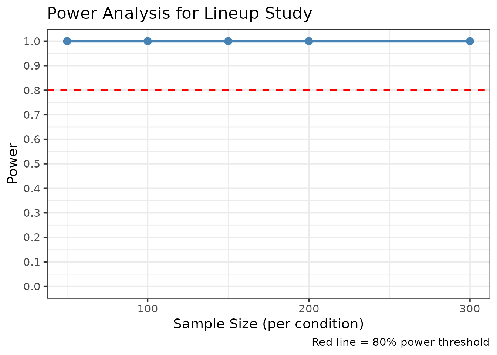
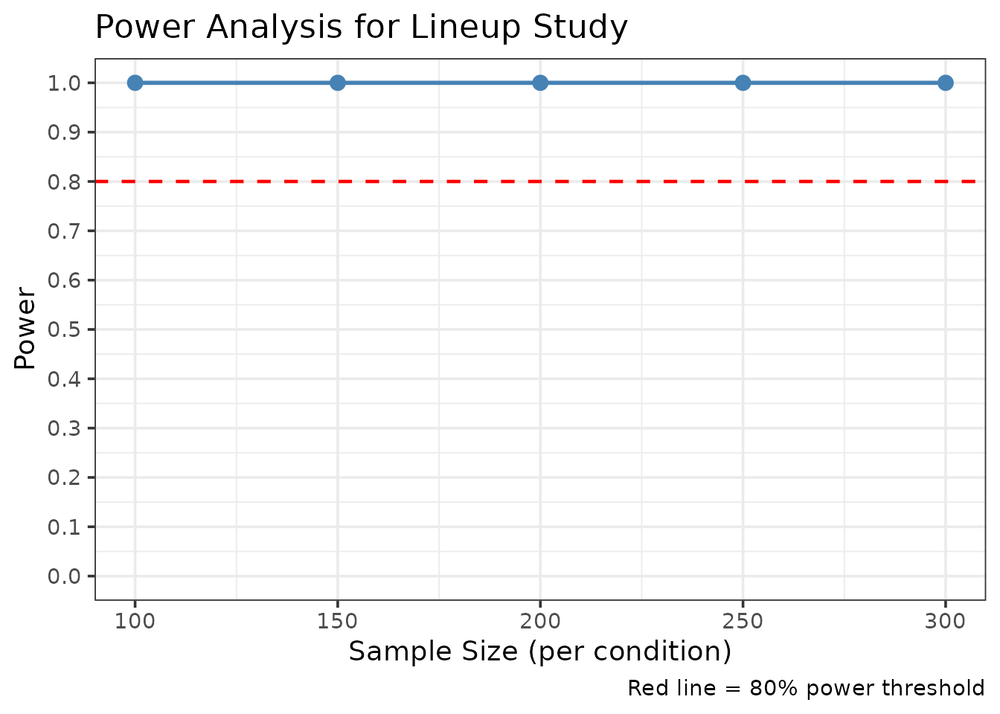
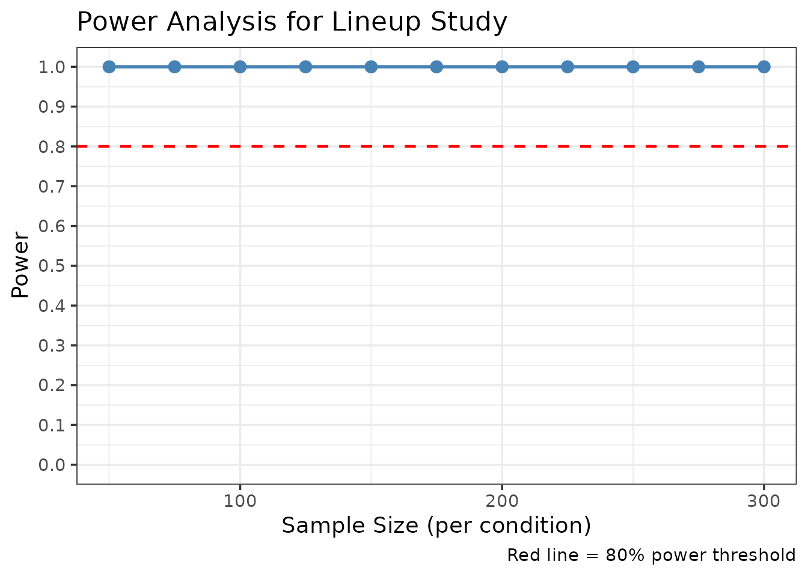

# Data Simulation and Power Analysis for Lineup Studies

## Introduction

This vignette demonstrates how to use r4lineups’ data simulation and
power analysis tools for planning eyewitness identification studies.
These tools help researchers:

- **Plan studies**: Determine required sample sizes for detecting
  effects
- **Validate methods**: Test if analyses recover known parameters
- **Explore scenarios**: Compare different experimental designs
- **Teach concepts**: Demonstrate signal detection theory principles

The simulation framework implements a Signal Detection Theory (SDT)
model with the MAX decision rule, following the methodology used in
eyewitness identification research (Wixted et al., 2018).

## Signal Detection Model

The simulation generates data using the following SDT framework:

**Memory strength distributions:** - Targets (guilty suspects):
Normal(d’, 1) - Lures (foils/innocent suspects): Normal(0, 1)

**MAX decision rule:** - The witness selects the lineup member with the
highest memory strength - If all memory strengths are below criterion c,
the lineup is rejected

**Parameters:** - `d_prime`: Discriminability between targets and lures
(higher = better memory) - `c_criterion`: Decision criterion (higher =
more conservative) - `lineup_size`: Number of lineup members -
`conf_levels`: Number of confidence scale points

## Basic Data Simulation

### Simulating a Single Dataset

``` r

library(r4lineups)

# Set seed for reproducibility
set.seed(2026)

# Simulate lineup data with moderate discriminability
sim_data <- simulate_lineup_data(
  n_tp = 200,           # 200 target-present lineups
  n_ta = 200,           # 200 target-absent lineups
  d_prime = 1.5,        # Moderate discriminability
  c_criterion = 0.5,    # Neutral criterion
  lineup_size = 6,      # Standard 6-person lineup
  conf_levels = 5       # 5-point confidence scale
)

# View structure
head(sim_data)
#> 
#> === Simulated Lineup Data ===
#> 
#> Simulation Parameters:
#>   Target-present lineups: 200 
#>   Target-absent lineups: 200 
#>   d': 1.5 
#>   Criterion: 0.5 
#>   Lineup size: 6 
#>   Decision rule: max 
#>   Confidence levels: 5 
#> 
#> Data Summary:
#>   Total trials: 6 
#>   Target-present:
#>     Suspect IDs: 1 
#>     Filler IDs: 1 
#>     Rejections: 0 
#>   Target-absent:
#>     Suspect IDs: 0 
#>     Filler IDs: 4 
#>     Rejections: 0 
#> 
#>   Suspect ID Accuracy: 0.6 
#> 
#> First 10 rows:
#>   participant_id target_present identification confidence
#> 1              4           TRUE         filler          4
#> 2            220          FALSE         filler          2
#> 3            285          FALSE         filler          5
#> 4            362          FALSE         filler          3
#> 5            298          FALSE         filler          4
#> 6             44           TRUE        suspect          3

# Summary
table(sim_data$target_present, sim_data$identification)
#>        
#>         filler suspect
#>   FALSE    168      32
#>   TRUE      82     118
```

The simulated data has the standard format required by r4lineups
functions: - `target_present`: TRUE (guilty suspect) or FALSE (innocent
suspect) - `identification`: “suspect”, “filler”, or “reject” -
`confidence`: Confidence rating (1 to conf_levels) - `response_time`:
Simulated response time (optional)

### Exploring Discriminability Levels

``` r

# Weak discriminability
weak_data <- simulate_lineup_data(
  n_tp = 150, n_ta = 150,
  d_prime = 1.0,
  lineup_size = 6
)

# Strong discriminability
strong_data <- simulate_lineup_data(
  n_tp = 150, n_ta = 150,
  d_prime = 2.5,
  lineup_size = 6
)

# Compare suspect ID rates
cat("Weak d' = 1.0:\n")
#> Weak d' = 1.0:
cat("  TP suspect IDs:",
    mean(weak_data$target_present & weak_data$identification == "suspect"), "\n")
#>   TP suspect IDs: 0.2333333
cat("  TA suspect IDs:",
    mean(!weak_data$target_present & weak_data$identification == "suspect"), "\n\n")
#>   TA suspect IDs: 0.1033333

cat("Strong d' = 2.5:\n")
#> Strong d' = 2.5:
cat("  TP suspect IDs:",
    mean(strong_data$target_present & strong_data$identification == "suspect"), "\n")
#>   TP suspect IDs: 0.42
cat("  TA suspect IDs:",
    mean(!strong_data$target_present & strong_data$identification == "suspect"), "\n")
#>   TA suspect IDs: 0.07666667
```

As expected, higher discriminability leads to: - More correct IDs
(target-present suspect IDs) - Fewer false IDs (target-absent suspect
IDs)

## Power Analysis for Study Planning

### Simple Power Analysis

Use
[`simulate_power_analysis()`](https://cgtza2.github.io/r4lineups/reference/simulate_power_analysis.md)
to determine the sample size needed to detect an effect:

``` r

# Power analysis for detecting d' = 1.5 with ROC pAUC
power_result <- simulate_power_analysis(
  sample_sizes = c(50, 100, 150, 200, 300),
  d_prime = 1.5,
  n_simulations = 100,  # Use 500+ for real studies
  alpha = 0.05
)
#> Simulating sample size: 50 
#> Simulating sample size: 100 
#> Simulating sample size: 150 
#> Simulating sample size: 200 
#> Simulating sample size: 300

# View results
print(power_result)
#>       sample_size mean_stat    sd_stat   ci_lower  ci_upper power
#> 2.5%           50 0.1288457 0.02966739 0.08496667 0.1852083     1
#> 2.5%1         100 0.1328031 0.01840048 0.09768938 0.1643758     1
#> 2.5%2         150 0.1305349 0.01389554 0.10236481 0.1572742     1
#> 2.5%3         200 0.1327607 0.01379545 0.10697328 0.1590655     1
#> 2.5%4         300 0.1328042 0.01077195 0.11178160 0.1554874     1

# Plot power curve
plot(power_result)
```



The power analysis shows how power increases with sample size. For 80%
power to detect d’ = 1.5, we typically need 150-200 participants per
condition.

### Different Discriminability Levels

Power analysis for different discriminability levels:

``` r

# Power to detect d' = 2.0
power_high <- simulate_power_analysis(
  sample_sizes = c(100, 150, 200, 250, 300),
  d_prime = 2.0,
  n_simulations = 100
)
#> Simulating sample size: 100 
#> Simulating sample size: 150 
#> Simulating sample size: 200 
#> Simulating sample size: 250 
#> Simulating sample size: 300

print(power_high)
#>       sample_size mean_stat    sd_stat  ci_lower  ci_upper power
#> 2.5%          100 0.1696722 0.02194507 0.1346002 0.2257902     1
#> 2.5%1         150 0.1740220 0.01916954 0.1389896 0.2093194     1
#> 2.5%2         200 0.1737213 0.01819713 0.1403551 0.2114540     1
#> 2.5%3         250 0.1749547 0.01398806 0.1487243 0.2045563     1
#> 2.5%4         300 0.1752754 0.01479037 0.1473659 0.1990578     1
plot(power_high)
```



The plot shows that with higher discriminability (d’ = 2.0), smaller
sample sizes are needed to achieve adequate power.

## Integration with r4lineups Analyses

Simulated data works seamlessly with all r4lineups functions:

### ROC Analysis

``` r

# Generate data
sim_roc <- simulate_lineup_data(
  n_tp = 200, n_ta = 200,
  d_prime = 1.8,
  conf_levels = 5
)

# Compute ROC curve
roc_result <- make_roc(sim_roc, lineup_size = 6)
print(roc_result)
#> 
#> === Lineup ROC Analysis ===
#> 
#> Partial AUC: 0.164 
#> Target-present lineups: 200 
#> Target-absent lineups: 200 
#> Lineup size: 6 
#> Confidence levels: 4 
#> 
#> ROC Data:
#> # A tibble: 5 × 5
#>   confidence correct_id_rate false_id_rate n_correct_ids n_false_ids
#>        <dbl>           <dbl>         <dbl>         <dbl>       <dbl>
#> 1          5           0.615         0.112           123        22.3
#> 2          4           0.705         0.254           141        50.8
#> 3          3           0.735         0.299           147        59.8
#> 4          2           0.74          0.304           148        60.8
#> 5          1           0             0                 0         0  
#> 
#> Plot available in $plot
```

### CAC Analysis

``` r

# Confidence-Accuracy Characteristic
cac_result <- make_cac(sim_roc)
print(cac_result)
#> 
#> === Lineup CAC Analysis ===
#> 
#> Overall Accuracy: 0.709 
#> Total Suspect IDs: 209 
#> Lineup size: 6 
#> 
#> CAC Data:
#> # A tibble: 4 × 6
#>   confidence n_correct n_incorrect n_total accuracy     se
#>   <chr>          <int>       <dbl>   <dbl>    <dbl>  <dbl>
#> 1 2                  1         1       2      0.5   0.354 
#> 2 3                  6         9      15      0.4   0.126 
#> 3 4                 18        28.5    46.5    0.387 0.0714
#> 4 5                123        22.3   145.     0.846 0.0299
#> 
#> Plot available in $plot
```

### RAC Analysis

``` r

# Generate data with response times
sim_rac <- simulate_lineup_data(
  n_tp = 200, n_ta = 200,
  d_prime = 1.5,
  include_response_time = TRUE
)

# Response Time-Accuracy Characteristic
rac_result <- make_rac(
  sim_rac,
  time_bins = c(0, 5000, 10000, 15000, 20000)
)
print(rac_result)
#> 
#> === Lineup RAC Analysis ===
#> 
#> Overall Accuracy: 0.652 
#> Total Suspect IDs: 192 
#> Lineup size: 6 
#> 
#> RAC Data:
#> # A tibble: 4 × 7
#>   response_time   mean_time n_correct n_incorrect n_total accuracy      se
#>   <chr>               <dbl>     <int>       <dbl>   <dbl>    <dbl>   <dbl>
#> 1 [0,5e+03]           4475.        39       9      48        0.812  0.0563
#> 2 (5e+03,1e+04]       6158.        86      57.5   144.       0.599  0.0409
#> 3 (1e+04,1.5e+04]      NaN          0       0.167   0.167    0      0     
#> 4 (1.5e+04,2e+04]      NaN          0       0       0       NA     NA     
#> 
#> Plot available in $plot
```

### Full ROC Analysis

``` r

# Full ROC using all responses
fullroc_result <- make_fullroc(sim_roc)
print(fullroc_result)
#> 
#> === Full Lineup ROC Analysis (Smith & Yang, 2020) ===
#> 
#> Full AUC: 0.854 
#> Target-present lineups: 200 
#> Target-absent lineups: 200 
#> Lineup size: 6 
#> Ordering method: diagnosticity 
#> Operating points: 8 
#> 
#> ROC Data (first 10 points):
#>   cumulative_hit_rate cumulative_false_alarm_rate evidence_label
#> 1               0.000                       0.000         origin
#> 2               0.615                       0.055      suspect_5
#> 3               0.620                       0.055      suspect_2
#> 4               0.650                       0.070      suspect_3
#> 5               0.740                       0.165      suspect_4
#> 6               0.915                       0.505       filler_5
#> 7               0.990                       0.790       filler_4
#> 8               1.000                       0.970       filler_3
#> 9               1.000                       1.000       filler_2
#> 
#> 
#> Diagnosticity Table (ordered by evidence strength):
#>  evidence_label hit_rate false_alarm_rate diagnosticity_ratio
#>       suspect_5    0.615            0.055         11.18181818
#>       suspect_2    0.005            0.000          5.00000000
#>       suspect_3    0.030            0.015          2.00000000
#>       suspect_4    0.090            0.095          0.94736842
#>        filler_5    0.175            0.340          0.51470588
#>        filler_4    0.075            0.285          0.26315789
#>        filler_3    0.010            0.180          0.05555556
#>        filler_2    0.000            0.030          0.00000000
#> 
#> Plot available in $plot
```

## Method Validation: Parameter Recovery

Use simulation to test if your analyses can recover known parameters:

``` r

# Simulate data with known d' = 2.0
true_dprime <- 2.0
recovery_data <- simulate_lineup_data(
  n_tp = 300, n_ta = 300,
  d_prime = true_dprime,
  lineup_size = 6,
  conf_levels = 5
)

# Fit 2-HT model and check if we recover similar discriminability
# Note: Model fitting may fail with some simulated datasets
tryCatch({
  model_2ht <- fit_winter_2ht(
    recovery_data,
    lineup_size = 6,
    target_present = "target_present",
    identification = "identification"
  )

  cat("True d':", true_dprime, "\n")
  cat("Recovered dP (detection):", round(model_2ht$parameters["dP"], 3), "\n")
  cat("Expected: Higher d' should lead to higher dP parameter\n")
}, error = function(e) {
  cat("Model fitting did not converge. Try different data or parameters.\n")
})
```

## Comparing Experimental Designs

Use simulation to compare different lineup configurations:

``` r

# Standard 6-person lineup
lineup_6 <- simulate_lineup_data(
  n_tp = 200, n_ta = 200,
  d_prime = 1.5,
  lineup_size = 6
)

# Smaller 4-person lineup (potentially easier)
lineup_4 <- simulate_lineup_data(
  n_tp = 200, n_ta = 200,
  d_prime = 1.5,
  lineup_size = 4
)

# Larger 8-person lineup (potentially harder)
lineup_8 <- simulate_lineup_data(
  n_tp = 200, n_ta = 200,
  d_prime = 1.5,
  lineup_size = 8
)

# Compare suspect ID rates
compare_lineups <- data.frame(
  Lineup_Size = c(4, 6, 8),
  TP_Suspect_ID = c(
    mean(lineup_4$target_present & lineup_4$identification == "suspect"),
    mean(lineup_6$target_present & lineup_6$identification == "suspect"),
    mean(lineup_8$target_present & lineup_8$identification == "suspect")
  ),
  TA_Suspect_ID = c(
    mean(!lineup_4$target_present & lineup_4$identification == "suspect"),
    mean(!lineup_6$target_present & lineup_6$identification == "suspect"),
    mean(!lineup_8$target_present & lineup_8$identification == "suspect")
  )
)

print(compare_lineups)
#>   Lineup_Size TP_Suspect_ID TA_Suspect_ID
#> 1           4        0.3575        0.1175
#> 2           6        0.3200        0.0625
#> 3           8        0.2850        0.0875
```

## Advanced: Custom Simulation Parameters

### Varying Decision Criterion

``` r

# Liberal criterion (low c)
liberal_data <- simulate_lineup_data(
  n_tp = 150, n_ta = 150,
  d_prime = 1.5,
  c_criterion = 0.0  # More liberal
)

# Conservative criterion (high c)
conservative_data <- simulate_lineup_data(
  n_tp = 150, n_ta = 150,
  d_prime = 1.5,
  c_criterion = 1.0  # More conservative
)

# Compare rejection rates
cat("Liberal criterion:\n")
#> Liberal criterion:
cat("  Rejection rate:", mean(liberal_data$identification == "reject"), "\n\n")
#>   Rejection rate: 0

cat("Conservative criterion:\n")
#> Conservative criterion:
cat("  Rejection rate:", mean(conservative_data$identification == "reject"), "\n")
#>   Rejection rate: 0.01
```

### Multiple Confidence Levels

``` r

# 3-point scale
conf_3 <- simulate_lineup_data(
  n_tp = 150, n_ta = 150,
  d_prime = 1.5,
  conf_levels = 3
)

# 7-point scale
conf_7 <- simulate_lineup_data(
  n_tp = 150, n_ta = 150,
  d_prime = 1.5,
  conf_levels = 7
)

cat("3-point scale: unique values =", length(unique(conf_3$confidence)), "\n")
#> 3-point scale: unique values = 2
cat("7-point scale: unique values =", length(unique(conf_7$confidence)), "\n")
#> 7-point scale: unique values = 7
```

## Practical Examples

### Example 1: Planning a Lineup Procedure Study

Research question: How many participants do we need to detect
discriminability at d’ = 1.5?

``` r

# Power analysis for d' = 1.5
lineup_power <- simulate_power_analysis(
  sample_sizes = seq(50, 300, by = 25),
  d_prime = 1.5,
  n_simulations = 200,
  alpha = 0.05
)
#> Simulating sample size: 50 
#> Simulating sample size: 75 
#> Simulating sample size: 100 
#> Simulating sample size: 125 
#> Simulating sample size: 150 
#> Simulating sample size: 175 
#> Simulating sample size: 200 
#> Simulating sample size: 225 
#> Simulating sample size: 250 
#> Simulating sample size: 275 
#> Simulating sample size: 300

plot(lineup_power)
```



``` r


# Result: We need approximately 150-200 participants per condition for 80% power
```

### Example 2: Testing a New Analysis Method

Verify that your new analysis recovers the correct underlying
parameters:

``` r

# Simulate data with known parameters
validation_data <- simulate_lineup_data(
  n_tp = 500, n_ta = 500,
  d_prime = 2.0,
  lineup_size = 6,
  conf_levels = 5,
  seed = 999
)

# Run your analysis
eig_result <- compute_eig(validation_data, prior_guilt = 0.5)

cat("EIG (Expected Information Gain):", round(eig_result$eig, 4), "bits\n")
#> EIG (Expected Information Gain): 0.3912 bits
cat("Interpretation: Higher d' should produce higher EIG\n")
#> Interpretation: Higher d' should produce higher EIG
```

## Best Practices

### 1. Sample Size Selection

- Use power analysis to determine minimum sample sizes
- Aim for 80% power (β = 0.20)
- Account for potential dropout/exclusions
- Consider practical constraints (time, resources)

### 2. Simulation Parameters

Choose realistic parameter values: - **d’ values**: - Weak: 0.8 - 1.2 -
Moderate: 1.3 - 1.8 - Strong: 1.9 - 2.5 - Very strong: \> 2.5

- **Criterion**:
  - Liberal: 0.0 - 0.3
  - Neutral: 0.4 - 0.6
  - Conservative: 0.7 - 1.2
- **Lineup size**:
  - Typical: 6 (most common)
  - Range: 4 - 8

### 3. Number of Simulations

- Exploratory: 100-200 simulations
- Planning: 500-1000 simulations
- Publication: 1000-2000 simulations

### 4. Reproducibility

Always set a seed for reproducibility:

``` r

# Set seed at the start
set.seed(2026)

# Your simulation code here
reproducible_data <- simulate_lineup_data(
  n_tp = 100, n_ta = 100,
  d_prime = 1.5
)
```

## Interpretation Guidelines

### Understanding d’ (Discriminability)

- **d’ = 0**: No discriminability (chance performance)
- **d’ = 1.0**: Weak discriminability
- **d’ = 1.5**: Moderate discriminability
- **d’ = 2.0**: Strong discriminability
- **d’ = 2.5+**: Very strong discriminability

### Understanding c (Criterion)

- **c \< 0**: Liberal (high ID rate, high false ID rate)
- **c = 0**: Neutral (balanced)
- **c \> 0**: Conservative (low ID rate, low false ID rate)

## Common Pitfalls

### 1. Insufficient Sample Size

``` r

# Too small for reliable estimates
small_sample <- simulate_lineup_data(n_tp = 20, n_ta = 20, d_prime = 1.5)

# ROC will be unreliable
roc_small <- make_roc(small_sample, lineup_size = 6, show_plot = FALSE)
cat("Small sample pAUC:", round(roc_small$pauc, 3),
    "(unreliable with n=40)\n")
#> Small sample pAUC: 0.086 (unreliable with n=40)
```

### 2. Unrealistic Parameter Values

``` r

# Unrealistically high d' (rarely observed in real studies)
unrealistic <- simulate_lineup_data(
  n_tp = 100, n_ta = 100,
  d_prime = 4.0  # Too high!
)

cat("Suspect ID rate:",
    mean(unrealistic$target_present & unrealistic$identification == "suspect"),
    "\n")
#> Suspect ID rate: 0.5
cat("This is unrealistically high for real eyewitness data\n")
#> This is unrealistically high for real eyewitness data
```

### 3. Ignoring Multiple Testing

When running many simulations, adjust for multiple comparisons:

``` r

# If testing 5 different conditions, use Bonferroni correction
alpha_corrected <- 0.05 / 5
cat("Adjusted alpha for 5 comparisons:", alpha_corrected, "\n")
#> Adjusted alpha for 5 comparisons: 0.01
```

## Summary

Key functions demonstrated:

- [`simulate_lineup_data()`](https://cgtza2.github.io/r4lineups/reference/simulate_lineup_data.md):
  Generate lineup identification data
- [`simulate_power_analysis()`](https://cgtza2.github.io/r4lineups/reference/simulate_power_analysis.md):
  Determine required sample sizes
- Integration with all r4lineups analyses (ROC, CAC, RAC, Full ROC,
  models)

Key takeaways:

1.  Use simulation for study planning and power analysis
2.  Validate methods with parameter recovery
3.  Choose realistic parameter values
4.  Use sufficient bootstrap/simulation samples
5.  Always report your assumptions and seed values

## References

Wixted, J. T., Vul, E., Mickes, L., & Wilson, B. M. (2018). Models of
lineup memory. *Cognitive Psychology, 105*, 81-114.

Mickes, L., Seale-Carlisle, T. M., Chen, X., & Boogert, S. (2024).
pyWitness 1.0: A python eyewitness identification analysis toolkit.
*Behavior Research Methods, 56*, 1533-1550.

Wixted, J. T., & Mickes, L. (2012). The field of eyewitness memory
should abandon probative value and embrace receiver operating
characteristic analysis. *Perspectives on Psychological Science, 7*(3),
275-278.

## Further Reading

- See
  [`?simulate_lineup_data`](https://cgtza2.github.io/r4lineups/reference/simulate_lineup_data.md)
  for complete parameter documentation
- See
  [`?simulate_power_analysis`](https://cgtza2.github.io/r4lineups/reference/simulate_power_analysis.md)
  for power analysis options
- See vignette(“model_comparison”) for comparing different models
- See vignette(“pauc_comparison”) for statistical comparison of ROC
  curves
